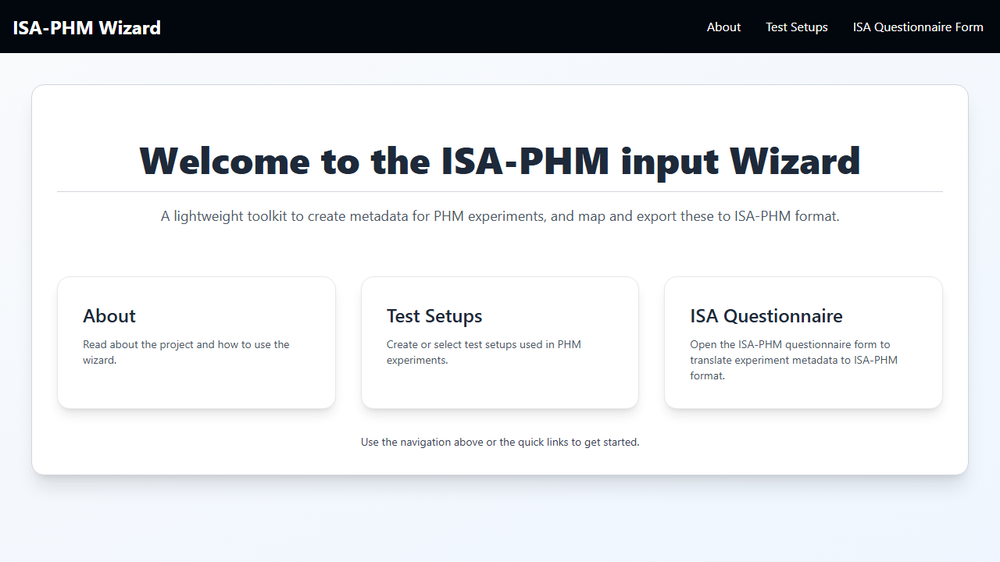

# ISA-PHM Wizard

A browser-based metadata wizard for creating ISA-PHM–style study descriptions for diagnostic and prognostic experiments. Based on the paper *ISA-PHM - a Standardized Format for Storing and Utilizing Metadata of Diagnostic and Prognostic Tests* ([PDF](docs/references/ISA-PHM_paper_final.pdf)).

The wizard guides users through describing their experimental setup (test rig, sensors, protocols) and study design (fault specifications, operating conditions, test matrix), then converts the resulting metadata into a single structured `isa-phm.json` file via a backend service.


> **Live app:** [https://nathanhouwaart.github.io/ISA-PHM-Wizard/](https://nathanhouwaart.github.io/ISA-PHM-Wizard/)



---

## Table of Contents

- [ISA-PHM Wizard](#isa-phm-wizard)
  - [Table of Contents](#table-of-contents)
  - [Background: PHM and the ISA-PHM Standard](#background-phm-and-the-isa-phm-standard)
    - [The ISA Hierarchy](#the-isa-hierarchy)
    - [Two Experiment Types](#two-experiment-types)
    - [FAIR Data Principles](#fair-data-principles)
  - [What This Wizard Does](#what-this-wizard-does)
  - [Typical Workflow](#typical-workflow)
  - [Documentation](#documentation)
    - [Getting started](#getting-started)
    - [Main workflow](#main-workflow)
    - [Slide-by-slide reference](#slide-by-slide-reference)
    - [Test setup tab reference](#test-setup-tab-reference)
    - [Worked examples](#worked-examples)
  - [Run Locally](#run-locally)
  - [Build \& Deploy](#build--deploy)
  - [Backend](#backend)
  - [Key Architectural Concepts](#key-architectural-concepts)
  - [Repository Structure](#repository-structure)
  - [Tech Stack](#tech-stack)
  - [Notes](#notes)

---

## Background: PHM and the ISA-PHM Standard

**Prognostics and Health Management (PHM)** is an engineering discipline focused on monitoring the condition of machinery and infrastructure, detecting faults, estimating remaining useful life, and scheduling maintenance before failure occurs. PHM experiments produce large measurement datasets (vibration, current, temperature, etc.) acquired under controlled conditions — seeded faults, degradation runs, load sweeps — but those datasets are often shared without the metadata needed to reproduce or compare results.

**ISA-PHM** addresses this by defining a standardized metadata format for PHM experiments. It adapts the [ISA (Investigation–Study–Assay)](https://isa-tools.org/) framework — widely adopted in life sciences — to the machinery health domain. The paper behind this standard is:

> *ISA-PHM – a Standardized Format for Storing and Utilizing Metadata of Diagnostic and Prognostic Tests* ([PDF](docs/references/ISA-PHM_paper_final.pdf))

### The ISA Hierarchy

ISA-PHM organizes metadata into three nested levels:

```
Investigation  ← the whole project (title, contacts, license, publications)
  └── Study      ← one experiment or fault condition (e.g. BPFO severity 1 at 1500 RPM)
        └── Assay  ← one measurement or processed-output file, per sensor, per run
```

Alongside the ISA hierarchy, ISA-PHM adds a **Test Setup** layer that captures the physical lab bench: sensor channel specifications, hardware configurations, and signal acquisition and processing protocols. This separation means the same lab bench can be described once and reused across many investigations.

### Two Experiment Types

The standard distinguishes between two kinds of PHM experiments:

| Type | Description | Use case |
|---|---|---|
| **Diagnostic** | Single-run tests with seeded or staged faults | Bearing diagnostics, fault classification datasets |
| **Prognostic** | Multi-run degradation trajectories | Milling tool wear, run-to-failure datasets |

The wizard supports both, controlled by a per-project template choice that adjusts what fields appear and how assay files are generated.

### FAIR Data Principles

ISA-PHM is designed to produce datasets that are **Findable, Accessible, Interoperable, and Reusable (FAIR)**. By capturing who ran the experiment, on what equipment, with what protocol, under what conditions, and what faults were seeded, ISA-PHM metadata makes it possible to:
- Search and filter PHM datasets by fault type, sensor type, or operating condition
- Reproduce experimental conditions from the metadata alone
- Combine datasets from different labs because the format is standardized

---

## What This Wizard Does

**Test setup authoring** — Before starting a questionnaire, users build a reusable test setup that describes the physical rig: its characteristics, sensors, hardware configurations, and measurement/processing protocols. Test setups are shared across all projects in the workspace.

**Project management** — Multiple named projects can be created in one browser session. Each project is independently configured with an experiment template (single-run diagnostic or multi-run prognostic), a dataset index, and a reference to a test setup.

**10-step ISA questionnaire** — A slide-by-slide wizard collects:
- Project *(ISA: Investigation)* title, license, and release dates
- Contacts and publications
- Experiments *(ISA: Studies)* with run counts
- Fault specifications and operating conditions
- Experiment-variable test matrix mappings
- Raw measurement output mappings (sensor → measurement protocol → experiment)
- Processed output mappings (sensor → processing protocol → experiment)

**Export** — Completed projects are sent to the ISA-PHM backend, which returns a `.json` file containing the full ISA-PHM structured metadata.

---

## Typical Workflow

1. Open **Test Setups** → build the test setup (sensors, configurations, protocols).
2. Open **ISA Questionnaire** → in **Project Sessions**, create or select a project.
3. Configure the project in **Project Sessions**: experiment template, dataset index (optional), and linked test setup.
4. Complete all 10 questionnaire slides.
5. Click **Convert to ISA-PHM** to download the output.

For a detailed walkthrough, see [docs/guides/GUIDE_QUICKSTART.md](docs/guides/GUIDE_QUICKSTART.md).

---

## Documentation

All user guidance lives in [`docs/README.md`](docs/README.md).

### Getting started

- [`docs/guides/GUIDE_CONCEPTS.md`](docs/guides/GUIDE_CONCEPTS.md) — ISA-PHM concepts: Project/Experiment/Measurement Output *(ISA: Investigation/Study/Assay)* and the dependency chain
- [`docs/guides/GUIDE_QUICKSTART.md`](docs/guides/GUIDE_QUICKSTART.md) — Complete walkthrough from blank screen to first export
- [`docs/guides/GUIDE_PROJECT_MANAGEMENT.md`](docs/guides/GUIDE_PROJECT_MANAGEMENT.md) — Create, configure, import, and export projects

### Main workflow

- [`docs/guides/GUIDE_PROJECT_MANAGEMENT.md`](docs/guides/GUIDE_PROJECT_MANAGEMENT.md) — Project Sessions modal: create, configure, import, and switch projects
- [`docs/guides/GUIDE_TEST_SETUPS.md`](docs/guides/GUIDE_TEST_SETUPS.md) — Build a test setup (sensors, configurations, protocols)
- [`docs/guides/GUIDE_QUESTIONNAIRE.md`](docs/guides/GUIDE_QUESTIONNAIRE.md) — Navigate the 10-slide ISA questionnaire (assumes project and test setup are ready)
- [`docs/guides/GUIDE_EXPORT.md`](docs/guides/GUIDE_EXPORT.md) — What the ISA-PHM output contains and how to use it
- [`docs/guides/TROUBLESHOOTING.md`](docs/guides/TROUBLESHOOTING.md) — Empty dropdowns, missing rows, conversion failures

### Slide-by-slide reference

Individual guides for each of the 10 questionnaire slides live in [`docs/slides/`](docs/slides/).

### Test setup tab reference

Individual guides for each of the 6 test setup editor tabs live in [`docs/test-setup-tabs/`](docs/test-setup-tabs/).

### Worked examples

- [`docs/examples/EXAMPLE_FROM_SCRATCH.md`](docs/examples/EXAMPLE_FROM_SCRATCH.md) — Simple bearing diagnostics, every step with concrete values
- [`docs/examples/EXAMPLE_SIETZE.md`](docs/examples/EXAMPLE_SIETZE.md) — Pre-loaded single-run diagnostic project (Sietze dataset)
- [`docs/examples/EXAMPLE_MILLING.md`](docs/examples/EXAMPLE_MILLING.md) — Pre-loaded multi-run prognostics project (Milling tool wear)

---

## Run Locally

```powershell
npm install
npm run dev
```

Open `http://localhost:5173/ISA-PHM-Wizard/#/` in your browser.

## Build & Deploy

```powershell
npm run build       # Production build → dist/
npm run preview     # Preview the production build locally
npm run deploy      # Push dist/ to GitHub Pages
```

---

## Backend

The export step sends project data to the ISA-PHM backend, which converts it to a structured ISA-PHM JSON file.

- Backend repository: [https://github.com/NathanHouwaart/ISA-PHM-Backend](https://github.com/NathanHouwaart/ISA-PHM-Backend)
- API call handled in `src/hooks/useSubmitData.jsx`

---

## Key Architectural Concepts

**Global state via `GlobalDataContext`** — All application data (projects, test setups, mappings, studies, variables, etc.) flows through a single context. Every state change auto-saves to `localStorage` under prefixed keys (`globalAppData_*`). On load, state is rehydrated from storage, falling back to JSON defaults in `src/data/`.

**Hook-based entity controllers** — Each entity type (studies, contacts, sensors, etc.) has a dedicated hook (`useStudies`, `useContacts`, …) that reads from and writes to the global context. `useMappingsController` provides generic CRUD for any mapping between two entity types.

**Slide carousel** — The questionnaire is a carousel of 10 slide components (`src/components/Slides/`). Navigation state lives in `useCarouselNavigation`. Each slide is self-contained with its own form logic.

**Reusable test setups** — Test setups are stored in a global catalog (separate from project data), so the same rig description can be reused across many projects. When a project is configured to use a test setup, its ID is stored in the project record and resolved at runtime.

**Experiment templates** — Two templates exist: `diagnostic-experiment` (single-run, one sample per study) and `prognostics-experiment` (multi-run, variable run counts per study). The template affects the Test Matrix slide and assay file generation.

---

## Repository Structure

```
├── src/
│   ├── App.jsx                  # Root component, router setup
│   ├── index.jsx                # App entry point
│   ├── pages/                   # Top-level route pages
│   │   ├── Home.jsx             # Landing page
│   │   ├── TestSetups.jsx       # Test setup editor (6-tab interface)
│   │   ├── IsaQuestionnaire.jsx # 10-slide questionnaire carousel
│   │   └── About.jsx            # About / info page
│   ├── components/              # Reusable UI components
│   │   ├── Slides/              # One component per questionnaire slide
│   │   ├── TestSetup/           # Test setup tab components
│   │   ├── ProjectConfiguration/# Project session and config modals
│   │   ├── DataGrid/            # Editable grid (RevoGrid wrapper)
│   │   ├── Form/                # JSON-driven form field components
│   │   ├── Study/               # Study card and editor
│   │   ├── StudyVariable/       # Study variable cards
│   │   ├── Contact/             # Contact cards
│   │   ├── Publication/         # Publication cards
│   │   └── Suggestions/         # Suggestion chip components
│   ├── hooks/                   # Custom React hooks
│   │   ├── useTestSetups.jsx    # Test setup CRUD
│   │   ├── useStudies.jsx       # Study CRUD
│   │   ├── useVariables.jsx     # Study variable CRUD
│   │   ├── useMeasurements.jsx  # Sensor measurement CRUD
│   │   ├── useMappingsController.jsx # Generic entity-mapping operations
│   │   ├── useDataGrid.jsx      # Grid interactions + undo/redo
│   │   ├── useSubmitData.jsx    # Backend POST + JSON download
│   │   ├── useFileSystem.jsx    # Project import/export (File System Access API)
│   │   └── ...                  # Other entity and utility hooks
│   ├── contexts/                # React context providers
│   │   └── GlobalDataContext.jsx# Central state + localStorage persistence
│   ├── constants/               # Shared lookup tables
│   │   ├── experimentTypes.js   # Template definitions (single/multi-run)
│   │   ├── variableTypes.jsx    # Study variable type options
│   │   └── suggestionCatalog.js # Fault spec and operating condition suggestions
│   ├── data/                    # Static JSON: defaults, form field schemas, examples
│   ├── services/                # External API calls (license fetching)
│   ├── state/                   # Shared state utilities
│   ├── layout/                  # Layout wrappers (PageWrapper, etc.)
│   └── utils/                   # Pure utility functions
├── docs/                        # All user-facing documentation (see below)
├── scripts/                     # Developer utility scripts
├── public/                      # Static assets served by Vite
├── index.html                   # HTML shell
├── vite.config.mjs              # Vite config (base path for GitHub Pages)
└── package.json
```

---

## Tech Stack

| Layer | Technology |
|---|---|
| Framework | React 18 |
| Build tool | Vite |
| Routing | `react-router-dom` (hash routing) |
| Styling | Tailwind CSS |
| UI primitives | Radix UI (`@radix-ui/*`) |
| Data grid | `@revolist/react-datagrid` |
| Unique IDs | `uuid` |
| State / persistence | React context + `localStorage` |
| File I/O | File System Access API (`useFileSystem`) |
| Backend | AWS App Runner (POST `/convert`, returns JSON) |
| Deployment | GitHub Pages via `gh-pages` |

---

## Notes

- All project data is stored in **browser localStorage** — clearing site data will delete all projects.
- The global test setup catalog is **shared across all projects** in the same browser session.
- The app uses **hash routing** (`#/...`) to support GitHub Pages hosting without server-side redirect rules.
