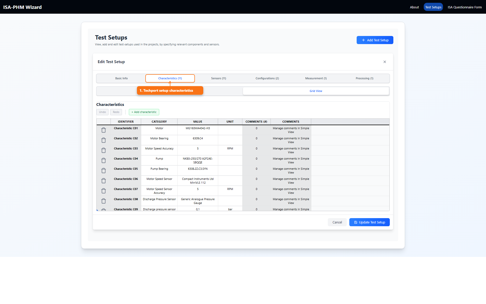
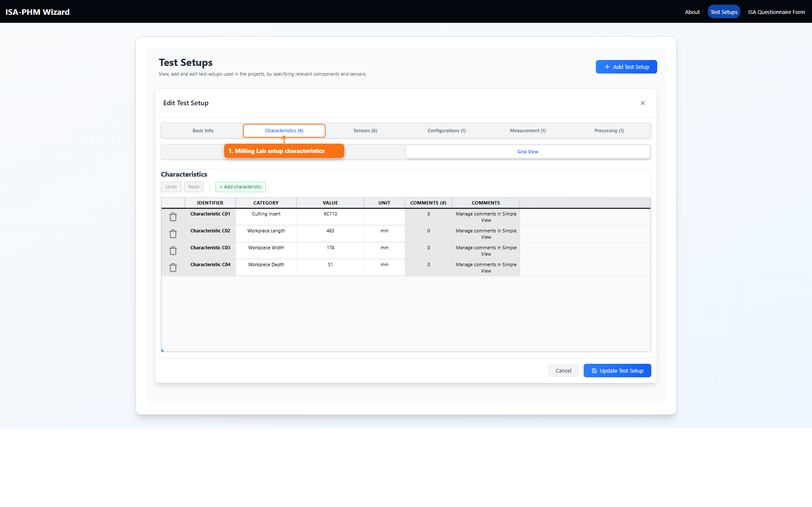

# Characteristics Guide

This guide focuses on characteristics metadata in the Test Setup layer of ISA-PHM, as outlined in *ISA-PHM - a Standardized Format for Storing and Utilizing Metadata of Diagnostic and Prognostic Tests* ([PDF](./references/ISA-PHM_paper_final.pdf)). These fields capture apparatus and component properties that contextualize Study and Assay results.

## What A Characteristic Is

A characteristic is a static property of the setup or its components (for example motor type, pump model, or nominal power). It is context metadata, not a per-run measurement value.

## What You Use It For

- Describe hardware context so results can be interpreted correctly.
- Compare setups and component baselines across projects and studies.
- Keep assumptions and fixed properties visible for later reuse.

## Where To Edit

- `Test Setups` -> open a setup -> `Characteristics` tab.

## Example Project Characteristics

### Techport (used by Single Run Sietze)

### Milling Lab (used by Multi Run Milling)

## Fields

- Category
- Value
- Unit
- Comments (simple view)

## How To Add A Characteristic

1. Open the `Characteristics` tab.
2. Click `+` (Add characteristic).
3. Fill Category, Value, Unit.
4. Add comments if needed.
5. Save the test setup.

## Simple View vs Grid View

- Simple view supports comments per characteristic.
- Grid view is better for fast bulk edits.
- Comment count and hint appear in grid view; comment content is managed in simple view.

## Good Practice

- Use consistent category naming.
- Use engineering units where possible.
- Keep comments for assumptions, constraints, or measurement notes.

## Example Entries

- Category: `Motor`, Value: `WEG W21`, Unit: `N/A`
- Category: `Motor Power`, Value: `2.2`, Unit: `kW`
