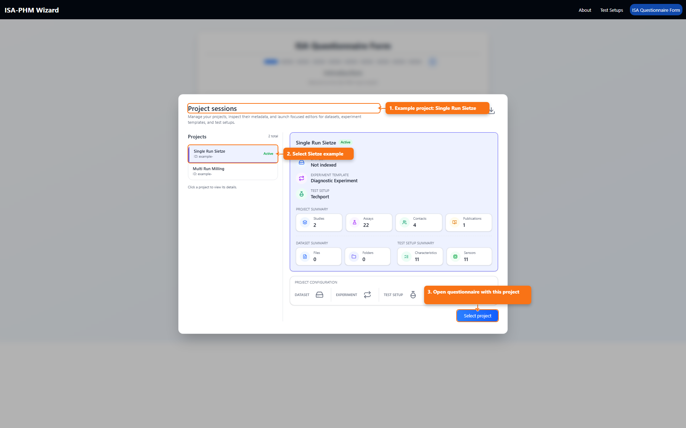
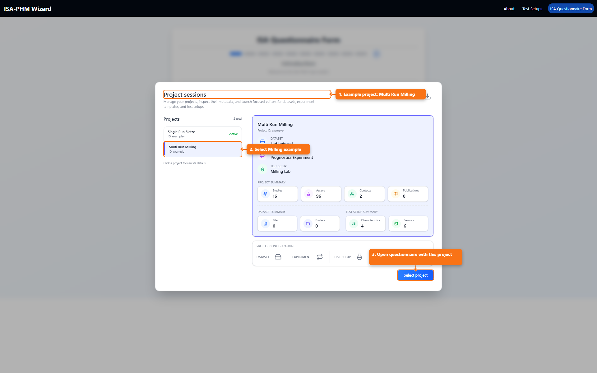

# Example Projects: Sietze And Milling

This guide uses the pre-annotated `Single Run Sietze` and `Multi Run Milling` projects to show how concepts from *ISA-PHM - a Standardized Format for Storing and Utilizing Metadata of Diagnostic and Prognostic Tests* ([PDF](./references/ISA-PHM_paper_final.pdf)) appear in real project/session and test-matrix data.

This wizard ships with two pre-annotated example projects:

- `Single Run Sietze` (diagnostic-style / single-run template)
- `Multi Run Milling` (prognostic-style / multi-run template)

## What These Example Projects Are

`Single Run Sietze` and `Multi Run Milling` are ready-to-open reference projects with prefilled metadata and mappings.

## What You Use Them For

- Learn the expected data shape before entering your own project.
- Compare single-run versus multi-run modeling in a real questionnaire flow.
- Validate your own project structure against known working examples.

## Project Session Examples

### Single Run Sietze

### Multi Run Milling

## Test Matrix Comparison

### Sietze: Single-run style mapping

### Milling: Multi-run style mapping

## Why This Matters

Following the ISA-PHM paper, this comparison shows how metadata structure changes with test intent:

- Single-run projects emphasize one row per experiment condition.
- Multi-run projects capture repeated/sequential runs per study while preserving labels and conditions.
- Both remain interoperable by preserving explicit metadata links.
