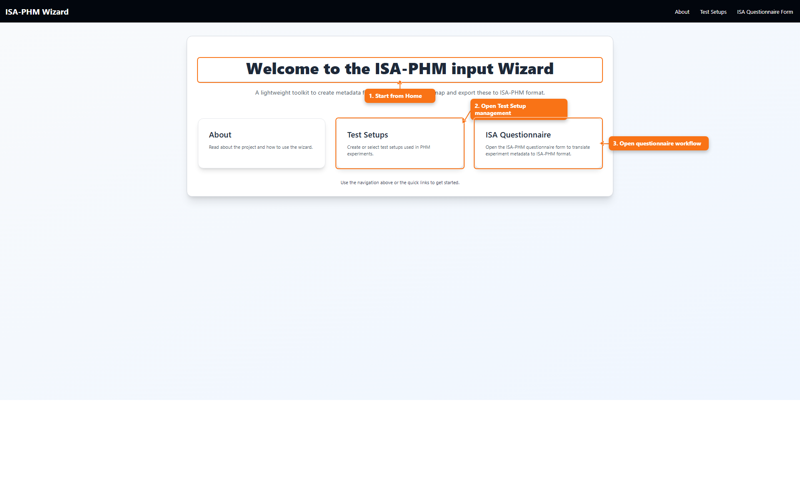
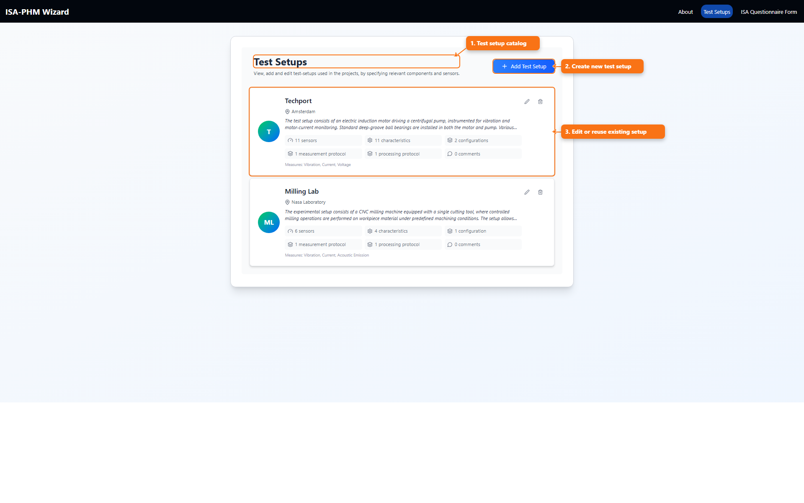

# General Usage Of The Wizard

This is the end-to-end operating guide for the wizard, aligned with the flow described in *ISA-PHM - a Standardized Format for Storing and Utilizing Metadata of Diagnostic and Prognostic Tests* ([PDF](./references/ISA-PHM_paper_final.pdf)), from project definition to Study/Assay mappings and export.

All screenshots below are captured at **80% browser zoom** in Chromium.

## What This Guide Is

This is the step-by-step onboarding path through the whole wizard, from project selection to ISA-PHM export.

## What You Use It For

- Start a new project without missing required dependencies between screens.
- Follow the fastest complete path when you are unsure where to begin.
- Use as a checklist before pressing `Convert to ISA-PHM`.

## 1. Open The Home Page

Use the three main entry points:

- `About`
- `Test Setups`
- `ISA Questionnaire`

## 2. Prepare A Project Session

When you enter the ISA Questionnaire flow, the project/session chooser opens.

Use it to:

- Select active project
- Create project
- Import/export project
- Configure project dataset/template/test setup

## 3. Build Or Reuse Test Setups

Go to `Test Setups` and create/edit the setup linked to your project.

A test setup should include:

- Basic info
- Characteristics
- Sensors
- Configurations
- Measurement protocols
- Processing protocols

## 4. Complete ISA Questionnaire Slides

In `ISA Questionnaire`, complete slides from project info to output mappings.

Recommended order:

1. Project information
2. Contacts and publications
3. Experiments
4. Fault specs and operating conditions
5. Test matrix
6. Measurement output and processing output

For full slide-level details, see:

- [Every ISA Questionnaire Slide Explained](./README_ISA_QUESTIONNAIRE_SLIDES.md)
- [Example Projects: Sietze And Milling](./README_EXAMPLE_PROJECTS.md)
- [Multiple Runs Explained](./README_MULTIPLE_RUNS.md)

## 5. Convert To ISA-PHM

Use `Convert to ISA-PHM` on the questionnaire page after all required metadata is present.

## Quick Quality Checklist

- Project has selected test setup.
- Study variables exist before test matrix mapping.
- Sensors exist before output mappings.
- Protocol variants exist before selecting protocol per study.
- File mappings are completed per run where needed.
