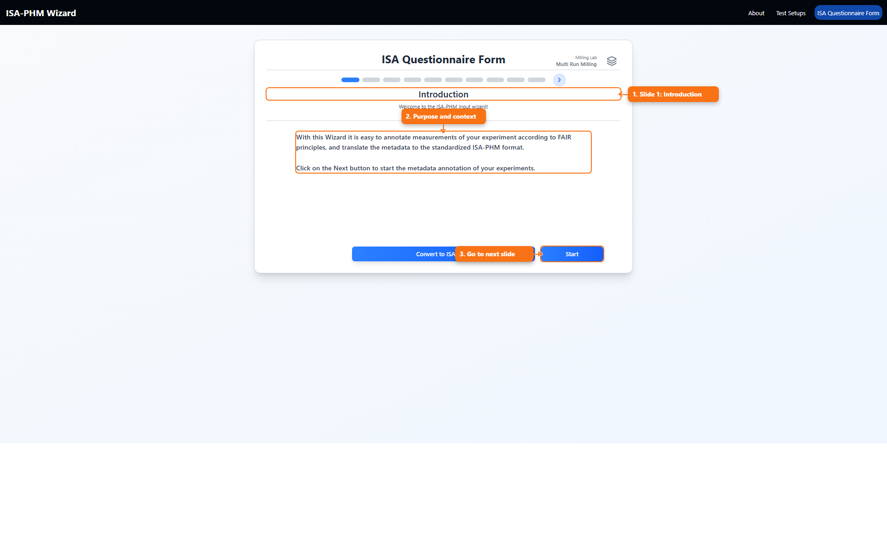
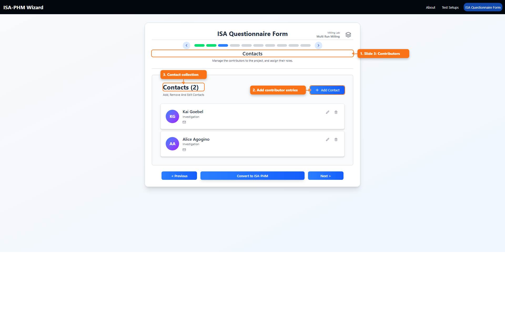
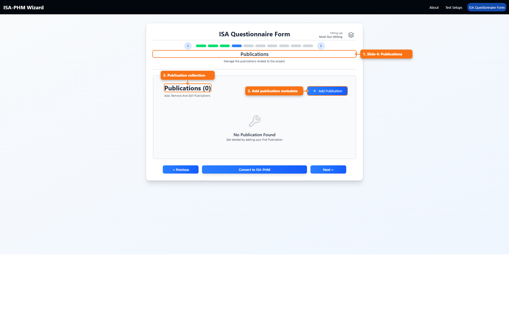
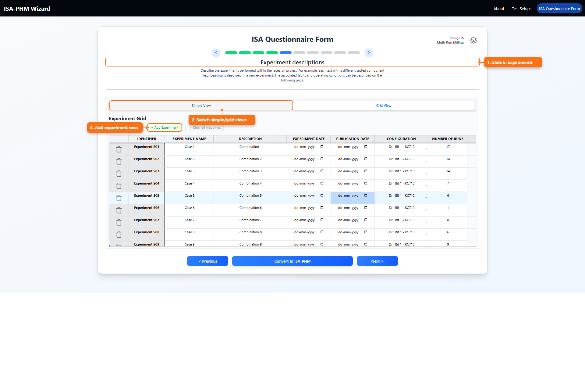
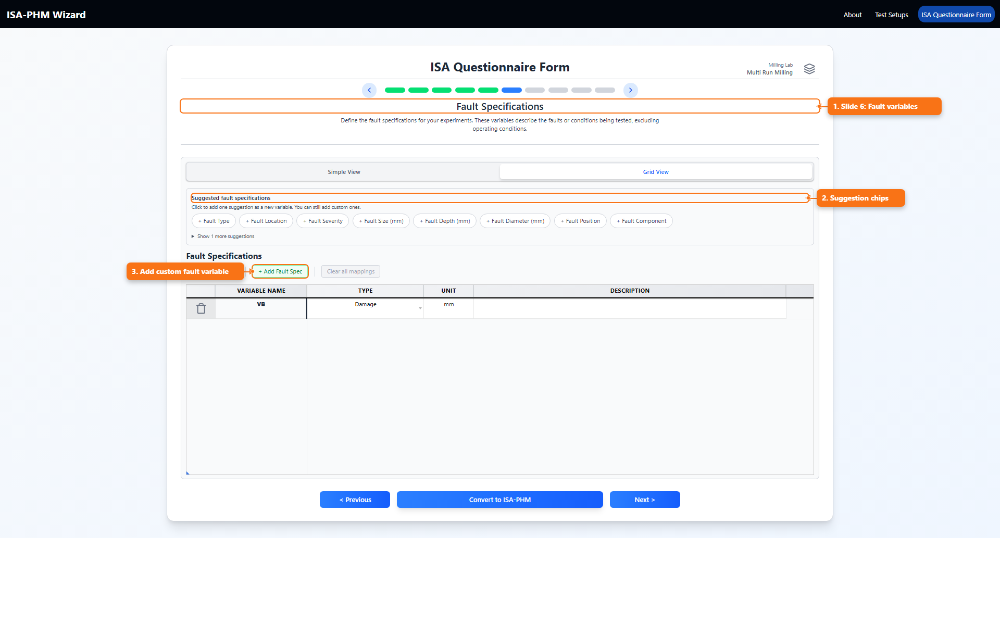
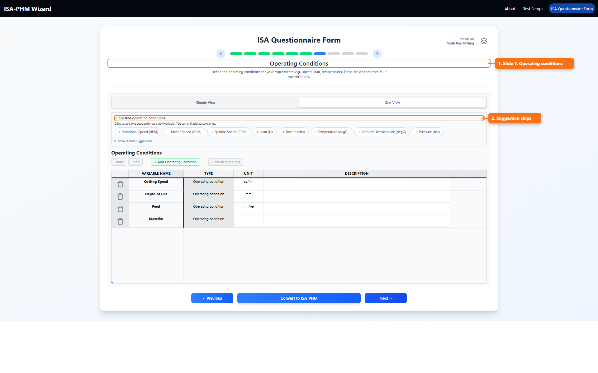
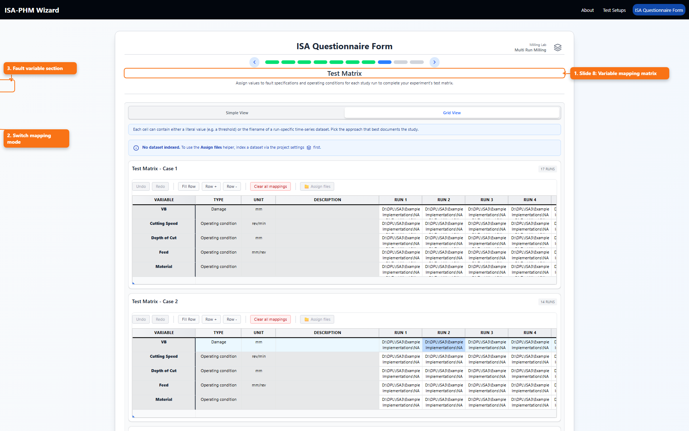
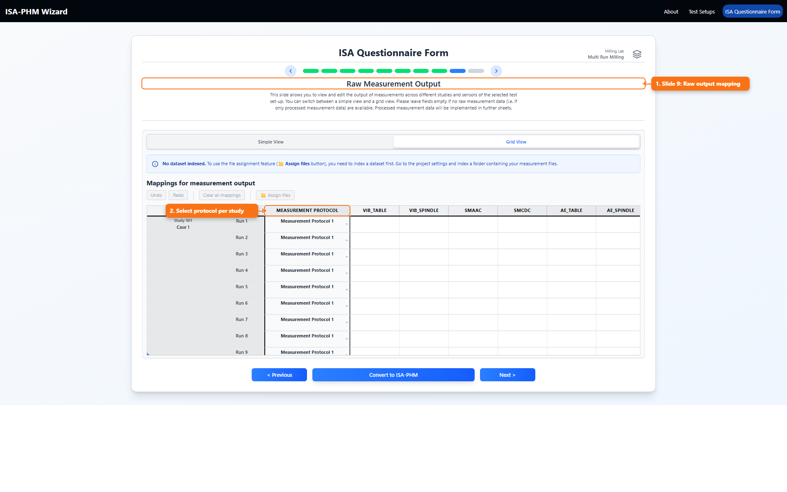
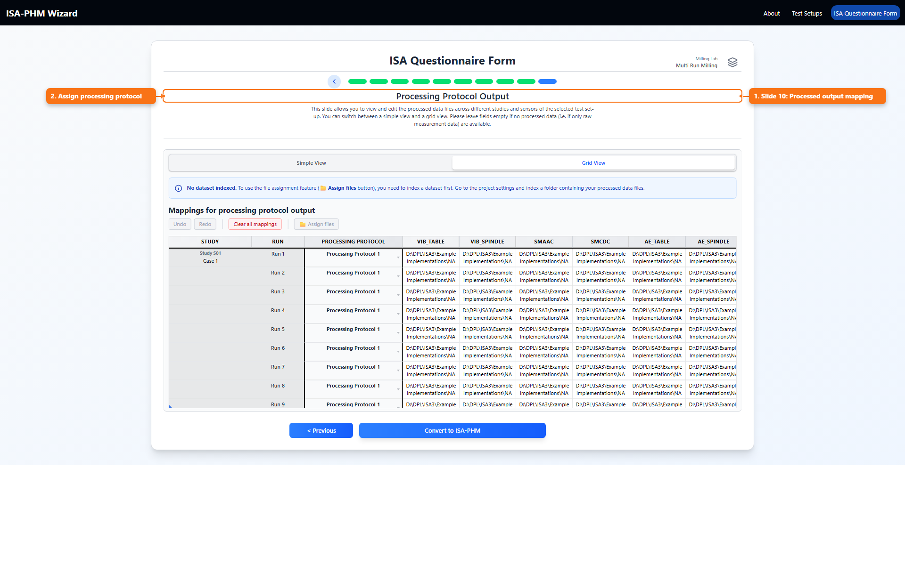

# Every ISA Questionnaire Slide Explained

This guide explains each of the 10 questionnaire slides as concrete ISA-PHM capture steps from *ISA-PHM - a Standardized Format for Storing and Utilizing Metadata of Diagnostic and Prognostic Tests* ([PDF](./references/ISA-PHM_paper_final.pdf)), so every screen maps to the right Investigation, Study, or Assay metadata.

All screenshots are captured at **80% browser zoom** in Chromium and include annotations.

## What This Slide Guide Is

This is a slide-by-slide field reference for the full ISA Questionnaire flow.

## What You Use It For

- Understand exactly what each slide captures and why it matters.
- Resolve confusion about field meaning, ordering, and required relationships.
- Train new users quickly with visual examples for every slide.

## Slide 1: Introduction

Purpose:

- Quick overview of the wizard and FAIR/ISA-PHM intent.

What to do:

- Read and continue.

## Slide 2: Project Information

Purpose:

- Capture high-level project metadata.

Key fields:

- Project Title
- Project Description
- License
- Project execution / data collection date
- Public Release Date

Tips:

- Use a clear, searchable title.
- Keep description specific to experimental scope.

## Slide 3: Contacts

Purpose:

- Maintain contributor list and roles.

Key fields per contact:

- Name
- Email / phone / address
- ORCID
- Affiliations
- Roles

Important rule:

- If a contact is a publication corresponding author, removing email is blocked.

## Slide 4: Publications

Purpose:

- Register publication metadata and author links.

Key fields:

- Publication Title
- DOI
- Publication Status
- Author list (ordered)
- Corresponding contact

Important rule:

- Corresponding contact must have an email.

## Slide 5: Experiment Descriptions

Purpose:

- Define each experiment/study.

Views:

- Simple view (cards/forms)
- Grid view (bulk editing)

Key fields:

- Experiment name
- Description
- Execution/publication dates
- Configuration
- Number of runs (for multi-run template)

Dependency:

- Configuration dropdown comes from selected test setup configurations.

## Slide 6: Fault Specifications

Purpose:

- Define fault-related study variables.

Views:

- Simple view
- Grid view

Key fields:

- Variable name
- Type (fault-related types)
- Unit
- Description

Suggestions:

- Chip list adds new variable rows with prefilled metadata.

## Slide 7: Operating Conditions

Purpose:

- Define operating-condition variables.

Views:

- Simple view
- Grid view

Key fields:

- Variable name
- Type (fixed to `Operating condition`)
- Unit
- Description

Suggestions:

- Chip list adds common condition variables like speed/load/temperature.

## Slide 8: Test Matrix

Purpose:

- Map fault/condition variable values to each study run.

Views:

- Simple view: variable-by-variable mapping
- Grid view: matrix mapping with optional file picker actions

Dependencies:

- Requires studies.
- Requires variables from slides 6 and 7.
- File assignment helper benefits from indexed dataset.

Notes:

- Supports single-run and multi-run templates.
- Variables are grouped as Fault Specifications and Operating Conditions.

## Slide 9: Raw Measurement Output

Purpose:

- Map raw measurement output per study run and sensor.

Views:

- Simple view (study/run cards)
- Grid view (study/run x sensor matrix)

What you assign:

- Measurement protocol per study
- Raw measurement file/value per sensor and run

Dependencies:

- Selected test setup
- Sensors defined in selected setup
- Measurement protocols defined in selected setup
- Studies exist

## Slide 10: Processing Protocol Output

Purpose:

- Map processed output per study run and sensor.

Views:

- Simple view
- Grid view

What you assign:

- Processing protocol per study
- Processed file/value per sensor and run

Dependencies:

- Selected test setup
- Sensors in setup
- Processing protocols in setup
- Studies exist

## Final Action

Use `Convert to ISA-PHM` after all slides are validated.

## Related Docs

- [Questionnaires Guide](./README_QUESTIONNAIRES.md)
- [Test Setup Tabs Explained](./README_TEST_SETUP_TABS.md)
