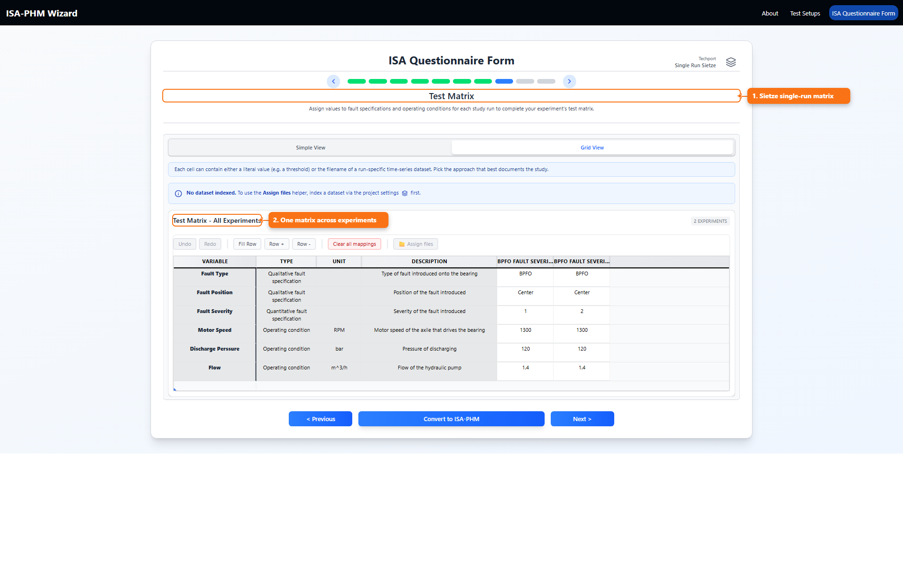
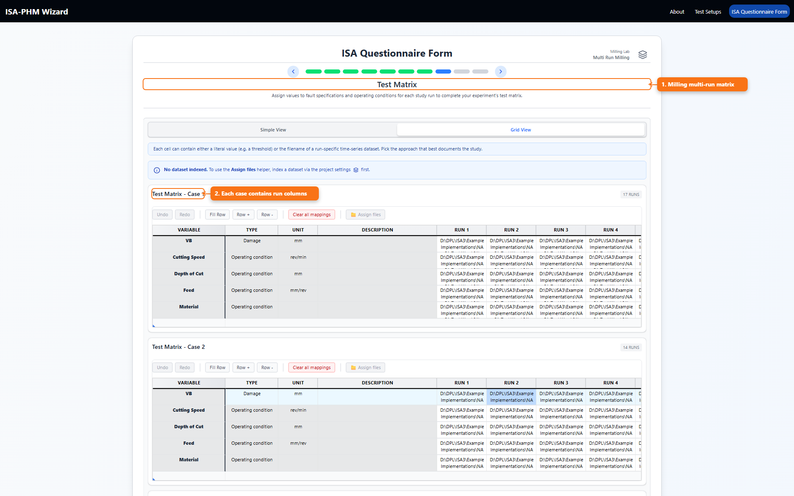

# Multiple Runs Explained

This guide focuses on the paper's multi-run modeling rules from *ISA-PHM - a Standardized Format for Storing and Utilizing Metadata of Diagnostic and Prognostic Tests* ([PDF](./references/ISA-PHM_paper_final.pdf)): when repeated observations should be separate studies and when sequential runs should remain grouped within one study.

## What Multiple Runs Is

Multiple runs means several runs that belong to one study context (same experiment case), rather than splitting every run into a separate study.

## What You Use It For

- Pick the right template (Single-run vs Multi-run) before modeling experiments.
- Keep prognostic sequences grouped correctly inside one study.
- Build correct per-run mappings in test matrix, raw output, and processing output slides.

## Definition From The Paper

The paper distinguishes repeated diagnostic tests from prognostic degradation runs:

- Repeated **diagnostic** tests can be modeled as independent experiments (separate Studies).
- Sequential **prognostic** runs on the same degrading sample should be modeled as **multiple runs within one Study**.

In the paper's wording, these runs are stored as consecutive rows in Study and Assay files for that experiment context.

## What This Means In The Wizard

In this wizard, the behavior is controlled by the selected experiment template:

- `Single-run template`: each study is effectively one run.
- `Multi-run template`: each study can have multiple runs.

Where this appears:

1. `Experiment descriptions` slide:
   - Multi-run template shows a `Number of runs` field.
2. `Test Matrix` slide:
   - Multi-run projects expose run-specific mapping columns/cards.
3. `Raw Measurement Output` and `Processing Protocol Output` slides:
   - Mappings are made per study-run and sensor.

## Visual Comparison

### Single-run (Sietze)

### Multi-run (Milling)

## Practical Rules

- Use single-run when each experiment has one trajectory/file set.
- Use multi-run when the same study/sample has sequential or repeated runs that must stay grouped.
- Keep operating conditions and fault/degradation labels explicit per run context.

## Related

- [Example Projects: Sietze And Milling](./README_EXAMPLE_PROJECTS.md)
- [Questionnaires Guide](./README_QUESTIONNAIRES.md)
- [Every ISA Questionnaire Slide Explained](./README_ISA_QUESTIONNAIRE_SLIDES.md)
