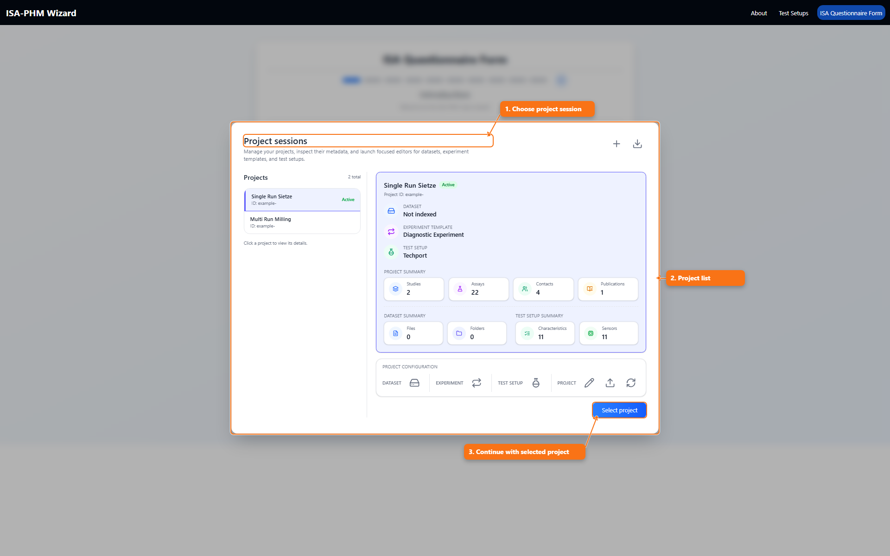
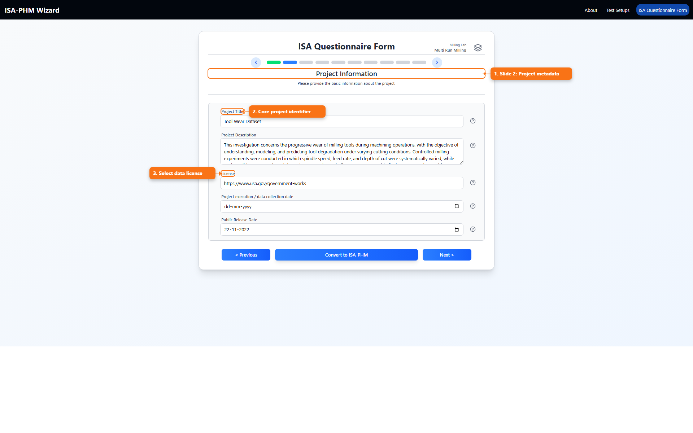

# Questionnaires Guide

This guide focuses on the ISA questionnaire flow, the wizard's primary path for capturing Investigation, Study, and Assay metadata defined in *ISA-PHM - a Standardized Format for Storing and Utilizing Metadata of Diagnostic and Prognostic Tests* ([PDF](./references/ISA-PHM_paper_final.pdf)).

## What It Is

The questionnaire is a guided 10-slide process to capture project metadata and mappings needed for ISA-PHM export.

## What You Use It For

- Capture project metadata in the right ISA order without missing dependencies.
- Define study structure, run behavior, and test-matrix mappings.
- Produce export-ready metadata the backend can convert consistently.

## Before You Start

Make sure the project has:

- Selected test setup
- Correct experiment template (single-run or multi-run)
- Dataset indexed if you plan to use file assignment helpers

## Main Steps

1. Open `ISA Questionnaire` from Home or Navbar.
2. Select the active project in the Project Sessions modal.
3. Move through slides using next/previous controls or top progress dots.
4. Complete metadata fields and mappings.
5. Click `Convert to ISA-PHM`.

## Views You Will Use

- Simple view: card/list based editing.
- Grid view: table-based editing for faster bulk input.

Some slides support both views; some are grid-only or simple-only based on function.

## Example Slide Snapshot

## Pre-Annotated Project Examples

- [Example Projects: Sietze And Milling](./README_EXAMPLE_PROJECTS.md)
- [Multiple Runs Explained](./README_MULTIPLE_RUNS.md)

## Common Pitfalls

- No test setup selected: measurement/processing mappings cannot be completed.
- No sensors in selected setup: output mapping has nothing to map against.
- No study variables: test matrix slide cannot be populated.
- No protocols defined in setup: protocol selectors in output slides stay empty.

## Deep Reference

- [Every ISA Questionnaire Slide Explained](./README_ISA_QUESTIONNAIRE_SLIDES.md)
