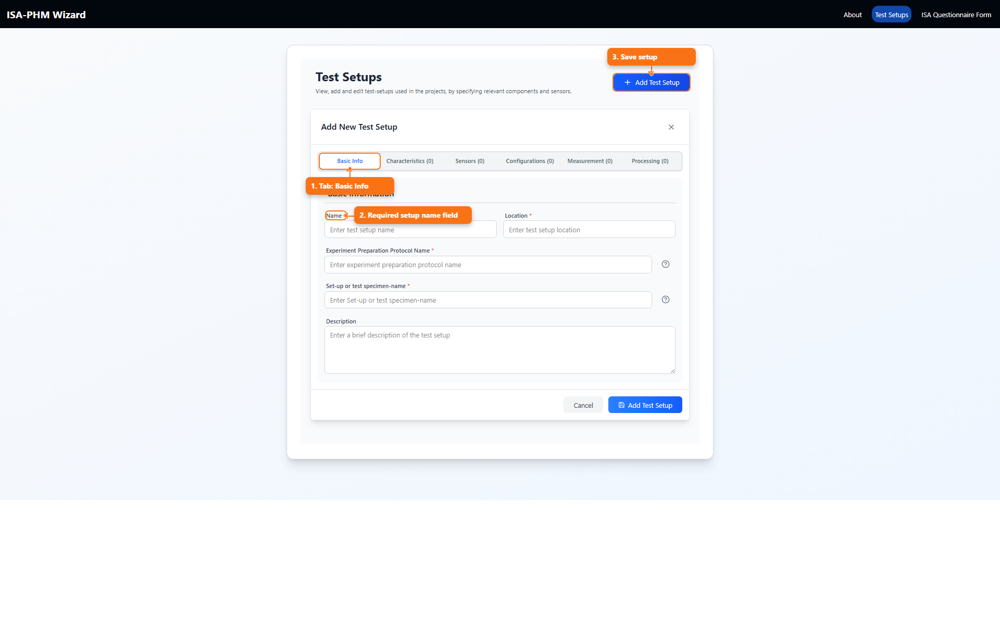
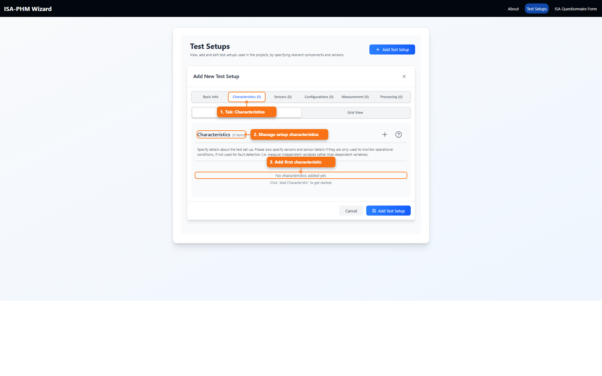
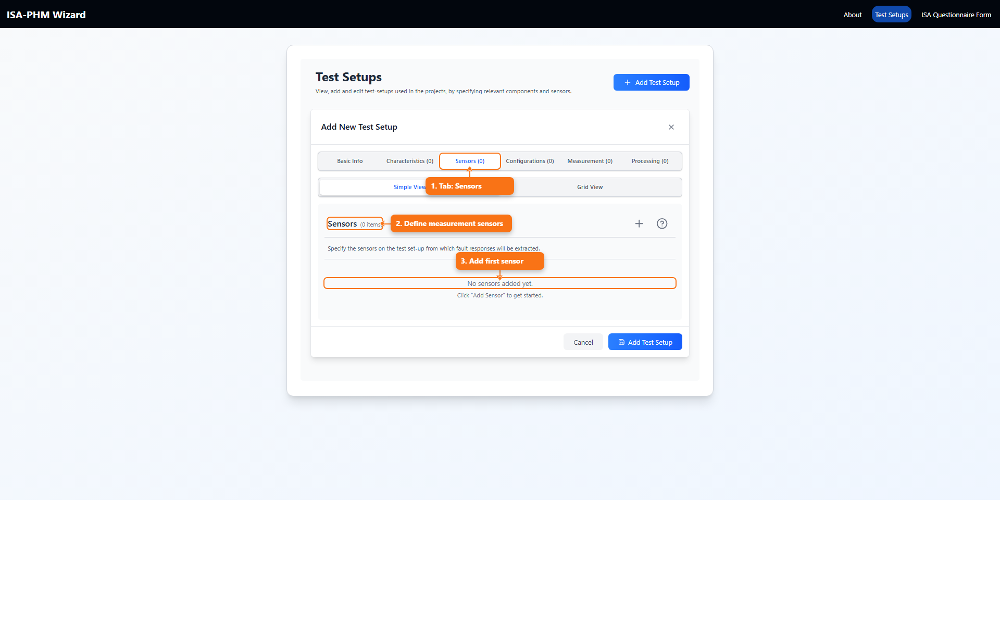
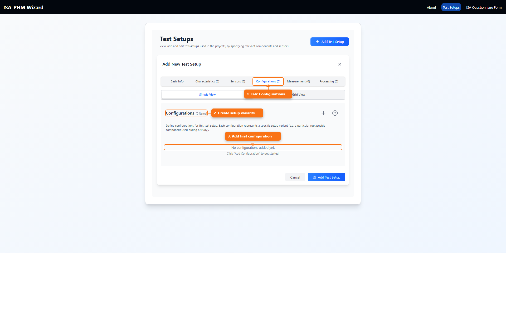
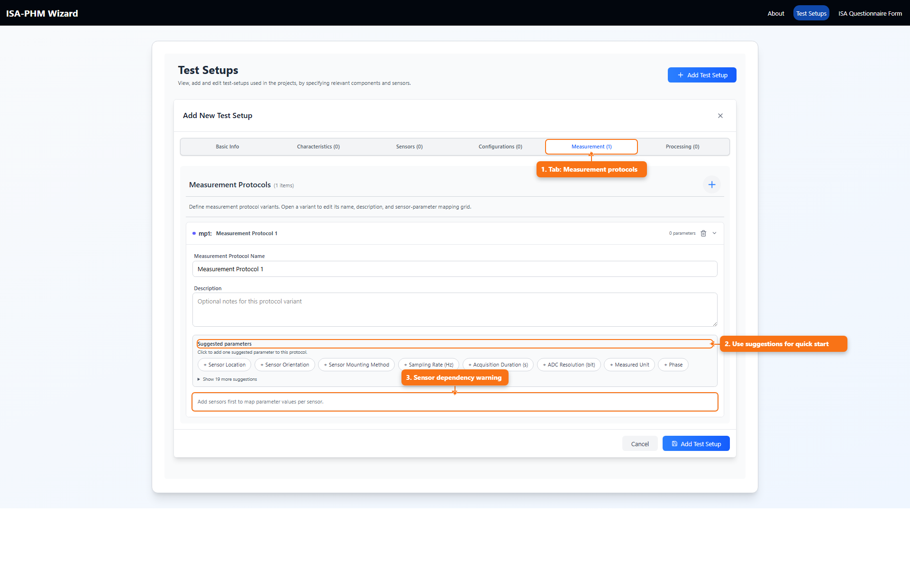
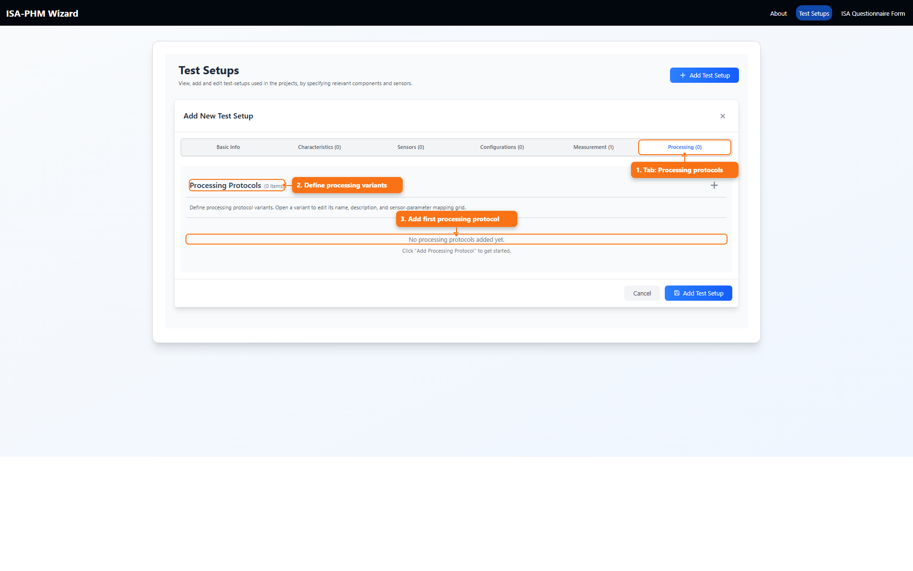

# Every Test Setup Tab Explained

This guide explains each Test Setup tab as a specific metadata block feeding ISA-PHM export, based on the structure in *ISA-PHM - a Standardized Format for Storing and Utilizing Metadata of Diagnostic and Prognostic Tests* ([PDF](./references/ISA-PHM_paper_final.pdf)), from setup context through protocol definitions.

All screenshots are captured at **80% browser zoom** in Chromium and include annotations.

## What This Tab Guide Is

This is a focused reference for each tab inside the Test Setup editor.

## What You Use It For

- Know exactly what belongs in each tab before you fill it.
- Understand how tab data flows into questionnaire and export steps.
- Troubleshoot missing dropdown options caused by incomplete setup tabs.

## 1. Basic Info

Purpose:

- Define the setup identity and core context.

Fields:

- Name (required)
- Location (required)
- Experiment Preparation Protocol Name (required)
- Set-up or test specimen-name (required)
- Description (optional)

## 2. Characteristics

Purpose:

- Describe setup/component characteristics.

Views:

- Simple view with expandable cards and comments
- Grid view for faster bulk editing

Fields:

- Category
- Value
- Unit
- Comments (simple view)

## 3. Sensors

Purpose:

- Define all sensors used in the setup.

Views:

- Simple view
- Grid view

Fields:

- Alias
- Sensor Model
- Sensor Type
- Measurement Type
- Description

Note:

- Sensor rows drive columns in protocol and output mapping grids.

## 4. Configurations

Purpose:

- Define setup variants (for example different replaceable components).

Views:

- Simple view
- Grid view

Fields:

- Name
- Replaceable Component ID
- Details list (name/value)

Note:

- Experiment slide can select these configurations per study.

## 5. Measurement

Purpose:

- Define raw acquisition protocol variants.

Main actions:

- Add/remove protocol variants
- Edit protocol name/description
- Add parameter rows (custom or suggested)
- Map parameter values per sensor

Parameter row fields:

- Parameter Name
- Unit
- Description

Dependencies:

- Sensors should already exist to map parameter values per sensor.

## 6. Processing

Purpose:

- Define processing protocol variants.

Main actions:

- Add/remove protocol variants
- Edit protocol metadata
- Add parameter rows (custom or suggested)
- Map processing parameters per sensor

Parameter row fields:

- Parameter Name
- Unit
- Description

Dependencies:

- Sensors should already exist.

## Save/Close Behavior

- `Cancel` closes editor.
- `Add Test Setup` or `Update Test Setup` saves.
- Closing with unsaved edits opens a warning dialog:
  - Save and close
  - Keep editing
  - Discard and close

## Related Docs

- [Test Setups Guide](./README_TEST_SETUPS.md)
- [Measurement Protocols Guide](./README_MEASUREMENT_PROTOCOLS.md)
- [Processing Protocols Guide](./README_PROCESSING_PROTOCOLS.md)
