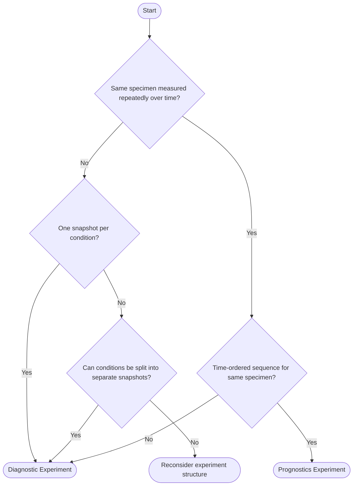

# ISA-PHM Concepts

Before opening the wizard, it helps to understand a handful of concepts. This page explains the ISA-PHM framework, why it exists, and how the wizard maps onto it.

---

## Why ISA-PHM?

Modern PHM (Prognostics and Health Management) experiments produce measurements, but the measurements alone are not reusable. To reproduce, compare, or publish results you also need to know:

- What equipment was used and how it was set up
- What faults were seeded and under what operating conditions
- How raw signals were processed into features

ISA-PHM is a standardized format that captures all of this metadata alongside the data files, following the FAIR principles (Findable, Accessible, Interoperable, Reusable). It reuses the ISA (Investigation–Study–Assay) framework, which is widely adopted in life sciences, adapting it for PHM experiments.

---

## The ISA Hierarchy

ISA-PHM builds on the **ISA** (Investigation–Study–Assay) framework, a metadata standard originally developed for life sciences (genomics, metabolomics) and widely adopted for structured research data. ISA-PHM adapts it for PHM experiments.

The wizard uses PHM-friendly language throughout its UI. The output JSON uses the original ISA terminology. **This table is the definitive translation between the two:**

| Wizard / PHM term | ISA term | JSON key | What it represents |
|---|---|---|---|
| Project | Investigation | top-level object | The whole dataset — title, contacts, publications, dates |
| Experiment | Study | `studies[]` | One test case — one fault condition or configuration variant |
| Measurement / Processing Output | Assay | `study.assays[]` | One sensor channel's data file for one run |
| Fault Spec / Operating Condition | Study Factor | `study.factors[]` | A variable that distinguishes experiments from each other |
| Test Matrix value | Factor Value | `samples[].factorValues[]` | The value of a factor for a specific experiment or run |
| Configuration | Sample | `study.materials.samples[]` | The physical component installed in the rig |
| Characteristics | Study Design Descriptor | `study.studyDesignDescriptors[]` | Fixed properties of the test rig, constant across all experiments |

The three-level hierarchy in the output JSON:

```
Investigation  (= Project)     ← title, contacts, publications
  └── Study    (= Experiment)  ← one fault condition or configuration variant
        └── Assay (= Measurement Output)  ← one sensor channel's data file
```

---

### Project — *ISA: Investigation*

The top-level container for your entire dataset. One dataset = one project = one ISA Investigation. It holds:
- Project title and description
- License
- Dates (data collection, public release)
- Contact list and publication list

In the output JSON this is the root object, with keys like `title`, `description`, `people`, and `publications`. See the [Export guide](./GUIDE_EXPORT.md#project-isa-investigation) for the full key list.

---

### Experiment — *ISA: Study*

Each distinct test case within the project. An experiment represents one fault condition with one configuration variant — the thing that makes it different from all other experiments in the same project. Examples:
- Bearing with BPFO fault, severity level 1
- Milling pass at 200 RPM, fresh tool

An experiment can have one run (diagnostic template) or multiple sequential runs (prognostic template).

In the output JSON, each experiment is one entry in `studies[]`. Its fault specifications and operating conditions appear in `study.factors[]`, and its test matrix values appear in `study.materials.samples[].factorValues[]`.

---

### Measurement Output — *ISA: Assay*

The data files linked to an experiment. Each measurement output represents the recorded signal from **one sensor channel** for **one run**.

> **Key rule:** A measurement output data file always has **exactly two columns** — a timestamp column and a **single measurement value** column. One sensor channel → one file.

**Multi-axis sensors must be split into separate entries.** A tri-axis accelerometer (X, Y, Z) produces **three measurement output files** — one per axis. In the wizard this means registering three separate sensor entries in the test setup, not one.

In the output JSON, each measurement output is one entry in `study.assays[]`. It contains the sensor metadata, the measurement and processing protocols used, and the file paths to the raw and processed data files.

<details>
<summary>Example — tri-axis accelerometer</summary>

Instead of one sensor entry `acc`:

| Alias | Type |
|-------|------|
| `acc` | Accelerometer |

Define **three** sensor entries, one per axis:

| Alias   | Type          |
|---------|---------------|
| `acc_x` | Accelerometer |
| `acc_y` | Accelerometer |
| `acc_z` | Accelerometer |

Each will generate its own two-column measurement output file in the output JSON:

```
timestamp, acc_x
0.000,     0.012
0.001,     0.015
...
```

```
timestamp, acc_y
0.000,    -0.003
0.001,    -0.001
...
```

</details>

Measurement outputs are constructed automatically from the experiment–sensor–run mappings you fill in on Slides 10 and 11. **One populated cell in that grid = one measurement output entry** in the output JSON.

---

## The Test Setup

Before (or alongside) filling in your project structure, you define a **Test Setup** — the reusable description of your physical lab bench. It contains:

- **Characteristics** — fixed hardware properties of the rig that are the same across all experiments (motor model, rated power, shaft geometry)
- **Sensors** — every measurement channel (alias, model, type)
- **Configurations** — Variants of the setup containing different physical hardware components or test articles (e.g. changed bearings, impellers, tool pieces, etc.)
- **Measurement Protocols** — how raw signals were acquired (sample rate, filter settings, etc.)
- **Processing Protocols** — how raw signals were turned into features (FFT, windowing, etc.)

Test setups are shared across projects. Once you have defined a setup for a lab bench, any future project on the same bench reuses it rather than re-entering everything.

### What is a Configuration? — *ISA: Sample*

A Configuration identifies **which specific physical component was installed** in the rig for a given experiment. In the ISA schema this is called a **Sample** — it appears in the output JSON as an entry in `study.materials.samples[]`. This is not just a health label; it is a distinct physical object.

> **Key rule:** Two experiments that use the same component *type* but a **different physical unit** should each have their own Configuration.

**Example — XJTU-SY bearing dataset:**  
15 accelerated degradation experiments, each run to failure. All use the same bearing model (LDK UER204), but each uses a **different physical bearing unit**. Each of those 15 bearing units is its own Configuration:

| Configuration name | Replaceable Component ID |
|---|---|
| `LDK UER204 — Unit 01 (run-to-failure)` | `BRG-01` |
| `LDK UER204 — Unit 02 (run-to-failure)` | `BRG-02` |
| `LDK UER204 — Unit 03 (run-to-failure)` | `BRG-03` |
| … | … |
| `LDK UER204 — Unit 15 (run-to-failure)` | `BRG-15` |

This matters for traceability: if a bearing's failure mode differs from the others, you can identify which unit that was. The Replaceable Component ID (`BRG-01` etc.) is the unique tag for that physical object.

**Characteristics vs. Configurations:**

| | Characteristics | Configurations |
|---|---|---|
| What it describes | The fixed rig itself (same for all experiments) | The specific component swapped in per experiment |
| ISA-PHM entity | Study Design Descriptor (ISA term) | Sample (ISA term) |
| Changes per experiment? | No | Yes (different unit, different fault, different specimen) |
| Example | Motor rated power = 11 kW | Bearing unit 03 — outer race fault |

---

## Single-Run vs. Multi-Run Templates

In the app, these templates are labelled **Diagnostic Experiment** and **Prognostics Experiment**.

The wizard supports two templates, chosen once per project:

| Template | When to use | ISA-PHM schema equivalent |
|---|---|---|
| **Diagnostic Experiment** | Short tests with stable, injected faults — each experiment produces one file set | One row per Study (ISA term) in the output |
| **Prognostics Experiment** | Degradation / run-to-failure — same experiment has one or more sequential trajectories | One or multiple rows per Study, one per run |

Choose **Diagnostic** for bearing seeded-fault datasets, freeze-profile tests, or any experiment where each (fixed) fault + operating condition is measured once.

Choose **Prognostics** for milling tool wear, accelerated degradation, or any experiment where the same sample is measured during a longer time period, or repeatedly over time.

### Decision Flowchart

Not sure which template applies to your experiment? Work through the questions below:



#### Quick rules of thumb

| Signal | Template |
|---|---|
| Fault **seeded** (known size, known location) measured **once** per condition | Diagnostic |
| Fault **injected artificially** at different severity levels | Diagnostic |
| Same component measured at **regular intervals** as it wears/ages (naturally or accelerated) | Prognostics |
| Test ends at **failure** (run-to-failure) | Prognostics |
| Dataset has a **RUL label** per sample | Prognostics |
| Dataset has a **fault class label** per sample | Diagnostic |

The template choice affects:
- Slide 5 (Experiment Descriptions) — shows a `Number of runs` field only for prognostics
- Slide 8 (Test Matrix) — columns multiply per run for prognostics
- Slides 10 & 11 (Output mapping) — rows multiply per run

---

## How Experiment Variables Work — *ISA: Study Factors*

Experiment variables are the conditions that differ between experiments. In the ISA schema these are called **Study Factors**, stored in `study.factors[]`. The value assigned to a factor for a specific experiment or run is a **Factor Value**, stored in `study.materials.samples[].factorValues[]`.

The wizard splits experiment variables into two flavours:

| Flavour | Slide | Type options | Example |
|---|---|---|---|
| **Fault Specifications** | Slide 6 | Qualitative fault spec, Quantitative fault spec, Damage, RUL, Other | Fault Type = BPFO, Fault Severity = 2 |
| **Operating Conditions** | Slide 7 | Operating condition | Motor Speed = 1300 RPM, Load = 50 N |

On Slide 8 (Test Matrix) you assign a value for each variable to each experiment (or run). This is what makes each experiment description unique and machine-readable.

> **Note (prognostic tests):** The ISA-PHM paper specifies that time-varying operating conditions in long-term degradation tests should be stored as separate time series files (one per variable per run), synchronised to a reference timestamp. The wizard currently captures operating conditions as scalar values only — time-varying file-based operating conditions are out of scope for this version.

---

## The Export

Pressing **Convert to ISA-PHM** sends your metadata to a backend conversion service. It returns a `.json` file containing the full ISA-PHM structured metadata, including the project details, all experiments, and all measurement outputs.

This file can be deposited alongside your raw data in a data repository to make the dataset FAIR-compliant. Additionally, further software tools can read the `.json` file to automatically and consistently label a dataset for model training and testing purposes.

---

## Dependency Chain

Many things in the wizard depend on other things existing first. The correct order for building a dataset documentation file is:

```
1. Create Test Setup
   ├─ Add basic info
   ├─ Add characteristics
   ├─ Add sensors
   ├─ Add configurations
   ├─ Add measurement protocols (after sensors)
   └─ Add processing protocols (after sensors)

2. Create Project
   └─ Link it to the test setup

3. Fill Questionnaire
   ├─ Slides 2–4: project-level metadata (independent)
   ├─ Slide 5: experiments (requires configurations from test setup)
   ├─ Slides 6–7: experiment variables — fault specifications & operating conditions (independent)
   ├─ Slide 8: test matrix (requires experiments + variables)
   ├─ Slide 9: study output mode (required before output mapping)
   ├─ Slide 10: raw output mapping (requires experiments + sensors + measurement protocols)
   └─ Slide 11: processed output mapping (requires experiments + sensors + processing protocols)

4. Convert to ISA-PHM
```

If a dropdown on a later slide is empty, something earlier in this chain is missing. See [Troubleshooting](./TROUBLESHOOTING.md).

---

## Related guides

- [Quick Start — first project from blank to export](./GUIDE_QUICKSTART.md)
- [Project Management — create, configure, import, export](./GUIDE_PROJECT_MANAGEMENT.md)
- [Test Setups — build your lab bench description](./GUIDE_TEST_SETUPS.md)
- [Questionnaire — fill all 11 slides](./GUIDE_QUESTIONNAIRE.md)
