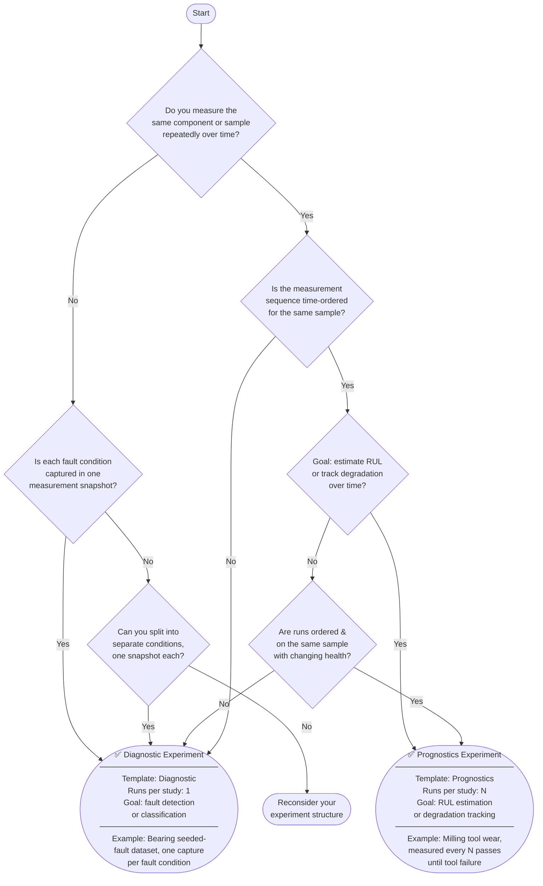

# ISA-PHM Concepts

Before opening the wizard, it helps to understand a handful of concepts. This page explains the ISA-PHM framework, why it exists, and how the wizard maps onto it.

---

## Why ISA-PHM?

Modern PHM (Prognostics and Health Management) experiments produce measurements, but the measurements alone are not reusable. To reproduce, compare, or publish results you also need to know:

- What equipment was used and how it was set up
- What faults were seeded and under what operating conditions
- How raw signals were processed into features

ISA-PHM is a standardized format that captures all of this metadata alongside the data files, following the FAIR principles (Findable, Accessible, Interoperable, Reusable). It reuses the ISA (Investigation–Study–Assay) framework, which is widely adopted in life sciences, adapting it for PHM experiments.

---

## The ISA Hierarchy

ISA-PHM organizes everything into three levels:

```
Investigation  ← the whole project (title, description, contacts, publications)
  └── Study      ← one experiment or test case (one fault condition, one setup variant)
        └── Assay  ← the actual measurement or processed output file, linked to a sensor
```

### Investigation

The top-level container. One project = one investigation. It holds:
- Project title and description
- License
- Dates (data collection, public release)
- Contact list and publication list

### Study

Each distinct experiment within the project. In PHM terms, a study typically represents one fault condition or one configuration variant tested. Examples:
- Bearing with BPFO fault, severity level 1
- Milling pass at 200 RPM, fresh tool

A study can have one run (diagnostic template) or multiple sequential runs (prognostic template).

### Assay

The measurements linked to a study. Each assay represents the output of **one sensor channel** for **one run**.

> **Key rule:** An assay data file always has **exactly two columns** — a timestamp column and a **single measurement value** column. One sensor channel → one assay file.

**Multi-axis sensors must be split into separate entries.** A tri-axis accelerometer (X, Y, Z) produces **three assays** — one per axis. In the wizard this means registering three separate sensor entries in the test setup, not one.

<details>
<summary>Example — tri-axis accelerometer</summary>

Instead of one sensor entry `acc`:

| Alias | Type |
|-------|------|
| `acc` | Accelerometer |

Define **three** sensor entries, one per axis:

| Alias   | Type          |
|---------|---------------|
| `acc_x` | Accelerometer |
| `acc_y` | Accelerometer |
| `acc_z` | Accelerometer |

Each will generate its own two-column assay file in the output JSON:

```
timestamp, acc_x
0.000,     0.012
0.001,     0.015
...
```

```
timestamp, acc_y
0.000,    -0.003
0.001,    -0.001
...
```

</details>

Assays are constructed automatically from the study–sensor–run mappings you fill in on Slides 9 and 10. **One populated cell in that grid = one assay entry** in the output JSON.

---

## The Test Setup

Before (or alongside) filling in the ISA hierarchy, you define a **Test Setup** — the reusable description of your physical lab bench. It contains:

- **Characteristics** — fixed hardware properties (motor type, bearing model, nominal power)
- **Sensors** — every measurement channel (alias, model, type)
- **Configurations** — named variants of the setup (e.g. healthy bearing vs. faulted bearing)
- **Measurement Protocols** — how raw signals were acquired (sample rate, filter settings, etc.)
- **Processing Protocols** — how raw signals were turned into features (FFT, windowing, etc.)

Test setups are shared across projects. Once you have defined a setup for a lab bench, any future project on the same bench reuses it rather than re-entering everything.

---

## Single-Run vs. Multi-Run Templates

The wizard supports two templates, chosen once per project:

| Template | When to use | Paper equivalent |
|---|---|---|
| **Diagnostic Experiment** | Short tests with stable, injected faults — each study produces one file set | One row per Study in the ISA-PHM Study file |
| **Prognostics Experiment** | Degradation / run-to-failure — same study has multiple sequential trajectories | Multiple rows per Study, one per run |

Choose **Diagnostic** for bearing seeded-fault datasets, freeze-profile tests, or any experiment where each condition is measured once.

Choose **Prognostics** for milling tool wear, accelerated degradation, or any experiment where the same sample is measured repeatedly over time.

### Decision Flowchart

Not sure which template applies to your experiment? Work through the questions below:



#### Quick rules of thumb

| Signal | Template |
|---|---|
| Fault **seeded** (known size, known location) measured **once** per condition | Diagnostic |
| Fault **injected artificially** at different severity levels | Diagnostic |
| Same component measured at **regular intervals** as it wears/ages | Prognostics |
| Test ends at **failure** (run-to-failure) | Prognostics |
| Dataset has a **RUL label** per sample | Prognostics |
| Dataset has a **fault class label** per sample | Diagnostic |

The template choice affects:
- Slide 5 (Experiment Descriptions) — shows a `Number of runs` field only for prognostics
- Slide 8 (Test Matrix) — columns multiply per run for prognostics
- Slides 9 & 10 (Output mapping) — rows multiply per run

---

## How Study Variables Work

Study variables are the conditions that differ between studies. They come in two flavours:

| Flavour | Slide | Type options | Example |
|---|---|---|---|
| **Fault Specifications** | Slide 6 | Qualitative fault spec, Quantitative fault spec, Damage, RUL, Other | Fault Type = BPFO, Fault Severity = 2 |
| **Operating Conditions** | Slide 7 | Operating condition | Motor Speed = 1300 RPM, Load = 50 N |

On Slide 8 (Test Matrix) you assign a value for each variable to each study (or run). This is what makes each study description unique and machine-readable.

> **Note (prognostic tests):** The ISA-PHM paper specifies that time-varying operating conditions in long-term degradation tests should be stored as separate time series files (one per variable per run), synchronised to a reference timestamp. The wizard currently captures operating conditions as scalar values only — time-varying file-based operating conditions are out of scope for this version.

---

## The Export

Pressing **Convert to ISA-PHM** sends your metadata to a backend conversion service. It returns a `.json` file containing the full ISA-PHM structured metadata, including the investigation, all studies, and all assays.

This file can be deposited alongside your raw data in a data repository to make the dataset FAIR-compliant.

---

## Dependency Chain

Many things in the wizard depend on other things existing first. The correct order is:

```
1. Create Test Setup
   ├─ Add sensors
   ├─ Add configurations
   ├─ Add measurement protocols (after sensors)
   └─ Add processing protocols (after sensors)

2. Create Project
   └─ Link it to the test setup

3. Fill Questionnaire
   ├─ Slides 2–4: investigation-level metadata (independent)
   ├─ Slide 5: experiments (requires configurations from test setup)
   ├─ Slides 6–7: study variables (independent)
   ├─ Slide 8: test matrix (requires studies + variables)
   ├─ Slide 9: raw output mapping (requires studies + sensors + measurement protocols)
   └─ Slide 10: processed output mapping (requires studies + sensors + processing protocols)

4. Convert to ISA-PHM
```

If a dropdown on a later slide is empty, something earlier in this chain is missing. See [Troubleshooting](./TROUBLESHOOTING.md).

---

## Related guides

- [Quick Start — first project from blank to export](./GUIDE_QUICKSTART.md)
- [Project Management — create, configure, import, export](./GUIDE_PROJECT_MANAGEMENT.md)
- [Test Setups — build your lab bench description](./GUIDE_TEST_SETUPS.md)
- [Questionnaire — fill all 10 slides](./GUIDE_QUESTIONNAIRE.md)
