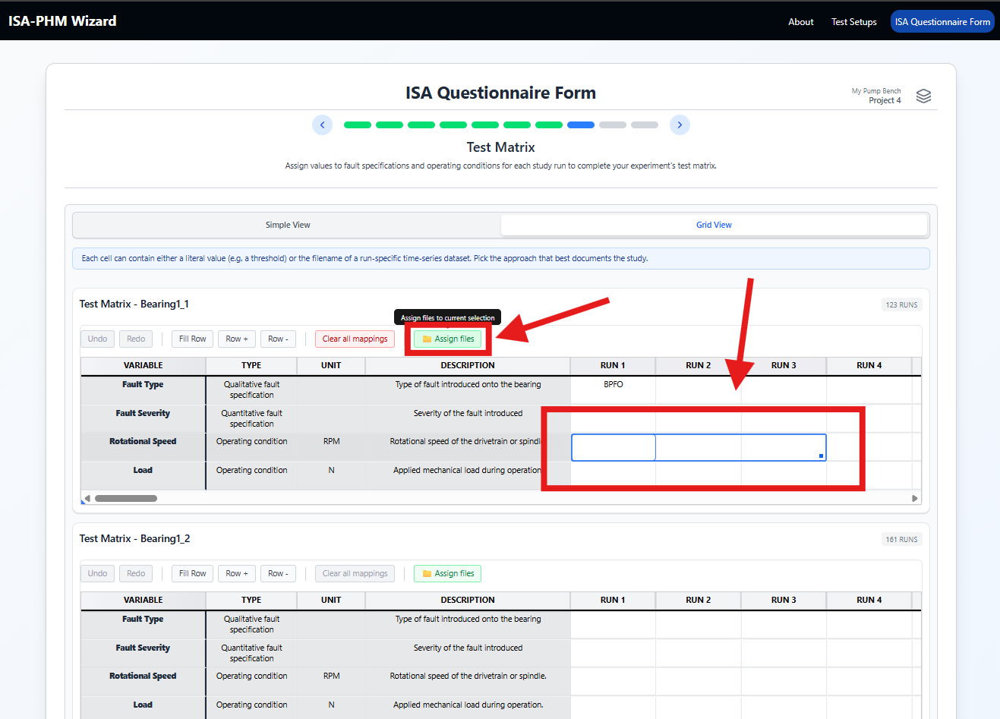
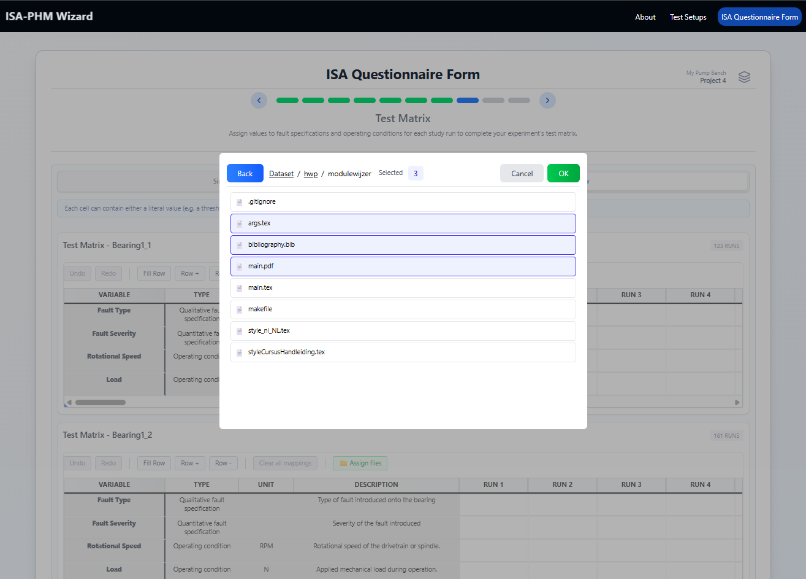

# Guide — Working with the Grid

The data grid is used on Slides 8, 9, and 10 to map variable values and file paths to experiments and runs. This guide covers navigation, the row toolbar actions, and the file picker for bulk file assignment.

---

## Grid view vs Simple view

Most mapping slides offer two view modes toggled by a button in the header:

| Mode | Best for |
|---|---|
| **Grid view** | Seeing and editing many experiments at once in a table layout |
| **Simple view** | Focusing on one experiment at a time with labelled fields |

<table><tr>
  <td></td>
  <td></td>
</tr>
<tr>
  <td align="center"><em>Grid view</em></td>
  <td align="center"><em>Simple view</em></td>
</tr></table>

Both views write to the same underlying data — switching between them at any point is safe.

---

## Navigation and editing

| Action | Result |
|---|---|
| **Click** a cell | Select and enter edit mode |
| **Tab** | Move to the next editable cell (left to right within a row, then wraps to next row) |
| **Arrow keys** | Move selection between cells without editing |
| **Enter** | Confirm an edit and move down |
| **Escape** | Cancel the current edit |
| **Ctrl + Z** | Undo the last cell edit (within the session) |
| **Ctrl + Y** | Redo |

> **Tip:** Tab through all cells in a row to fill one full experiment/run, then continue to the next.


---

## Row toolbar actions

The row toolbar appears in the grid controls bar (above the grid). Three bulk-fill buttons are available when a row or range is selected:

### Fill Row

Fills **all editable cells** in the selected row(s) with the **same constant value**.

1. Select a row (or drag/Shift+Click to select multiple rows).
2. Click **Fill Row**.
3. A prompt asks for the value to fill.
4. All editable cells in the selection are set to that value.

Useful for operating conditions that are constant across all runs (e.g. material = `Steel` for every row).

### Row +

Fills selected row(s) with **incrementing values** — a sequence starting at a given value and stepping up by a fixed amount.

1. Select the row(s) to fill.
2. Click **Row +**.
3. A prompt asks for the **start value** (e.g. `0`).
4. A second prompt asks for the **step size** (e.g. `1`).
5. Cells are filled left to right: `start`, `start + step`, `start + 2×step`, …

Useful for run indices, sequence numbers, or linearly spaced load values.

### Row −

Same as **Row +** but fills with **decrementing values** — the sequence counts down by the step each column.

> **All three fill actions respect undo.** Press Ctrl+Z immediately after to revert the fill.

---

## Assign Files (File Picker)

The file picker lets you browse your indexed dataset and assign file paths to cells in bulk, instead of typing them manually. It is available on Slides 8 (Prognostics projects), 9, and 10 when a dataset has been indexed for the active project.

### Prerequisites

Before the file picker is available you must index a dataset folder in the Project Sessions modal. See [Step 3 — Dataset indexation](./GUIDE_PROJECT_MANAGEMENT.md#step-3--dataset-indexation-skippable).

> **Always index the root folder of your dataset**, not a subfolder. All file paths written into the output JSON are relative to the folder you indexed. After exporting, place the JSON in that same root so the relative paths resolve correctly when the dataset is shared.

### Opening the file picker

1. **Select the cells** you want to fill — click a cell, or drag / Shift+Click to select multiple cells.
2. The **Assign Files** button appears in the grid toolbar.
3. Click it to open the file browser.



### File browser controls

In the file browser, files from the indexed dataset are listed in alphabetical order by filename.

| Action | Result |
|---|---|
| **Click** a file | Select that file (deselects any previous selection) |
| **Ctrl + Click** | Add or remove a single file from the selection |
| **Shift + Click** | Select a contiguous range from the last clicked item to the current one |
| **Navigation buttons** (prev / next page) | Browse through large indexed directories |



### Fill behaviour

Files are assigned to cells **left to right** in the order they appear in the file browser (alphabetical by filename). The number of files selected versus the number of selected cells controls the outcome:

| Files picked | Cells selected | Result |
|---|---|---|
| Equal | Equal | Every cell receives exactly one file — perfect match |
| Fewer than cells | More | Cells filled left to right; remaining cells on the right are **left blank** |
| More than cells | Fewer | Files assigned left to right up to the last cell; extra files are **ignored** |

#### Example — fewer files than cells

You select 4 cells and pick 2 files (`run_01.csv`, `run_02.csv`):

```
Cell 1 → run_01.csv
Cell 2 → run_02.csv
Cell 3 → (blank)
Cell 4 → (blank)
```

#### Example — more files than cells

You select 2 cells and pick 4 files (`run_01.csv`, `run_02.csv`, `run_03.csv`, `run_04.csv`):

```
Cell 1 → run_01.csv
Cell 2 → run_02.csv
run_03.csv → (ignored)
run_04.csv → (ignored)
```

### Left-to-right order and file naming

Because the file picker fills cells in alphabetical file order, **your filenames must sort alphabetically in the same order as your columns**.

If your sensor columns are (left to right) `acc_x`, `acc_y`, `acc_z`, your files should sort in that same order:

```
study01_acc_x_run1.csv  →  acc_x column
study01_acc_y_run1.csv  →  acc_y column
study01_acc_z_run1.csv  →  acc_z column
```

If your files sort in a different order than your columns, the assignment will be wrong. Rename files or reorder columns to align them before using bulk assignment.

> **Tip:** Design your file naming convention before collecting data. A consistent pattern like `{study}_{sensor}_{run}.{ext}` sorts predictably and maps cleanly to the columns defined in the test setup.

### Root folder and relative paths

The file picker writes **relative paths** — paths relative to the indexed root folder, not absolute paths. This is intentional so the JSON remains portable. Paths always start with `./`.

| Dataset root | File location | Path written in JSON |
|---|---|---|
| `pump_bench/` | `pump_bench/vibration/run1_ch1.csv` | `./vibration/run1_ch1.csv` |
| `pump_bench/` | `pump_bench/run1_vib_ch1.csv` | `./run1_vib_ch1.csv` |

After exporting the JSON, place it at the same root level (`pump_bench/`) and zip the entire folder. Whoever extracts it will have the JSON at the root with all relative paths correctly resolving to the data files beneath it.

### Where the file picker is available

| Slide | When |
|---|---|
| **8 — Test Matrix** | Prognostics projects only, for variable value cells |
| **9 — Raw Measurement Output** | Any project with a dataset indexed |
| **10 — Processing Protocol Output** | Any project with a dataset indexed |

For diagnostics test matrix cells (Slide 8), the file picker does not appear — enter values as plain text or numbers directly in the grid.
