# Project Management

This guide covers everything related to creating, naming, configuring, switching, importing, and exporting projects in the ISA-PHM Wizard.

---

## The Project Sessions Modal

Every time you open the **ISA Questionnaire**, the Project Sessions modal appears first. This is where you manage all your projects.

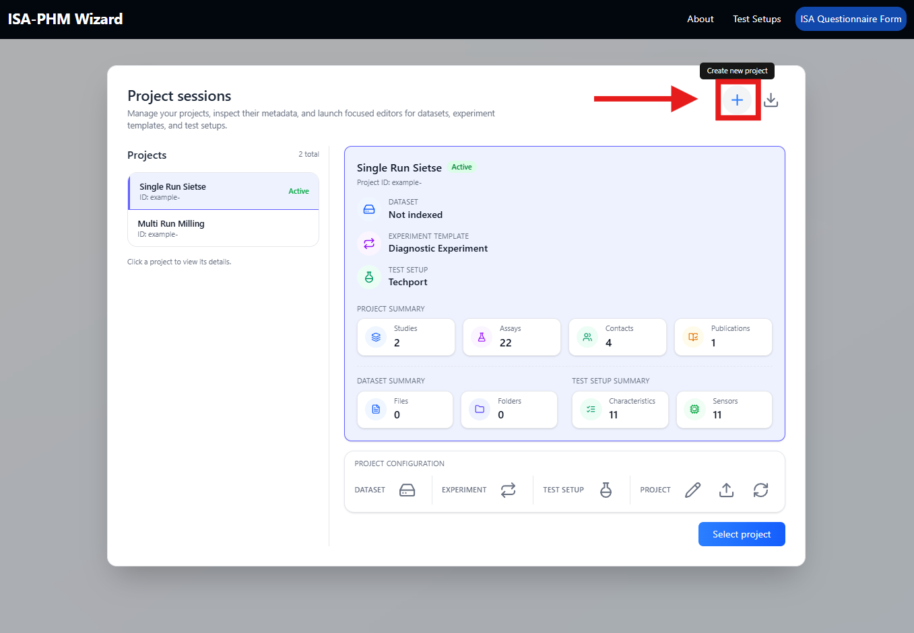

From this modal you can:
- Select the active project (click a project card)
- Create a new project
- Rename a project
- Delete a project
- Import a project from a JSON file
- Export a project to a JSON file
- Configure a project's template, test setup, and dataset

---

## Creating a New Project

1. Open **ISA Questionnaire**.
2. In the Project Sessions modal, click **Create New Project**.

This opens a short four-step setup wizard:

### Step 1 — Project name

Enter a name for the project. This is for your own reference only — it is not included in the exported metadata.

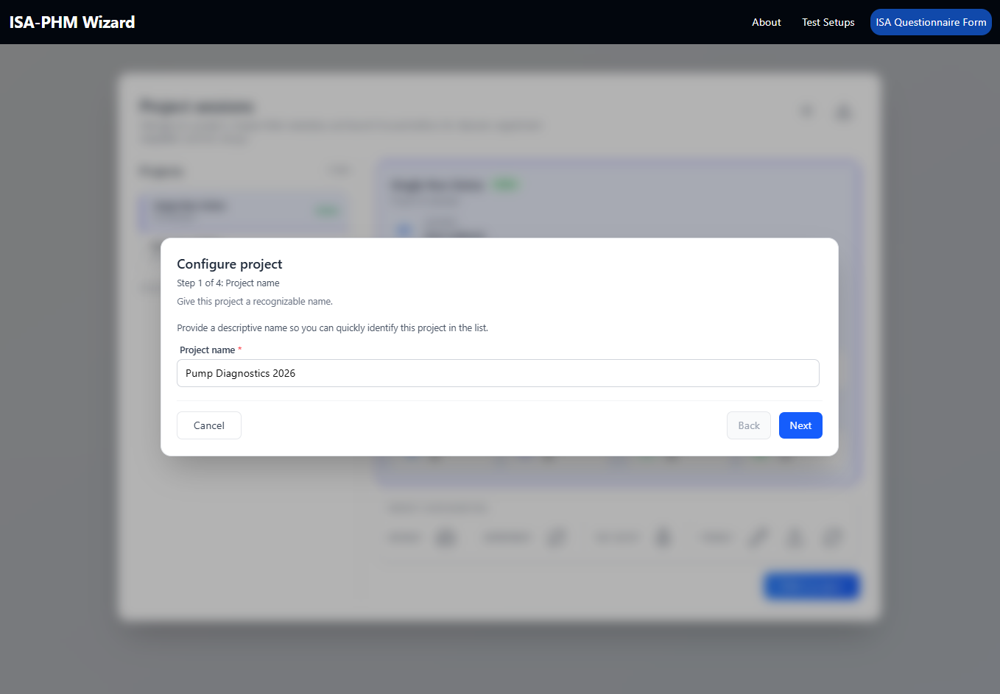

### Step 2 — Experiment type

Select the template that matches your experiment:

| Option | When to use |
|---|---|
| **Diagnostic Experiment** | Each study is one measurement snapshot (one fault condition, one run) |
| **Prognostics Experiment** | Each study contains multiple sequential runs (degradation / run-to-failure) |

Not sure which applies? → [Decision flowchart in ISA-PHM Concepts](./GUIDE_CONCEPTS.md#decision-flowchart)

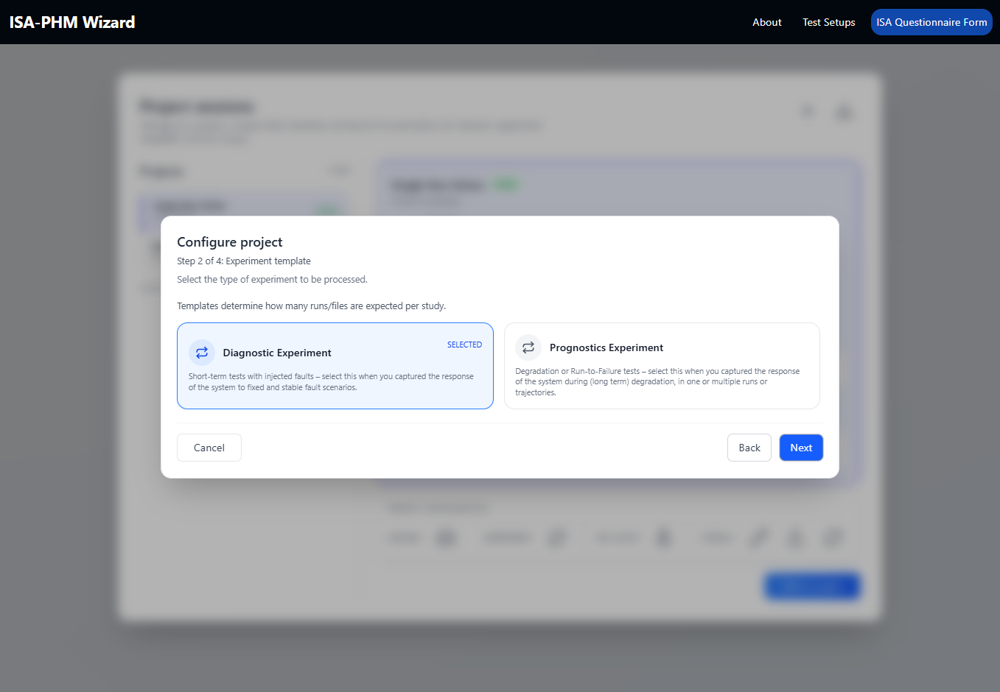

This choice affects the Test Matrix (Slide 8) and Output mapping slides (9 & 10). **You can change it later** from the project card, but doing so resets run-level mappings.

### Step 3 — Dataset indexation *(skippable)*

If you have a local dataset folder, index it here to enable the file picker on Slides 9–10 (and Slide 8 for prognostics projects).

> **Important — pick the root of your dataset.** The relative file paths written into the output JSON are relative to the folder you index here. After downloading the JSON, you place it in that same root folder alongside your data files. When the dataset is zipped and shared, whoever extracts it will have the JSON at the root with all file paths correctly resolving to the data files beneath it.
>
> **Example:** If your dataset root is `pump_bench/` and a file lives at `pump_bench/vibration/run1_ch1.csv`, the path written into the JSON will be `vibration/run1_ch1.csv`. That path is only correct if the JSON lives at `pump_bench/`.

Skip this step if you prefer to type file paths manually on Slides 9–10.

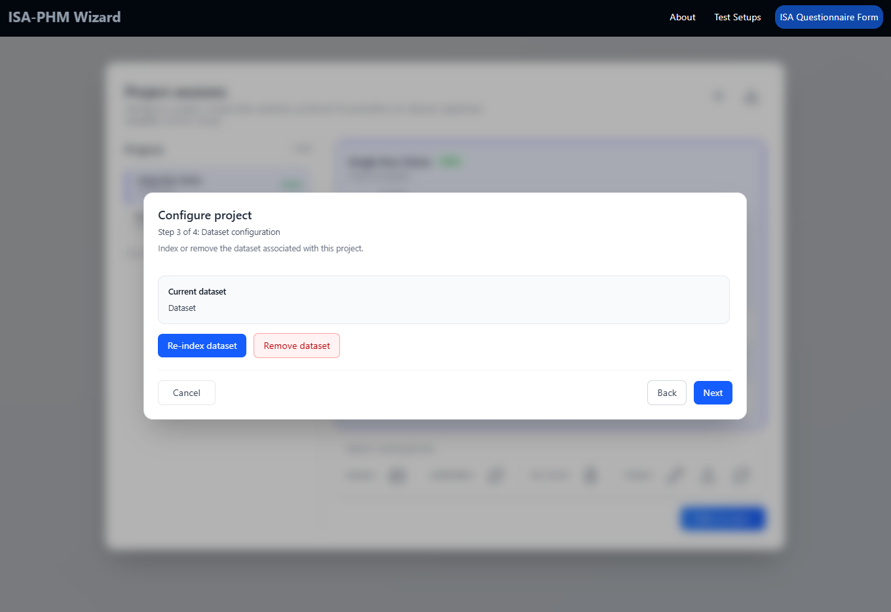

### Step 4 — Test setup selection

Select the test setup this project uses. Only one test setup can be active per project. The selected setup's sensors, configurations, and protocols become available throughout the questionnaire.

If no test setups exist yet, create one first: see [Test Setups Guide](./GUIDE_TEST_SETUPS.md).

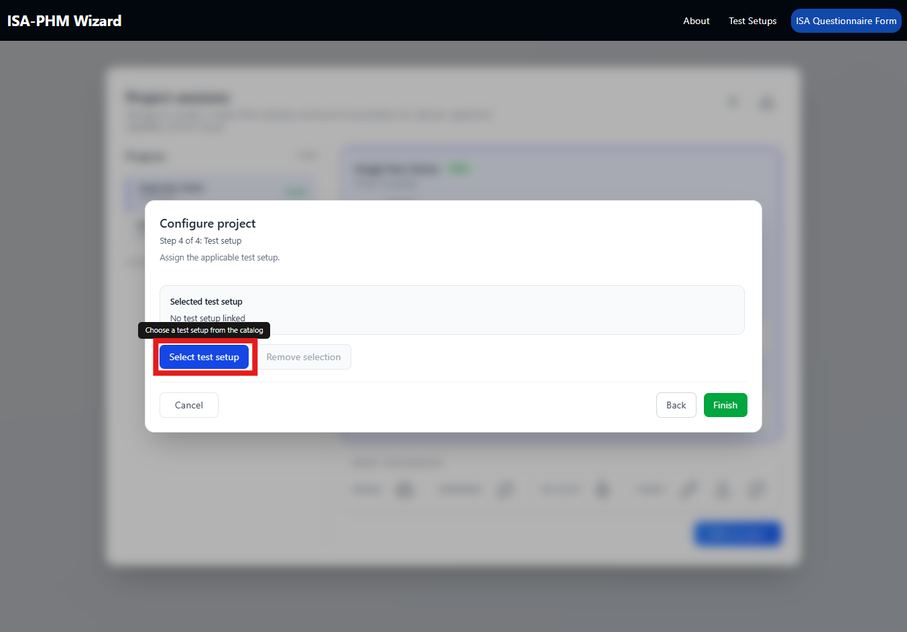

After confirming, the new project card appears in the modal. Click **Select** to make it active and enter the questionnaire.

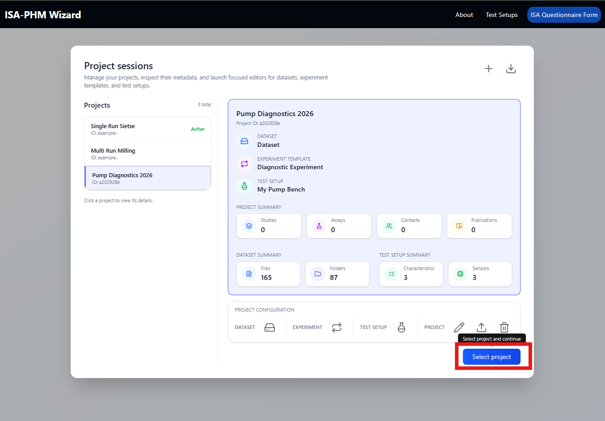

---

## Configuring a Project

The four configuration sections are set during the creation wizard (above) but can all be changed later from the project card in the modal.

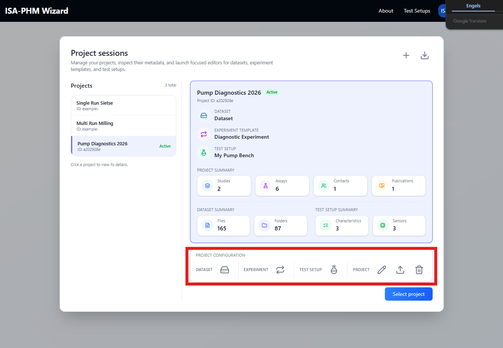

From left to right:

| Icon | Button | Description |
|---|---|---|
| 📁 | **Dataset** | Index a local dataset folder to enable the file picker on Slides 9–10. File paths in the output JSON will be relative to this folder. |
| 🔄 | **Experiment** | Change the experiment type (Diagnostic or Prognostics). Changing this resets run-level mappings. |
| 🧪 | **Test Setup** | Switch the test setup linked to this project. The selected setup's sensors, configurations, and protocols become available throughout the questionnaire. |
| ✏️ | **Rename** | Rename the project display name (not exported). |
| 📤 | **Export** | Download the project as a JSON file for backup or sharing on another machine. |
| 🗑️ | **Delete** | Permanently remove the project from localStorage. This cannot be undone. |

---

## Selecting the Active Project

Click a project card (or a **Select** / **Open** button) to make it the active project. The questionnaire loads that project's data.

---

## Importing a Project

Use **Import** in the Project Sessions modal to load a previously exported project JSON file. The file contains all project data and the test setup it used.

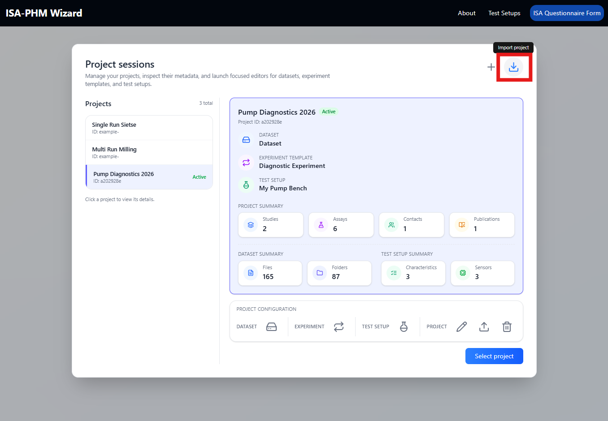

> The two built-in example projects (`Single Run Sietze` and `Multi Run Milling`) are loaded this way — they ship as JSON files in `src/data/`.

---

## Exporting a Project

Use **Export** on a project card to download it as a JSON file. This file:
- Captures all questionnaire data for that project
- Includes the linked test setup snapshot
- Can be shared, backed up, or re-imported on another machine

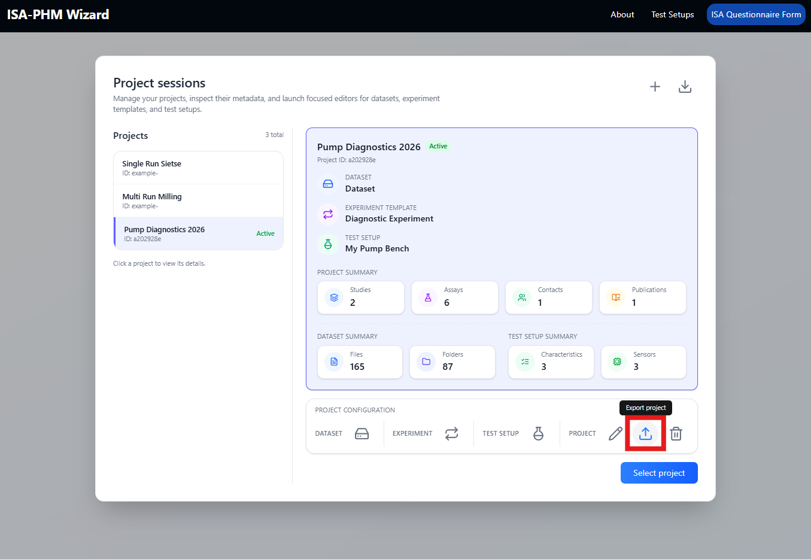

---

## Deleting a Project

Click the delete icon on a project card. A confirmation dialog appears.

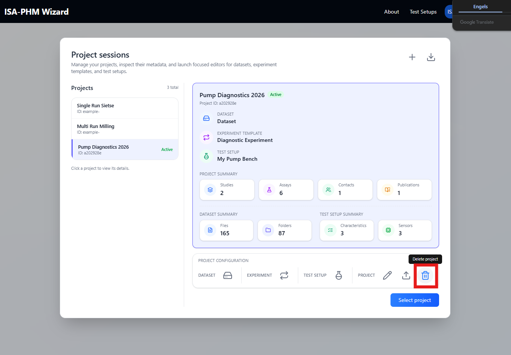

> All data for that project is removed from localStorage. This cannot be undone.

---

## Data Persistence

All project data is stored in the browser's **localStorage** (no server-side save). This means:
- Data persists across page reloads within the same browser
- Data is **lost** if you clear browser storage
- Data does **not** sync between different browsers or devices

**Use Export regularly** to back up work in progress.

### Clearing all data

If you want to start completely fresh — removing all projects, test setups, and settings — you can wipe the app's localStorage directly from your browser's developer tools:

1. Open **DevTools** (`F12` or `Ctrl+Shift+I` / `Cmd+Option+I` on Mac).
2. Go to the **Application** tab (Chrome/Edge) or **Storage** tab (Firefox).
3. In the left sidebar, expand **Local Storage** and click the entry for the app's URL.
4. Press the 🚫 **Clear all** button (the icon that looks like a no-entry sign), or right-click the URL entry and choose **Clear**.
5. Reload the page — the app will start as if freshly installed.

> **Warning:** This deletes everything permanently. Export any projects you want to keep first.

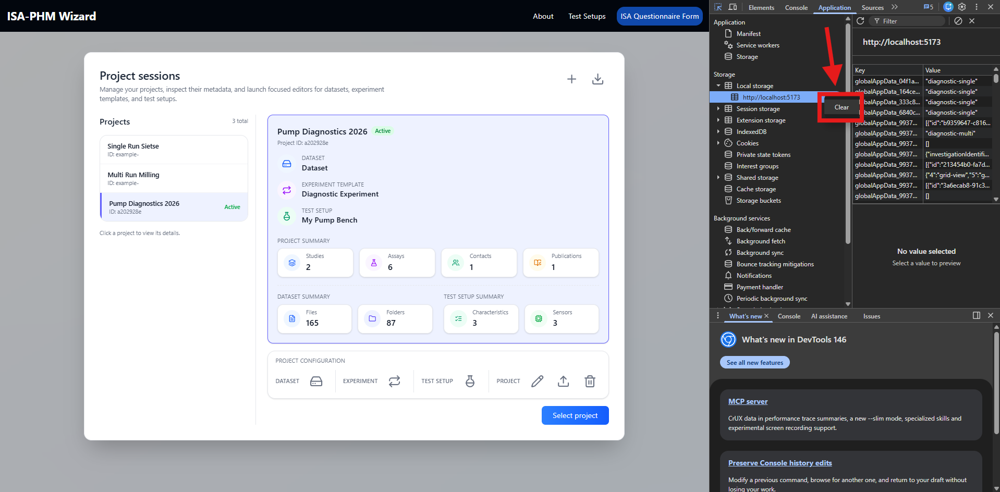

---

## Related guides

- [ISA-PHM Concepts](./GUIDE_CONCEPTS.md) — understanding Investigation/Study/Assay and why setup comes first
- [Test Setups](./GUIDE_TEST_SETUPS.md) — creating the test setup before linking it to a project
- [Export Guide](./GUIDE_EXPORT.md) — what happens after Convert to ISA-PHM
