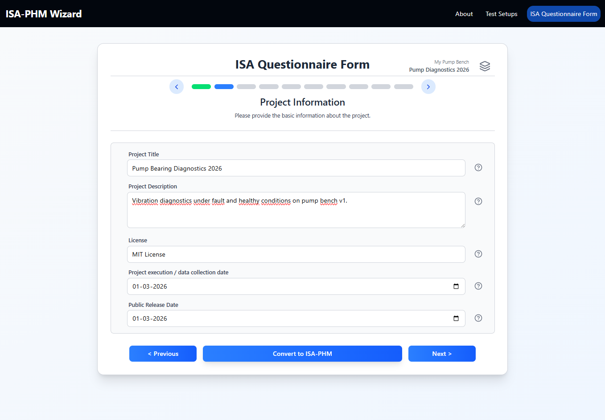
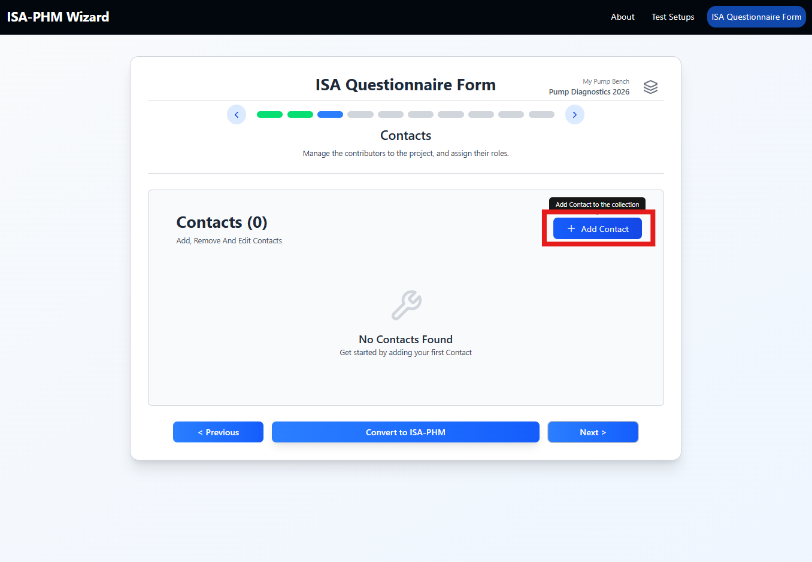
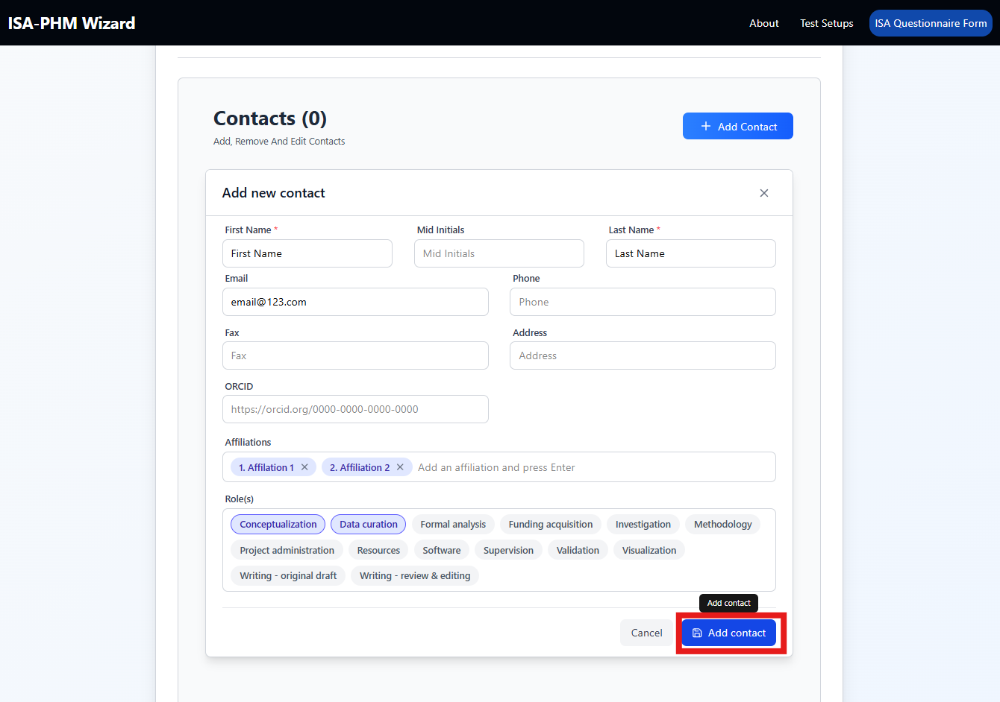
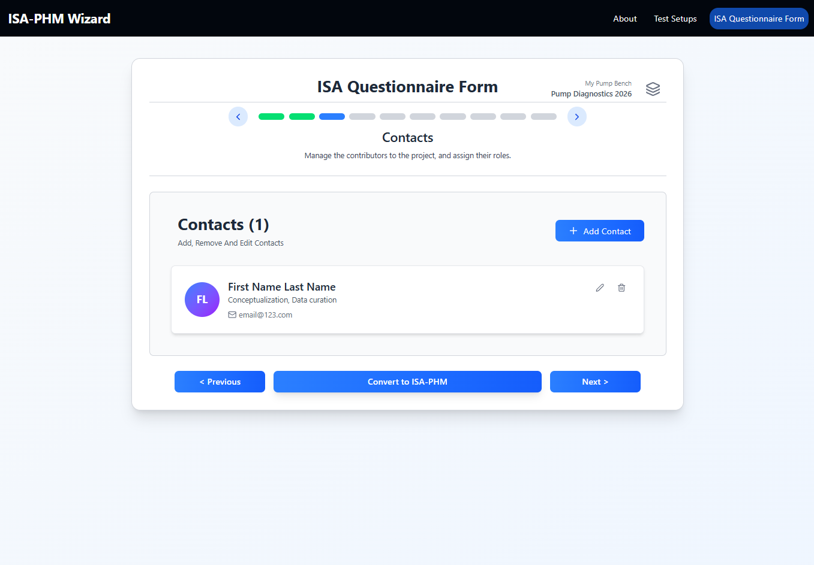
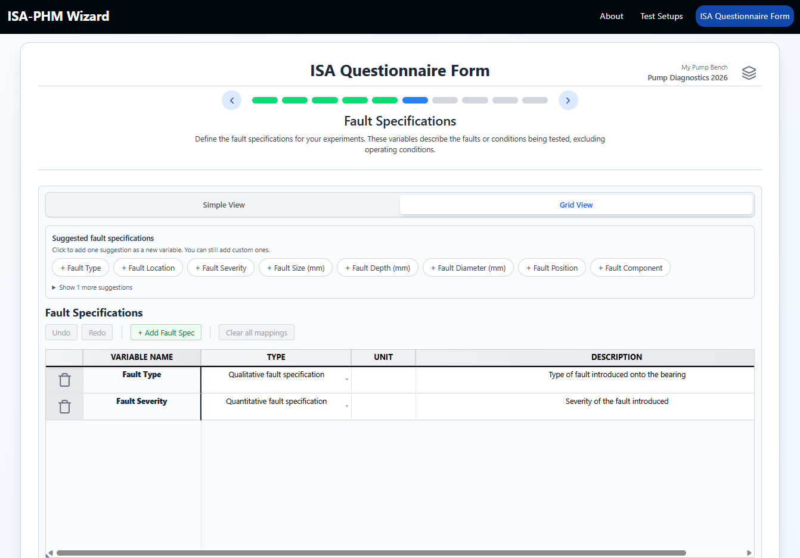
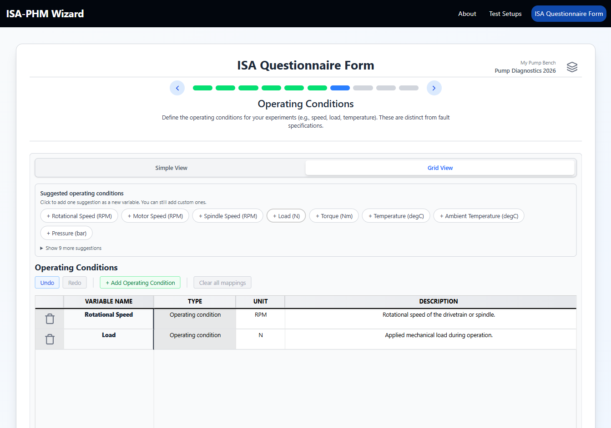
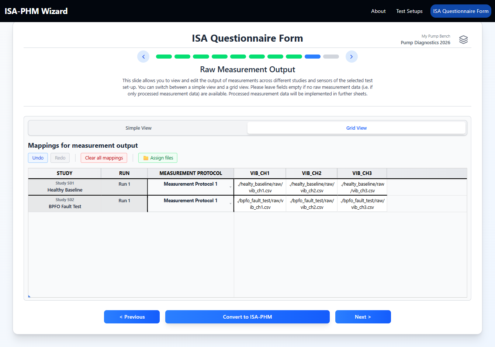
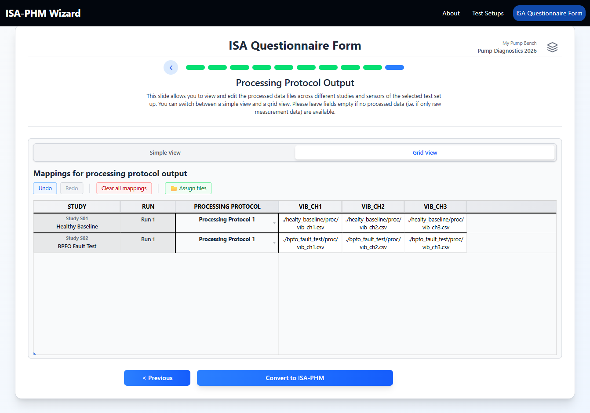
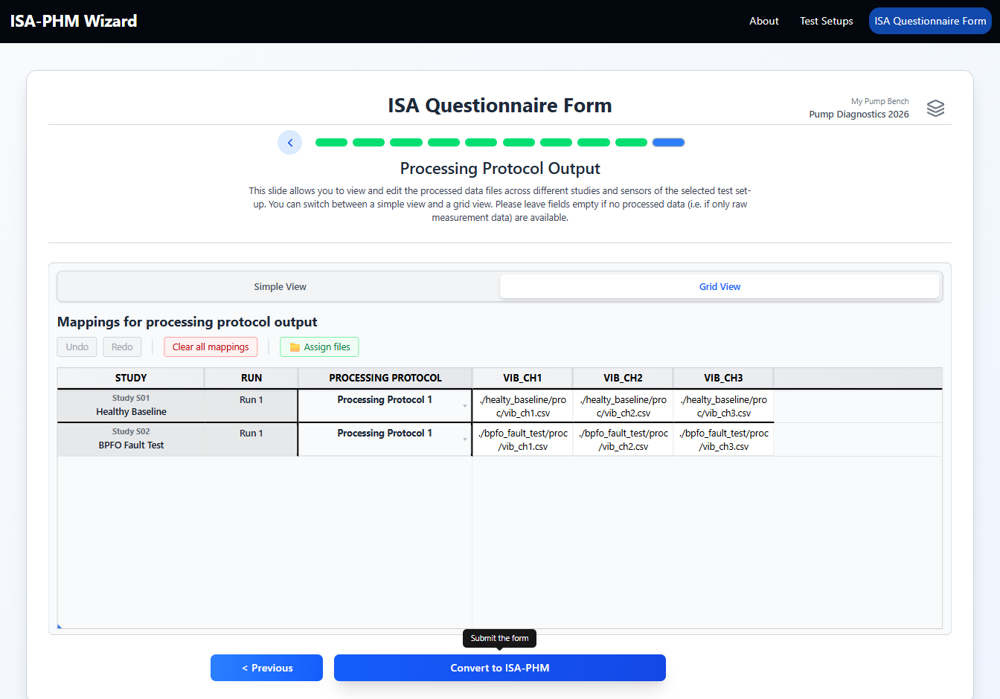
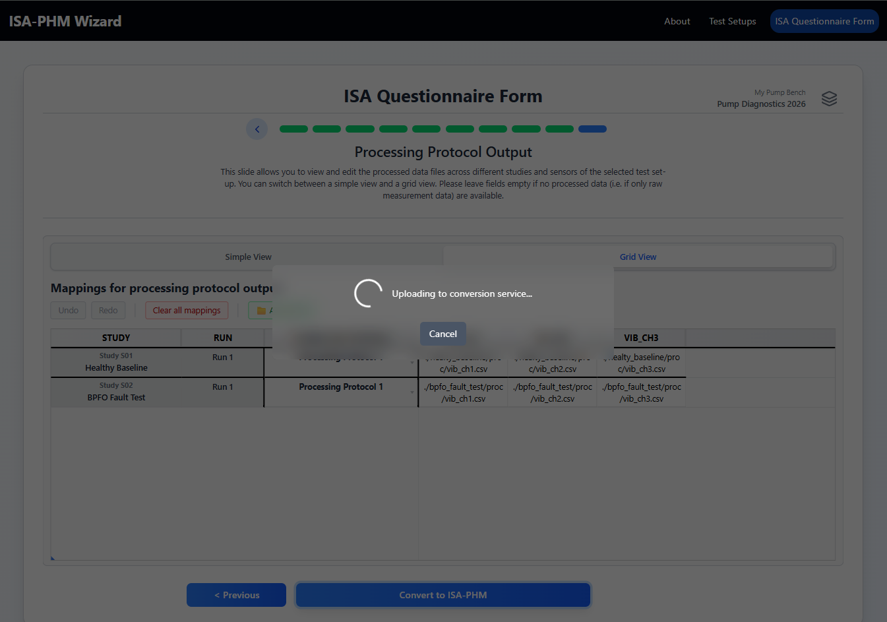

# Quick Start — First ISA-PHM Project

This page takes you from a completely fresh install to a converted ISA-PHM export in the shortest possible path. It uses a simple artificia scenario so every field has a concrete example value.

**Scenario used in this guide:** A single-run bearing diagnostics test on a small motor-pump bench.  
For real-world filled examples, see [Example: Sietze (single-run)](../examples/EXAMPLE_SIETZE.md) and [Example: Milling (multi-run)](../examples/EXAMPLE_MILLING.md).

---

## Before you start

Open the app. You will land on the Home page.

> **Live app:** [https://nathanhouwaart.github.io/ISA-PHM-Wizard/](https://nathanhouwaart.github.io/ISA-PHM-Wizard/)

---

## Step 1 — Build a Test Setup

Test setups must exist before you create a project, because a project links to one.

1. Click **Test Setups** from the Home page.
2. Click **Add Test Setup**.

### 1a — Basic Info tab

Fill in the required fields:

| Field | Example value |
|---|---|
| Name | My Pump Bench |
| Location | Lab A, Building 2 |
| Experiment Preparation Protocol Name | Standard bearing swap |
| Set-up or test specimen-name | Pump bench v1 |

### 1b — Characteristics tab

Document the fixed hardware properties of your test rig — anything that doesn't change between experiments.

1. Click **+ Add Characteristic**.
2. Add a few key properties:

| Category | Value | Unit |
|---|---|---|
| Motor | WEG W21 | |
| Motor Power | 2.2 | kW |
| Pump Bearing | 6308.2Z.C3 | |

> **Tip:** Include model numbers, bearing designations, and rated specifications — enough for someone else to replicate your setup.

### 1c — Sensors tab

1. Click **+ Add Sensor**.
2. Add at least one sensor:

| Field | Example |
|---|---|
| Alias | vib_ch1 |
| Sensor Model | PCB 352C33 |
| Sensor Type | Accelerometer |
| Measurement Type | Vibration |

> **Why this matters:** Every sensor you define here becomes a column in the measurement and processing output mapping grids (Slides 9 & 10).

### 1d — Configurations tab

A configuration defines the rig with the **specific physical components installed** for a given experiment - the ISA-PHM "Sample". For example, in a bearing test bench it is important to know which specific bearing (ID) is used, even if the introduced fault is the same.  Include the component designation and a unique ID, to unambiguously describe the used set-up.

1. Click **+ Add Configuration**.
2. Add two configurations:

| Name | Replaceable Component ID |
|---|---|
| `Bearing #101 - 6309.C4` | `RC-001` |
| `Bearing #201 - 6309.C4` | `RC-002` |

> **Tip:** Include the bearing designation (or impeller model, tool spec) in the name — "Healthy Bearing" alone tells a reader nothing about which bearing was used.

### 1e — Measurement Protocols tab

1. Click **+ Add Protocol Variant** (or similar button).
2. Name it `Standard Acquisition`.
3. Add a parameter using the suggestions strip or **+ Add parameter**:
   - Parameter: `Sampling Rate`, Unit: `kHz`, Value for vib_ch1: `25.6`

### 1f — Processing Protocols tab

Same pattern. Name it `FFT Feature Extraction`. Add at least one parameter.

### 1g — Save

Click **Add Test Setup** or **Update Test Setup** at the bottom.

---

## Step 2 — Create a Project

Click **ISA Questionnaire** in the navbar or Home page. The **Project Sessions** modal opens — this is where you create and manage projects before entering the questionnaire.

Click **Create New Project**. This walks you through four short setup slides:

### 2a — Project name

Enter a name for the project, e.g. `Pump Diagnostics 2026`. This is for your own reference only — it is not exported.

### 2b — Experiment type

Select the template that matches your experiment:

| Option | When to use |
|---|---|
| **Diagnostic Experiment** | Each study is one measurement snapshot (one fault condition, one run) |
| **Prognostics Experiment** | Each study contains a longer duration measurement, cinsisting of one or multiple sequential runs (degradation / run-to-failure) |

Not sure which applies? → [Decision flowchart in ISA-PHM Concepts](./GUIDE_CONCEPTS.md#decision-flowchart)

For this guide, select **Diagnostic Experiment**.

### 2c — Dataset indexation *(skippable)*

If you have a local dataset folder, index it here to enable the file picker on Slides 9–10 (and Slide 8 for prognostics projects).

> **Important — pick the root of your dataset.** The relative file paths written into the output JSON are relative to the folder you index here. After downloading the JSON, you place it in that same root folder alongside your data files. When the dataset is zipped and shared, whoever extracts it will have the JSON at the root with all file paths correctly resolving to the data files beneath it.
> 
> **Example:** If your dataset root is `pump_bench/` and a file lives at `pump_bench/vibration/run1_ch1.csv`, the path written into the JSON will be `./vibration/run1_ch1.csv`. That path is only correct if the JSON lives at `pump_bench/`.

For this guide, skip this step — file names will be typed manually.

### 2d — Test setup selection

Select the test setup this project uses. Choose **My Pump Bench** (the one created in Step 1).

After confirming, click **Select** on the project card to make it the active project and enter the questionnaire.

---

## Step 3 — Fill the Questionnaire

You are now inside the 10-slide questionnaire.

### Slide 2 — Project Information

Fill:
- Title: `Pump Bearing Diagnostics 2026`
- Description: `Vibration diagnostics under fault and healthy conditions on pump bench v1.`
- License: `MIT License`
- Data collection date: `2026-03-01`
- Public release date: `2026-06-01`

Click **Next**.

### Slide 3 — Contacts

Click **Add Contact**. Fill first name, last name, email, and at least one role.

<table><tr>
  <td></td>
  <td></td>
  <td></td>
</tr></table>

Click **Next**.

### Slide 4 — Publications

Optional. Skip if you have no publication yet.

<table><tr>
  <td></td>
  <td></td>
  <td></td>
</tr></table>

Click **Next**.

### Slide 5 — Experiment Descriptions

Click **Add** (or **+**) to add two experiments. For each experiment, give it a name and select its **Configuration** (may be the same for the two experiments) from the dropdown:

| Name | Configuration |
|---|---|
| Healthy Baseline | `Bearing #101 - 6309.C4` |
| BPFO Fault Test | `Bearing #201 - 6309.C4` |

> **Note:** The **Configuration** dropdown is populated from the configurations you defined in the test setup (Step 1d). If the dropdown is empty, go back to the test setup editor → **Configurations** tab and add at least one configuration.

Click **Next**.

### Slide 6 — Fault Specifications

Click the suggestion chips to add:
- **Fault Type** (Qualitative fault specification)
- **Fault Severity** (Quantitative fault specification)

Click **Next**.

### Slide 7 — Operating Conditions

Click the suggestion chips to add:
- **Rotational Speed** (RPM)
- **Load** (N)

Click **Next**.

### Slide 8 — Test Matrix

For each experiment and each variable, enter the value that applies to that run:

| Study | Fault Type | Fault Severity | Rotational Speed | Load |
|---|---|---|---|---|
| Healthy Baseline | None | 0 | 1500 | 50 |
| BPFO Fault Test | BPFO | 1 | 1500 | 50 |

Click a cell in the grid and type the value, or use simple view to fill experiment by experiment.

> **Tip:** In grid view, Tab moves to the next cell and Enter confirms. This is the fastest way to fill the matrix when you have many experiments and variables.

Click **Next**.

### Slide 9 — Raw Measurement Output

1. For each experiment/run, select a **Measurement Protocol** from the dropdown (e.g. `Standard Acquisition`).
2. Fill in the file names (or values) per sensor and per run:
   - Healthy Baseline / vib_ch1: `healthy_run1_ch1.csv`
   - BPFO Fault Test / vib_ch1: `bpfo_sev1_ch1.csv`

Click **Next**.

### Slide 10 — Processing Protocol Output

Same pattern as Slide 9, using **Processing Protocol** (`Processing Protocol 1`).

---

## Step 4 — Convert to ISA-PHM

Click **Convert to ISA-PHM** (visible on the last slide or in the header area).

The wizard sends your metadata to the backend service and returns a downloadable `.json` file containing the full ISA-PHM structured metadata.

<table><tr>
  <td></td>
  <td></td>
</tr></table>

---

## What you created

A single **`isa-phm.json`** file containing the full ISA-PHM structured metadata for your project — investigation details, study descriptions, factor values, and assay entries with links to your data files (the relative paths you filled in on Slides 9–10).

This file is the metadata companion to your dataset. Place it in the root of your dataset folder alongside your `.csv` data files, then zip and deposit everything together to make the dataset FAIR-compliant.

---

## Next steps

- Read [ISA-PHM Concepts](./GUIDE_CONCEPTS.md) for a deeper explanation of what each file contains.
- Read [Guide: Export](./GUIDE_EXPORT.md) for details on the output format.
- Open **Single Run Sietze** or **Multi Run Milling** (pre-loaded example projects) to see a fully filled project.
