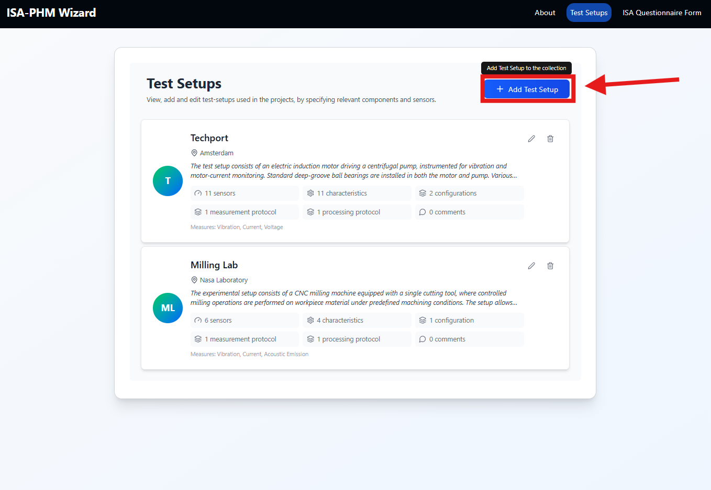
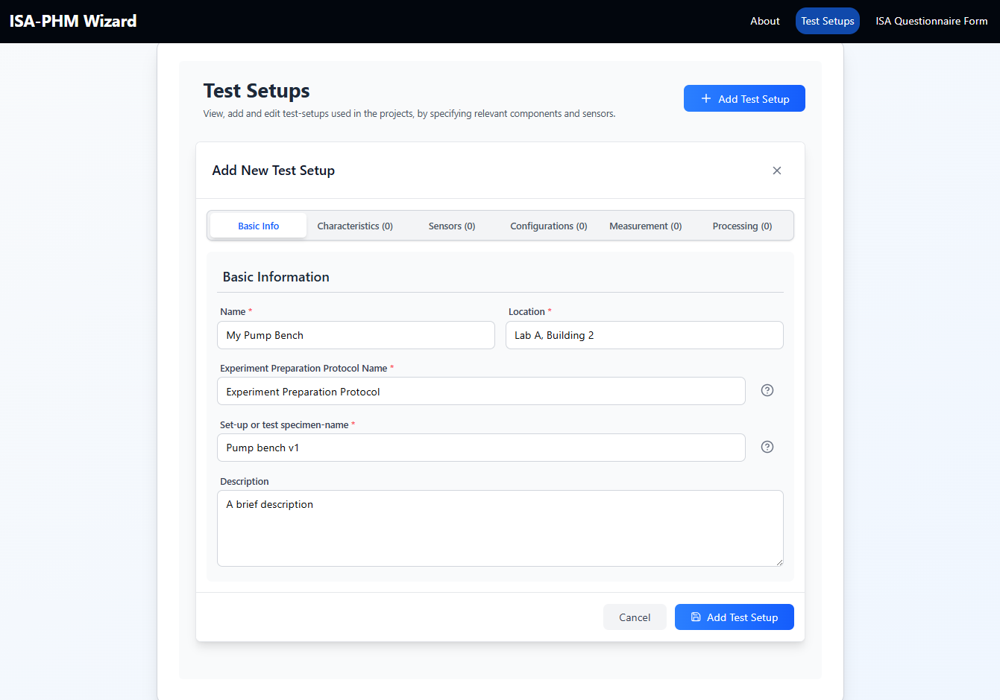
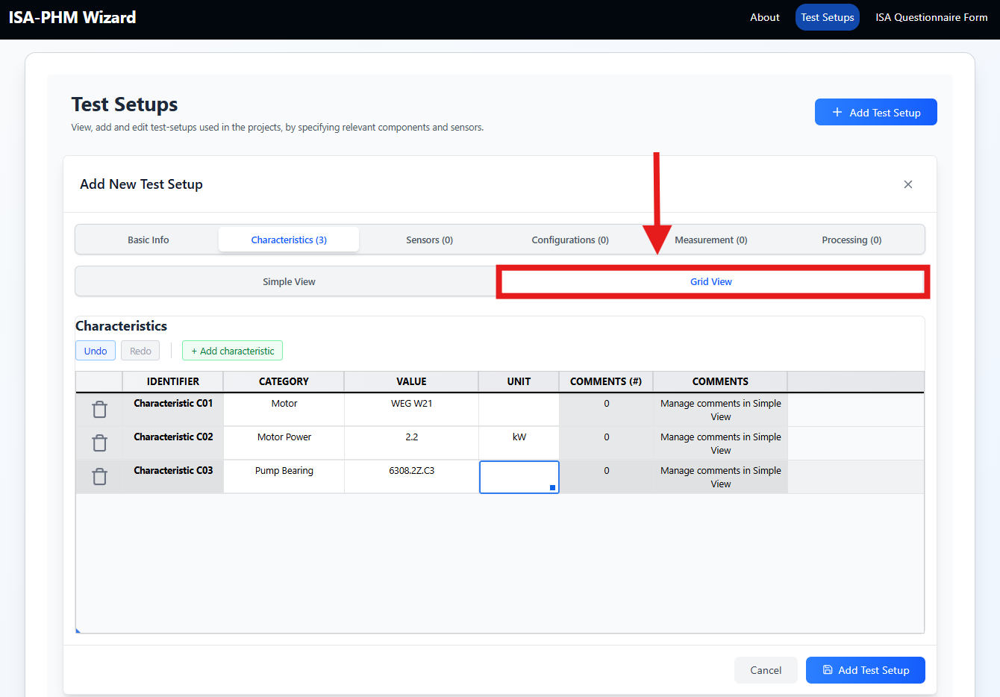
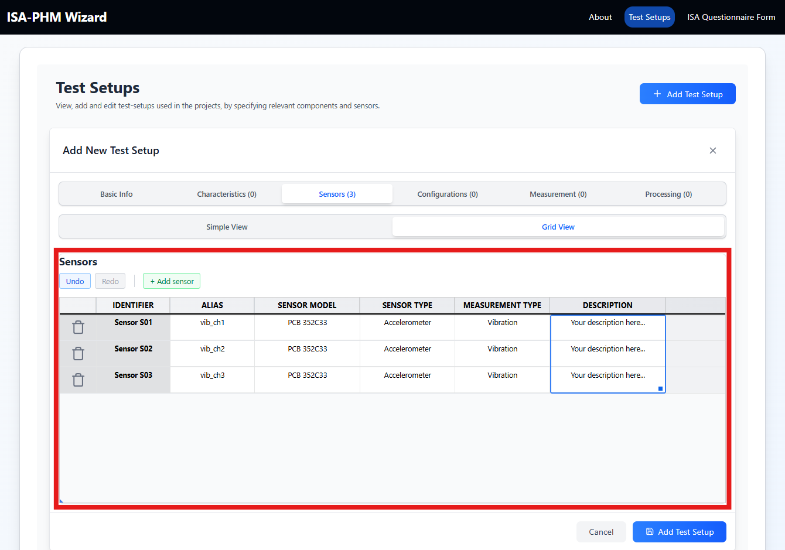
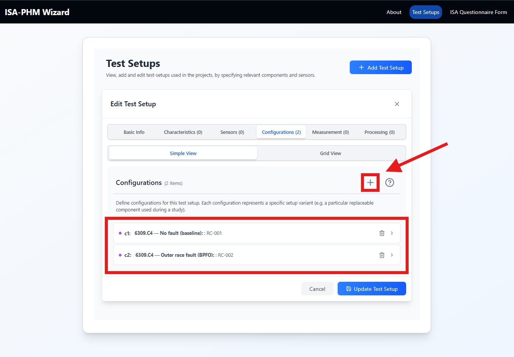
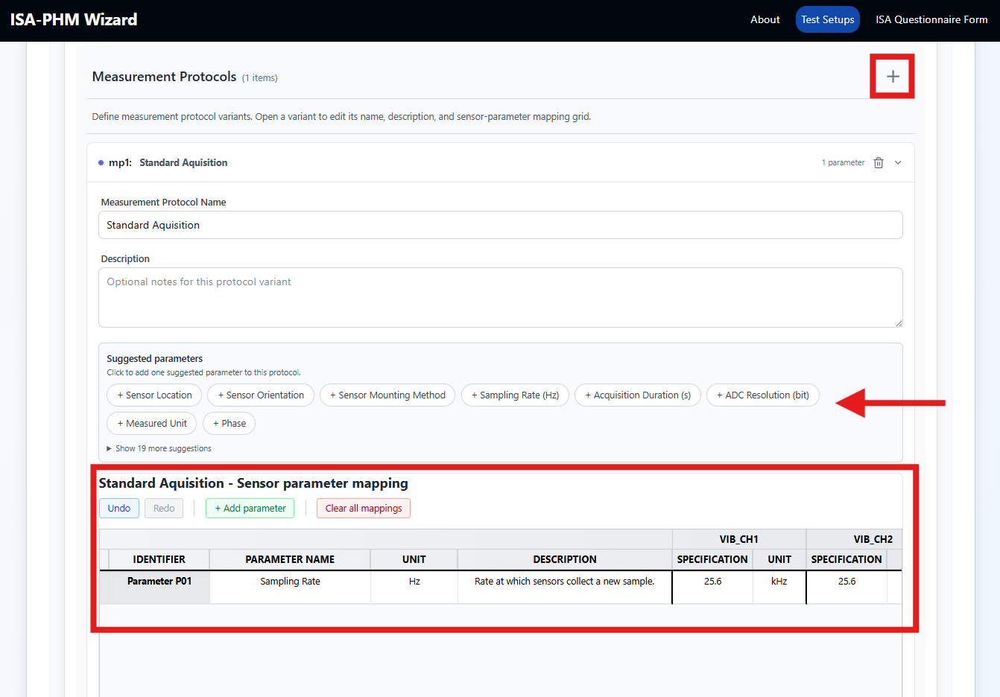
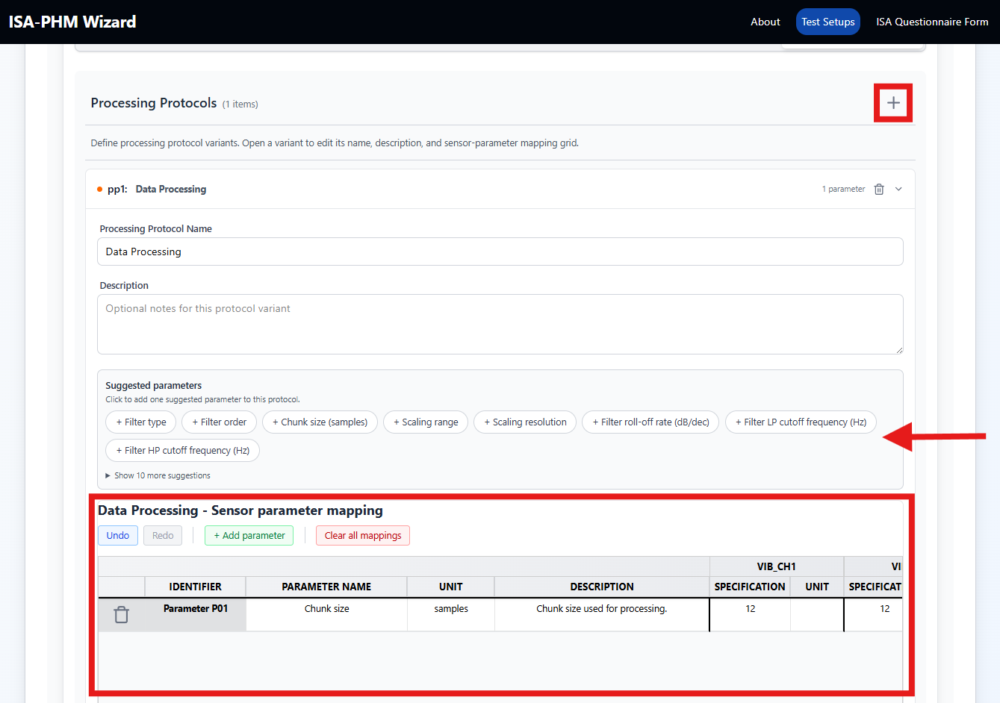
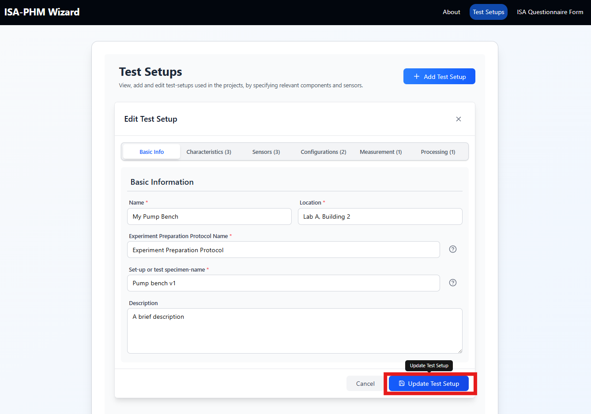

# Test Setups

A test setup is the reusable description of your lab bench — sensors, equipment properties, configurations, and protocols. It is defined once and shared across any number of projects.

This guide covers the full creation workflow. For per-tab field details, see the [test-setup-tabs](../test-setup-tabs/) folder.

---

## Why test setups come first

The questionnaire (Slides 5, 9, 10) depends on data that lives in the test setup:
- Slide 5 (Experiments) pulls **configurations** to let you link each study to a hardware state
- Slide 9 (Raw Output) pulls **sensors** and **measurement protocols**
- Slide 10 (Processed Output) pulls **sensors** and **processing protocols**

Empty dropdowns on those slides almost always mean the linked test setup is missing data. Build the setup completely before starting the questionnaire.

---

## Overview

[SCREENSHOT: Test Setups overview page — list of test setup cards, "Add Test Setup" button]

Each card shows the setup name, location, and sensor/configuration counts. Click the **pencil icon** to edit, the **trash icon** to delete.

---

## Creating a Test Setup

1. Click **Test Setups** in the navbar or Home page.
2. Click **Add Test Setup**.



3. The test setup editor opens with six tabs.

Fill the tabs in this recommended order:

```
1. Basic Info       ← required fields that identify the setup
2. Characteristics  ← fixed hardware properties
3. Sensors          ← measurement channels (must exist before protocols)
4. Configurations   ← hardware variants (must exist before experiments)
5. Measurement      ← raw acquisition protocol(s)
6. Processing       ← feature extraction protocol(s)
```

---

## Tab 1 — Basic Info

**Required fields (all four must be filled to save):**

| Field | Description | Example |
|---|---|---|
| Name | Display name for the setup | My Pump Bench |
| Location | Physical lab location | Lab A, Building 2 |
| Experiment Preparation Protocol Name | Name of the preparation/installation procedure | Standard bearing swap |
| Set-up or test specimen-name | Short identifier of the test rig or specimen | Pump bench v1 |

Optional: Description (free text, can be long).



---

## Tab 2 — Characteristics

Static hardware properties of the rig or its components — anything that doesn't change between experiments.

Each row has: **Category**, **Value**, **Unit**, optional **Comments** (simple view only).

Use the **+ Add Characteristic** button, or switch to **Grid view** for fast bulk entry.



Examples:
- Category: `Motor`, Value: `WEG W21`, Unit: ``
- Category: `Motor Power`, Value: `2.2`, Unit: `kW`
- Category: `Pump Bearing`, Value: `6308.2Z.C3`, Unit: ``

> **Tip:** Include model numbers, bearing designations, and rated specifications — enough for someone else to replicate your setup.

Full details: [TAB_CHARACTERISTICS.md](../test-setup-tabs/TAB_CHARACTERISTICS.md)

---

## Tab 3 — Sensors

> **Define sensors before adding protocols.** Protocol tabs create per-sensor columns from this list.

Each sensor row has: **Alias**, **Sensor Model**, **Sensor Type**, **Measurement Type**, **Description**.

Click **+ Add Sensor**. The app pre-fills an alias like `Sensor SE01`.



Examples:
- Alias: `vib_ch1`, Model: `PCB 352C33`, Type: `Accelerometer`, Measurement: `Vibration`
- Alias: `curr_phase_a`, Model: `LEM LA55-P`, Type: `Current sensor`, Measurement: `Current`

> **Why this matters:** Every sensor you define here becomes a column in the measurement and processing output mapping grids (Slides 9 & 10).

Full details: [TAB_SENSORS.md](../test-setup-tabs/TAB_SENSORS.md)

---

## Tab 4 — Configurations

A configuration is the **specific physical component installed** in the rig for a given experiment — the ISA-PHM "Sample". Include the component designation and its condition, not just a health label.

Each configuration has: **Name**, **Replaceable Component ID**, and optional **Details** (name/value pairs).



Examples:
- Name: `6309.C4 — No fault (baseline)`, ID: `RC-001`
- Name: `6309.C4 — Outer race fault (BPFO), 0.5 mm notch`, ID: `RC-002`

> **Tip:** Include the bearing designation (or impeller model, tool spec) in the name — "Healthy Bearing" alone tells a reader nothing about which bearing was used.

Full details: [TAB_CONFIGURATIONS.md](../test-setup-tabs/TAB_CONFIGURATIONS.md)

---

## Tab 5 — Measurement Protocols

Defines how raw signals are acquired. You can create multiple protocol **variants** (e.g. different sample rates for different experiments).

For each variant:
1. Click **+ Add Protocol Variant** / **+**.
2. Enter a **Name** and optional **Description** (e.g. `Standard Acquisition`).
3. Add parameters using **+ Add parameter** or by clicking suggestion chips.
4. In the sensor-parameter grid, fill the value for each sensor column.



Common suggested parameters: `Sampling Rate`, `Record Length`, `Filter Type`, `Filter Cutoff`.

Example: Parameter `Sampling Rate`, Unit `kHz`, Value for `vib_ch1`: `25.6`

Full details: [TAB_MEASUREMENT_PROTOCOLS.md](../test-setup-tabs/TAB_MEASUREMENT_PROTOCOLS.md)

---

## Tab 6 — Processing Protocols

Defines how raw signals are transformed into features. Same structure as Measurement Protocols.

For each variant, name it (e.g. `FFT Feature Extraction`) and add at least one parameter.



Common suggested parameters: `Analysis Method`, `Window Function`, `Overlap`, `FFT Size`, `Feature Type`.

Full details: [TAB_PROCESSING_PROTOCOLS.md](../test-setup-tabs/TAB_PROCESSING_PROTOCOLS.md)

---

## Saving

Click **Add Test Setup** (new) or **Update Test Setup** (existing) at the bottom of the editor.



If you close without saving, a dialog appears:
- **Save and close** — saves all changes
- **Keep editing** — returns to the editor
- **Discard and close** — loses all unsaved changes

---

## Editing an existing setup

1. On the Test Setups page, click the **pencil icon** on a setup card.
2. Update any tab.
3. Click **Update Test Setup**.

> **Note:** Updating a test setup affects every project that references it. Sensor renames or deletions will break any existing output mappings that reference those sensors.

---

## Using a setup in a project

After creating your setup, link it to a project via **Project Sessions modal → Test Setup**. See [Project Management](./GUIDE_PROJECT_MANAGEMENT.md).

---

## Related guides

- [TAB_BASIC_INFO.md](../test-setup-tabs/TAB_BASIC_INFO.md)
- [TAB_CHARACTERISTICS.md](../test-setup-tabs/TAB_CHARACTERISTICS.md)
- [TAB_SENSORS.md](../test-setup-tabs/TAB_SENSORS.md)
- [TAB_CONFIGURATIONS.md](../test-setup-tabs/TAB_CONFIGURATIONS.md)
- [TAB_MEASUREMENT_PROTOCOLS.md](../test-setup-tabs/TAB_MEASUREMENT_PROTOCOLS.md)
- [TAB_PROCESSING_PROTOCOLS.md](../test-setup-tabs/TAB_PROCESSING_PROTOCOLS.md)
