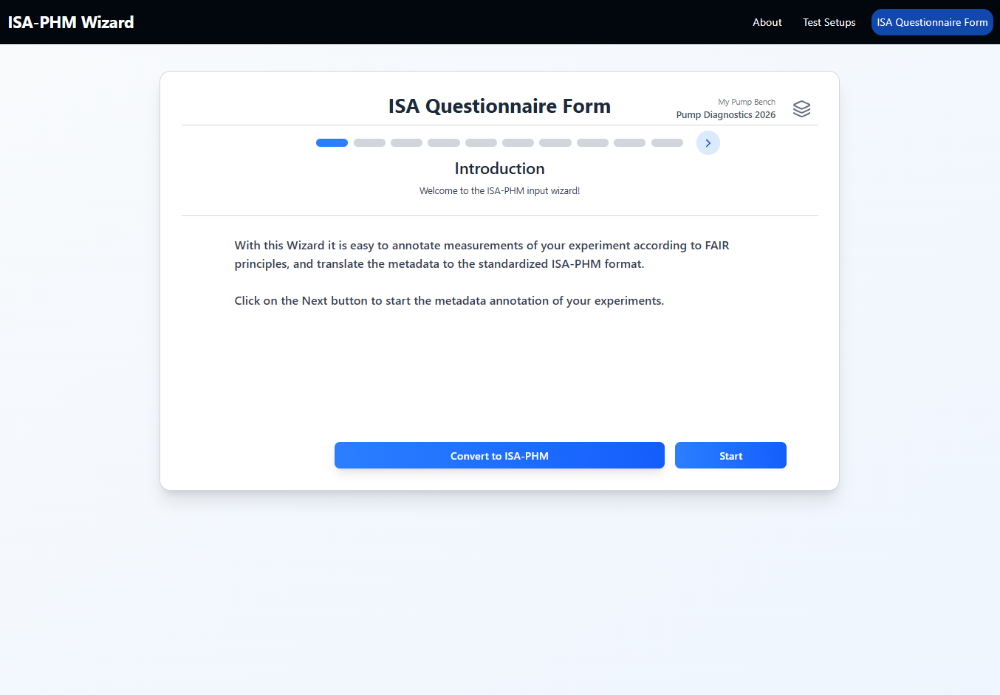

# Slide 1 — Introduction

**ISA-PHM hierarchy level:** None (informational)  
**Dependencies:** None

---

Slide 1 is purely informational. It introduces the wizard and its purpose.

## What it says

> "With this Wizard it is easy to annotate measurements of your experiment according to FAIR principles, and translate the metadata to the standardized ISA-PHM format."

## What to do

Read it. Click **Next** to proceed to Slide 2.

> **Tip:** Before clicking Next, make sure you have already created a project linked to a test setup. If the questionnaire opened without a test setup configured, dropdowns on Slides 5, 10, and 11 will be empty. Go back to the Project Sessions modal and link a test setup first.

---

## Why FAIR matters

FAIR stands for **F**indable, **A**ccessible, **I**nteroperable, **R**eusable. Applying the ISA-PHM format to your dataset metadata means anyone (including future you) can understand what was measured, how, and under what conditions — without needing to contact the original researcher.

The ISA-PHM Wizard handles the formatting. Your job is to fill in the facts accurately.

---

## What the wizard produces

After completing all 11 slides and clicking **Convert to ISA-PHM**, the wizard returns a single **`isa-phm.json`** file. This file contains the full structured metadata for your experiment — project details, experiment descriptions, variable values (fault specifications and operating conditions), and measurement output entries with links to your data files.

Place it in the root of your dataset folder alongside your `.csv` files, then zip and deposit to make the dataset FAIR-compliant.

---

[← Back to Questionnaire Guide](../guides/GUIDE_QUESTIONNAIRE.md) | [Next: Slide 2 →](./SLIDE_02_PROJECT_INFORMATION.md) | [Troubleshooting](../guides/TROUBLESHOOTING.md)
