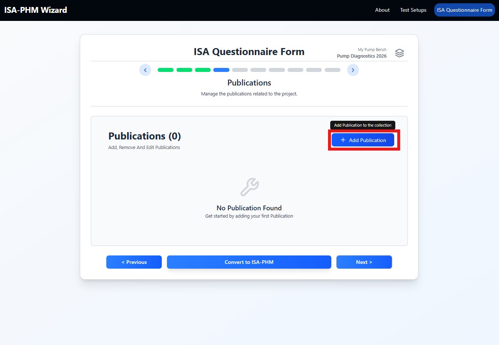
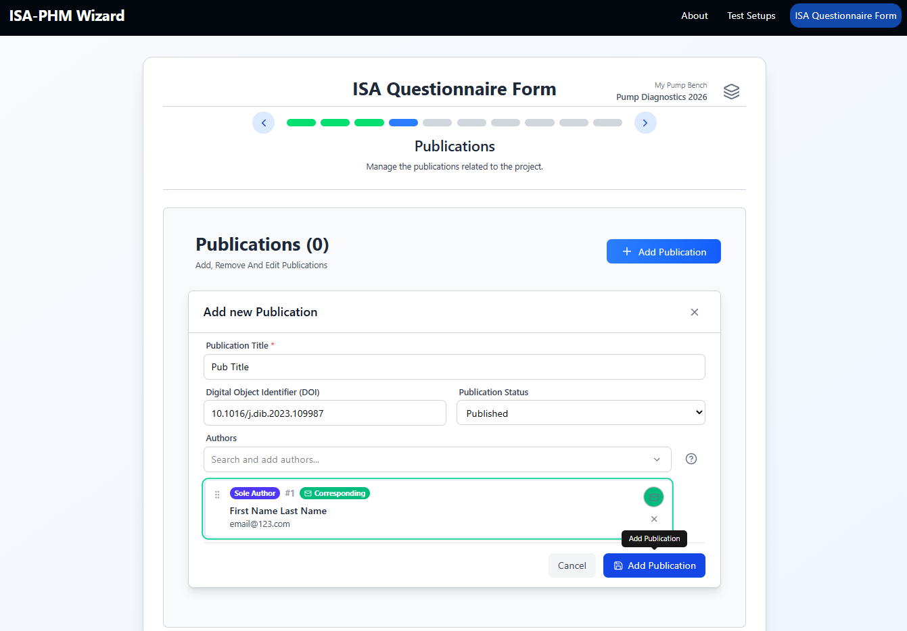
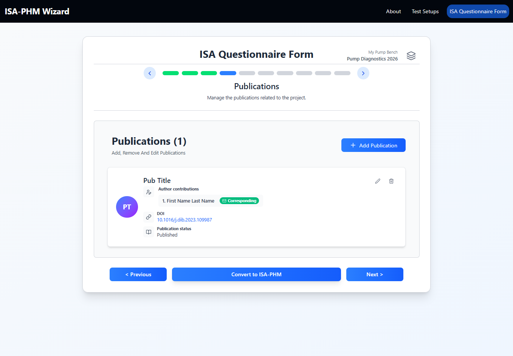

# Slide 4 — Publications

**ISA-PHM hierarchy level:** Investigation  
**Dependencies:** Contacts (Slide 3) — a publication's corresponding author must be an existing contact with an email address

---

<table><tr>
  <td></td>
  <td></td>
  <td></td>
</tr></table>

---

## Purpose

Registers publications associated with the dataset, including author order and the corresponding contact.

---

## Fields per publication

| Field | Required | Description | Example |
|---|---|---|---|
| **Publication Title** | Yes | Full title of the paper or report | `Motor Current and Vibration Monitoring Dataset for various Faults in an E-motor-driven Centrifugal Pump` |
| **DOI** | No | Digital Object Identifier | `10.1016/j.dib.2023.109987` |
| **Publication Status** | No | Current publication state | `Published`, `Submitted`, `In preparation` |
| **Author List** | No | Ordered list of authors drawn from your contacts | Select contacts in order |
| **Corresponding Author** | No | Contact who serves as corresponding author (must have an email) | Select from contacts |

---

## Adding a publication

1. Click **Add Publication**.
2. Fill the title and optional DOI.
3. Select a publication status.
4. Build the author list by selecting contacts in the order you want them to appear.
5. Select the corresponding author (must have an email — the field is blocked otherwise).

> **Tip:** This slide is optional. Skip it if you have no publication yet — you can always re-import the project JSON later, add the publication, and re-export.

---

## The corresponding author constraint

If a contact is set as corresponding author, their email cannot be removed on Slide 3. To remove the email:
1. Come back to Slide 4.
2. Clear the corresponding author field on the relevant publication.
3. Then go to Slide 3 and edit the contact.

---

## Downstream use

Each publication becomes an entry in the top-level `publications[]` array. The same list is duplicated inside every `study.publications[]`.

| Slide 4 field | JSON key | Example |
|---|---|---|
| Publication Title | `publications[].title` | `"Motor Current and Vibration Monitoring Dataset..."` |
| DOI | `publications[].doi` | `"10.1016/j.dib.2023.109987"` |
| Publication Status | `publications[].status.annotationValue` | `"Published"` |
| Author List | `publications[].authorList` | `"#UUID1; #UUID2; #UUID3"` (semicolon-delimited `#author_id` references) |
| Corresponding Author | `publications[].comments[name="Corresponding author ID"].value` | `"UUID"` |

Author order in `authorList` matches the order you selected contacts on this slide. The `#UUID` references in `authorList` correspond to the `author_id` values stored in `people[].comments`.

---

[← Slide 3](./SLIDE_03_CONTACTS.md) | [Next: Slide 5 →](./SLIDE_05_EXPERIMENTS.md)
