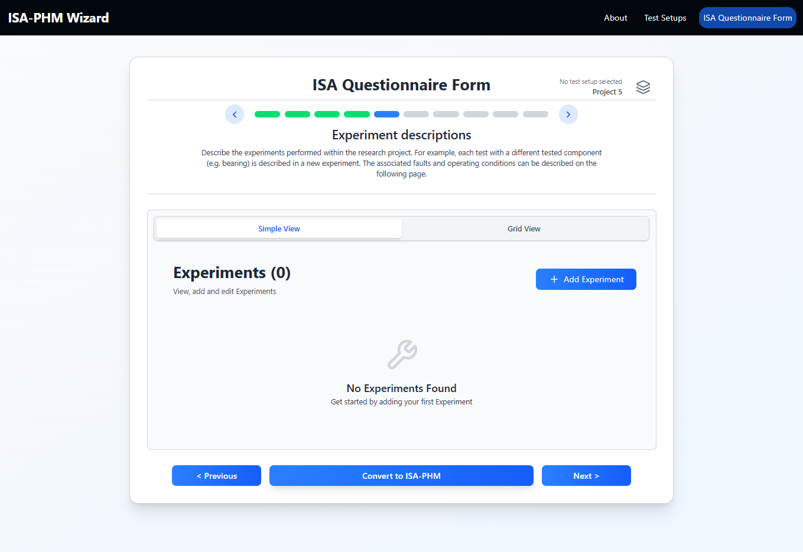
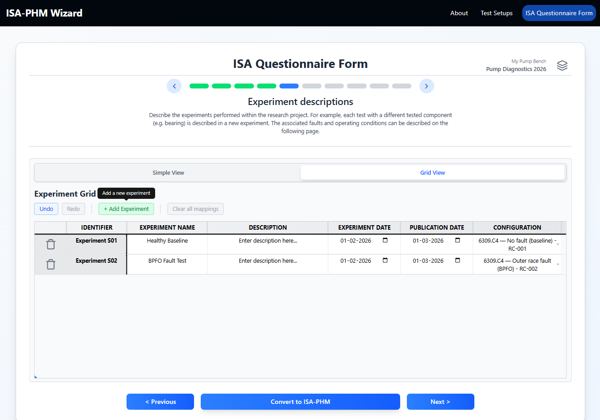
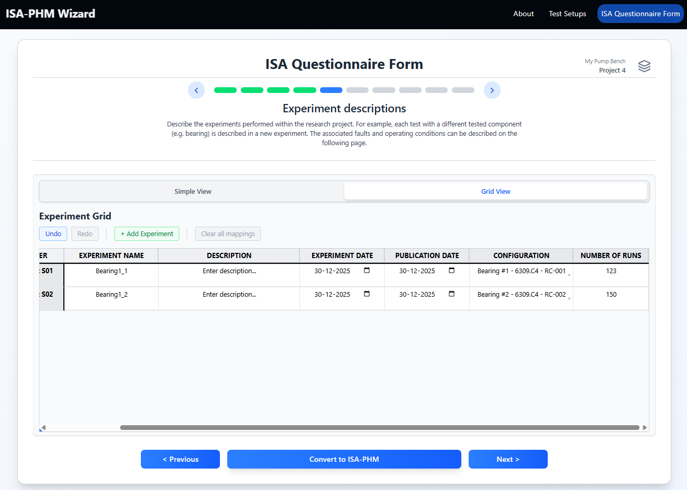
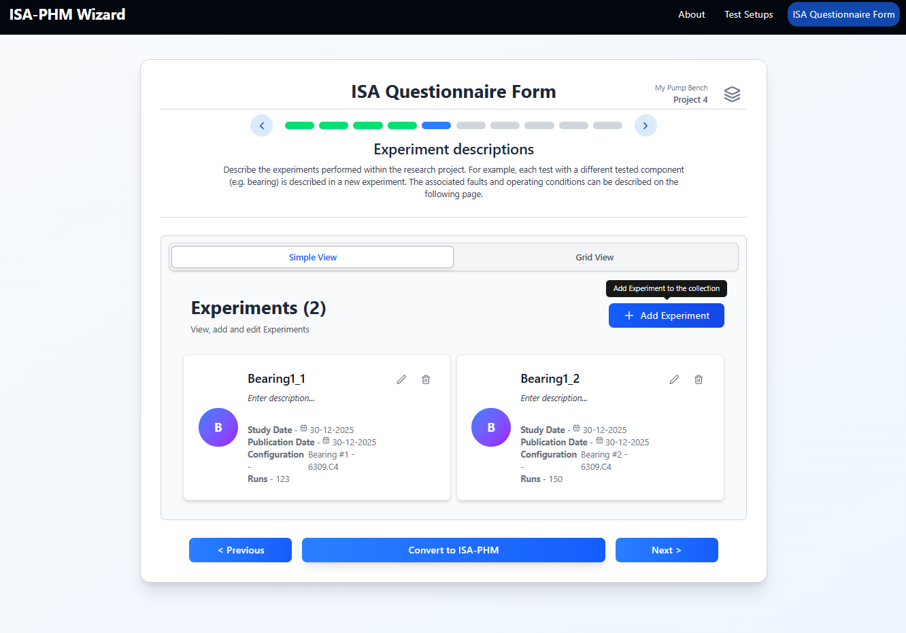
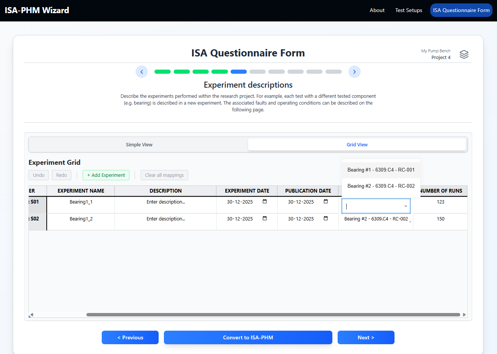
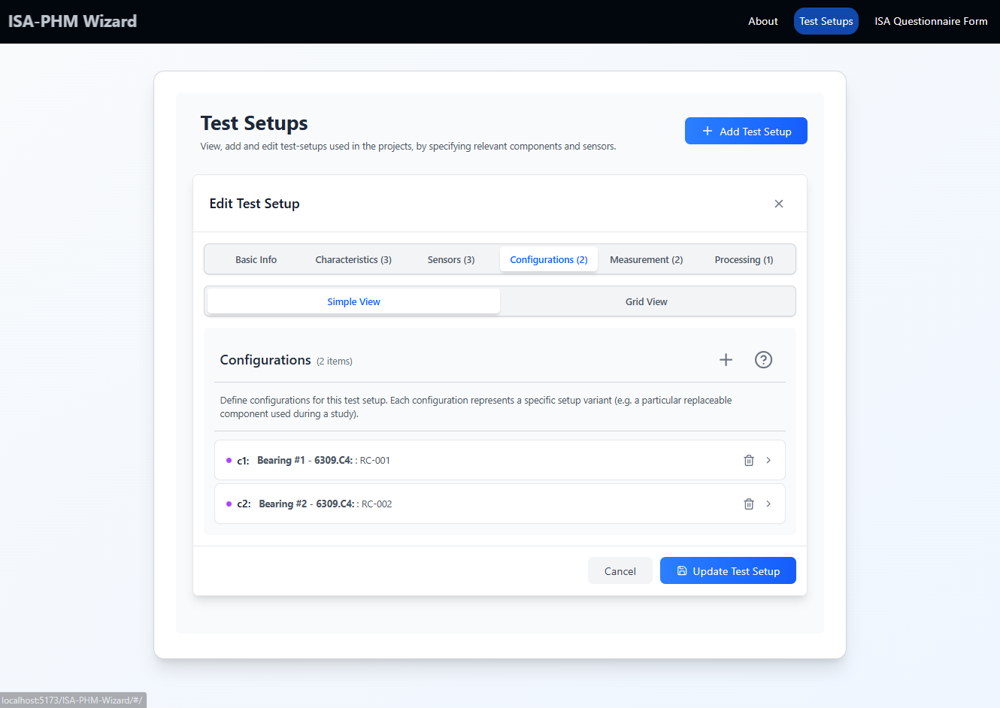

# Slide 5 — Experiment Descriptions

**ISA-PHM hierarchy level:** Study  
**Dependencies:** Test setup selected + at least one configuration in that setup (for the configuration dropdown)

---

<table><tr>
  <td></td>
  <td></td>
  <td></td>
</tr></table>

---

## Purpose

Defines all experiments in the project. Each experiment becomes one ISA Study. The set of experiments you create here drives the rows in the Test Matrix (Slide 8) and the output mapping grids (Slides 9–10).

---

## Fields per experiment

| Field | Required | Description | Example |
|---|---|---|---|
| **Experiment Name** | Yes | Descriptive short name | `BPFO Fault Severity 1 100%` |
| **Description** | No | Free-text description of what was done | `Outer race fault, seeded at the 6 o'clock position` |
| **Submission Date** | No | When this study was submitted/recorded | `2023-10-26` |
| **Publication Date** | No | When this study was published | `2023-12-17` |
| **Configuration** | No | The test setup configuration that applies | `Faulted Bearing RC-002` |
| **Number of Runs** | Prognostics only | How many sequential runs this study contains | `5` |

---

## Adding experiments

**Simple view:** Click **+ Add** (or the empty-state button). A card appears for each experiment. Expand or edit inline.

**Grid view:** Each row is an experiment. Click a cell to edit. Use the trash column to delete a row.

> **Tip:** Grid view is the fastest way to add many experiments at once — Tab moves to the next cell, Enter confirms. Ctrl+Z undoes the last edit within the session.

---

## Configuration dropdown

The **Configuration** dropdown is populated from the **Configurations tab of the Test Setup page** — not from the questionnaire itself. Configurations must be defined there before they become available here.

If the dropdown is empty:
1. Navigate to **Test Setups** (via the navbar or Home page).
2. Open your test setup and go to the **Configurations** tab.
3. Add at least one configuration there.
4. Return to Slide 5 — the dropdown will now be populated.

> **Why here?** Configurations represent the physical component installed during a specific experiment (e.g. a specific bearing or tool). They are defined on the Test Setup page because they belong to the test rig, not to a single project. That also means they can be reused across multiple projects that share the same rig.

<table><tr>
    <td></td>
    <td></td>
</tr></table>
---

## Number of runs (Prognostics Experiment only)

This field only appears when the project template is set to **Prognostics Experiment**. Set it to the number of runs (measurement intervals) for each study. For example, a milling tool wear experiment with 5 tool inspections = 5 runs.

Another concrete example: the [XJTU-SY bearing dataset](https://biaowang.tech/xjtu-sy-bearing-datasets/) runs each bearing to failure, recording multiple short acquisition windows along the way — each acquisition window is one run. If a bearing produced 123 acquisitions before failure, that experiment has **Number of Runs = 123**.

Each run gets its own column in the Test Matrix (Slide 8) and its own row in the output mapping grids.

---

## Downstream use

Each experiment becomes one **Study** entry in the exported `isa-phm.json`. The study file is named automatically following the pattern `s{nn}_.txt` (e.g. `s01_.txt`, `s02_.txt`).

Field mapping:

| Slide 5 field | JSON key | Example |
|---|---|---|
| Experiment Name | `title` | `"BPFO Fault Severity 1 100%"` |
| Description | `description` | `"BPFO Fault Severity 1 at 100%"` |
| Submission Date | `submissionDate` | `"2023-10-26"` |
| Publication Date | `publicReleaseDate` | `"2023-12-17"` |
| Number of Runs | `comments[total_runs]` | `"1"` |

The **Experiment Type** set during project creation (Diagnostic / Prognostic) is written into each study as a `studyDesignDescriptor` — either `"Diagnostics"` or `"Prognostics"`.

The selected **Configuration** is written into the study's `materials.samples[].characteristics` — as the `Configuration Name` characteristic (the name you gave it) and the `Replaceable Component` characteristic (the replaceable component ID). This is how a study know exactly what physical component was installed during that particular experiment.

Assay entries (one per sensor, see Slides 9–10) are nested under each study and use the filename pattern `a_st{study_n}_se{sensor_n}`.

---

[← Slide 4](./SLIDE_04_PUBLICATIONS.md) | [Next: Slide 6 →](./SLIDE_06_FAULT_SPECIFICATIONS.md)
