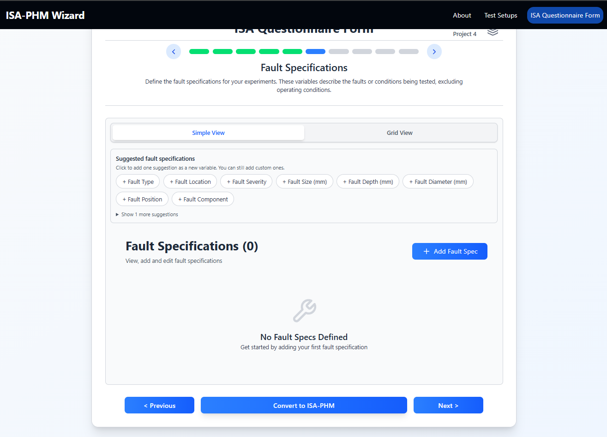

# Slide 6 — Fault Specifications

**ISA-PHM hierarchy level:** Experiment *(ISA: Study)* — Fault Specification *(ISA: Study Factor)*  
**Dependencies:** None

---

<table><tr>
  <td></td>
  <td></td>
  <td></td>
</tr></table>

---

## Purpose

Defines the fault-related variables that characterize your experiments. These become the factor columns in the experiment entries and the rows in the Test Matrix grid (Slide 8, left section).

---

## Variable type options

| Type | Use when |
|---|---|
| **Qualitative fault specification** | Non-numeric fault description — fault type, fault location, fault component |
| **Quantitative fault specification** | Numeric fault amount — fault severity level, fault size in mm |
| **Damage** | Wear or damage quantity, e.g. VB (wear land width) |
| **RUL** | Remaining Useful Life value |
| **Other** | Anything that doesn't fit the above |

---

## Fields per variable

| Field | Description | Example |
|---|---|---|
| **Variable Name** | Short identifier used throughout the wizard | `Fault Type` |
| **Type** | See table above | `Qualitative fault specification` |
| **Value Mode** | Expected value format in Slide 8: literal scalar or file-based timeseries path | `Scalar` / `Timeseries (.csv)` |
| **Unit** | Physical unit or blank for dimensionless | `mm` / `` |
| **Description** | Longer description for documentation | `Type of fault introduced onto the bearing` |

---

## Adding variables

**Via suggestions (recommended):** Click one of the suggestion chips at the top of the slide. One click adds one row, pre-filled with sensible defaults. Available suggestions include:

- Fault Type
- Fault Location
- Fault Severity
- Fault Size
- Fault Depth
- Fault Diameter
- Fault Position
- Fault Component
- VB (milling tool wear)

**Manually:** Click **+ Add** to create a blank row and fill all fields yourself.

**Grid view:** Edit all variables in a spreadsheet layout. Type dropdown supports all type options.

> **Tip:** Tab between cells to move across a row quickly. Ctrl+Z undoes an accidental change within the session.

---

## Tips

- Keep names short — they appear as column headers in the Test Matrix.
- Use **Scalar** for fixed values (e.g. `BPFO`, `0.2`) and **Timeseries (.csv)** when the factor is recorded as a per-run file.
- You can add, edit, or delete variables at any time before exporting. Deleting a variable also removes its values from the Test Matrix.

> `Value Mode` is a wizard-side input rule for Slide 8 and validation. It is not exported as a separate ISA-PHM factor property.

---

## Downstream use

Each fault specification variable becomes a `study.factors[]` entry in the JSON, shared across all experiments in the project.

| Slide 6 field | JSON key | Example |
|---|---|---|
| Variable Name | `factors[].factorName` | `"Fault Type"` |
| Type | `factors[].factorType.annotationValue` | `"Qualitative fault specification"` |
| Unit | `factors[].comments[name="unit"].value` | `"mm"` |
| Description | `factors[].comments[name="description"].value` | `"Type of fault introduced onto the bearing"` |

The values you fill in on Slide 8 end up in `study.materials.samples[].factorValues[]` — one `factorValue` entry per variable per configuration row (ISA: sample), referencing the factor by `@id`.

---

[← Slide 5](./SLIDE_05_EXPERIMENTS.md) | [Next: Slide 7 →](./SLIDE_07_OPERATING_CONDITIONS.md) | [Troubleshooting](../guides/TROUBLESHOOTING.md)
