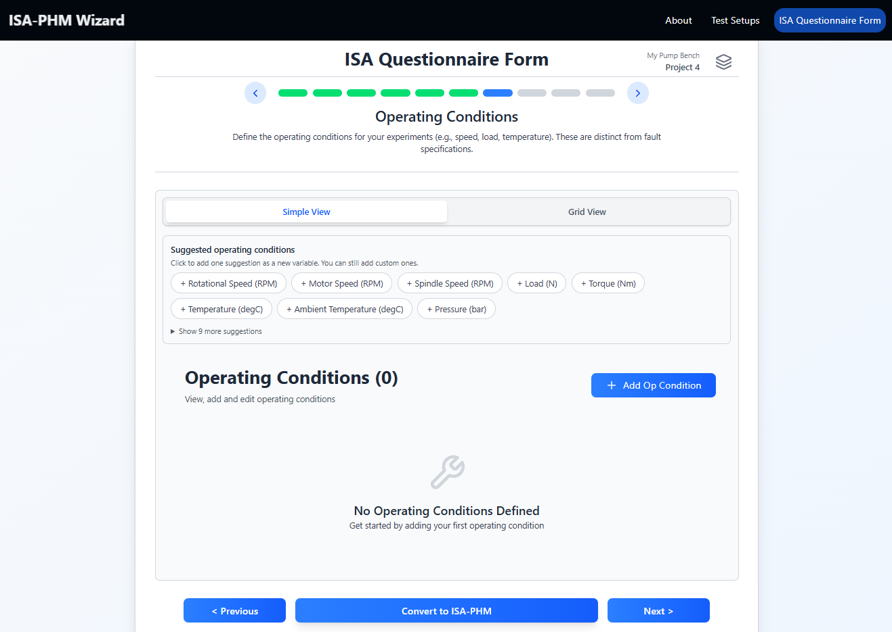
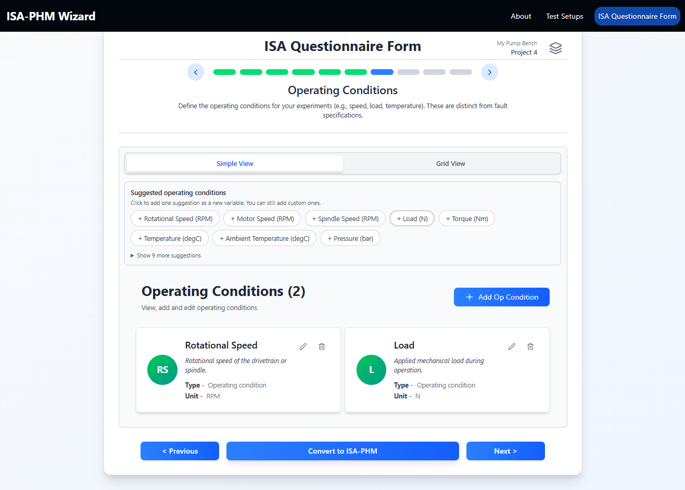
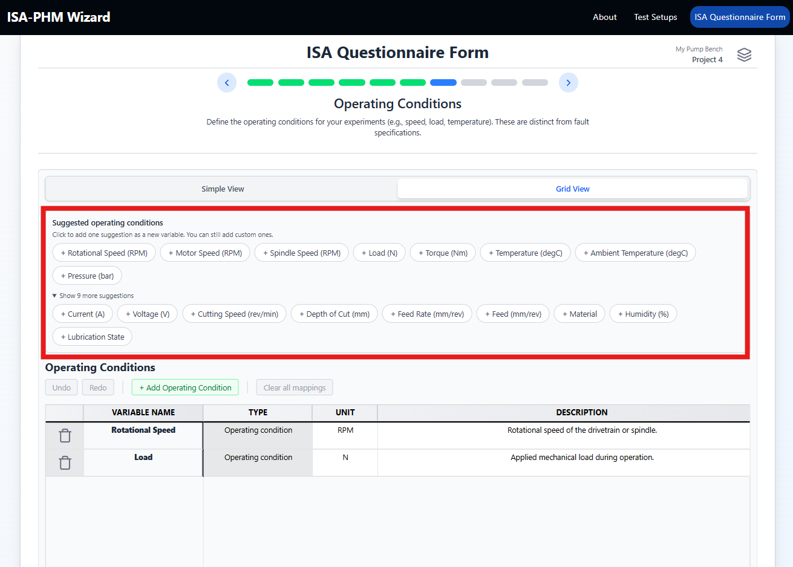

# Slide 7 — Operating Conditions

**ISA-PHM hierarchy level:** Experiment *(ISA: Study)* — Operating Condition *(ISA: Study Factor)*  
**Dependencies:** None

---

<table><tr>
  <td></td>
  <td></td>
  <td></td>
</tr></table>

---

## Purpose

Defines the environmental and operational variables that were controlled or recorded during the experiments. Like fault specifications (Slide 6), these become factor columns in the experiment entries and Test Matrix columns (Slide 8, right section).

All variables on this slide have the type **Operating condition** — this is fixed and cannot be changed.

---

## Fields per variable

| Field | Description | Example |
|---|---|---|
| **Variable Name** | Short identifier | `Rotational Speed` |
| **Value Mode** | Expected value format in Slide 8: literal scalar or file-based timeseries path | `Scalar` / `Timeseries (.csv)` |
| **Unit** | Physical unit | `RPM` |
| **Description** | Longer description | `Rotational speed of the drivetrain or spindle.` |

---

## Adding variables

**Via suggestions (recommended):** Click suggestion chips to add common variables in one click. Available suggestions include:

| Suggestion | Unit |
|---|---|
| Rotational Speed | RPM |
| Motor Speed | RPM |
| Spindle Speed | RPM |
| Load | N |
| Torque | Nm |
| Temperature | °C |
| Ambient Temperature | °C |
| Pressure | bar |
| Current | A |
| Voltage | V |
| Feed Rate | mm/min |
| Depth of Cut | mm |

**Manually:** Click **+ Add** for a blank row.

**Grid view:** Edit all conditions in a table layout.

> **Tip:** Tab through cells to fill all conditions quickly. Ctrl+Z undoes the last edit within the session.

---

## Difference from Fault Specifications

| | Fault Specifications (Slide 6) | Operating Conditions (Slide 7) |
|---|---|---|
| Describes | The fault or degradation state | The machine or environmental state |
| Type | Multiple selectable types | Always "Operating condition" |
| Examples | Fault Type = BPFO, VB = 0.3 mm | Speed = 1500 RPM, Load = 50 N |

Often both types of variables are needed: the fault condition describes *what* was seeded, the operating condition describes *how the machine was running*.

---

## Tips

- Add all conditions that were varied or controlled, even if they were constant across all experiments — constant conditions are still worth documenting for reproducibility.
- Constant values across all experiments (e.g. load was always 50 N) are fine — just fill 50 in every cell of Slide 8.
- Set **Timeseries (.csv)** when an operating condition varies during a run and is documented as a run-level CSV path in Slide 8.

---

## Downstream use

Each operating condition becomes a `study.factors[]` entry in the exported `isa-phm.json`, alongside the fault specification factors from Slide 6. The JSON structure is identical to Slide 6 — the only distinction is the `factorType`:

| Slide 7 field | JSON key | Example |
|---|---|---|
| Variable Name | `factors[].factorName` | `"Motor Speed"` |
| Type | `factors[].factorType.annotationValue` | always `"Operating condition"` |
| Unit | `factors[].comments[name="unit"].value` | `"RPM"` |
| Description | `factors[].comments[name="description"].value` | `"Rotational speed of the drivetrain"` |

Sietze example factors from this slide: `Motor Speed`, `Discharge Pressure`, `Flow`.  
Milling example factors from this slide: `Cutting Speed`, `Depth of Cut`, `Feed`, `Material`.

The values you fill in on Slide 8 end up in `study.materials.samples[].factorValues[]` — one entry per variable per configuration row (ISA: sample), referencing the factor by `@id`. This is the same mechanism as Slide 6.

---

[← Slide 6](./SLIDE_06_FAULT_SPECIFICATIONS.md) | [Next: Slide 8 →](./SLIDE_08_TEST_MATRIX.md) | [Troubleshooting](../guides/TROUBLESHOOTING.md)
