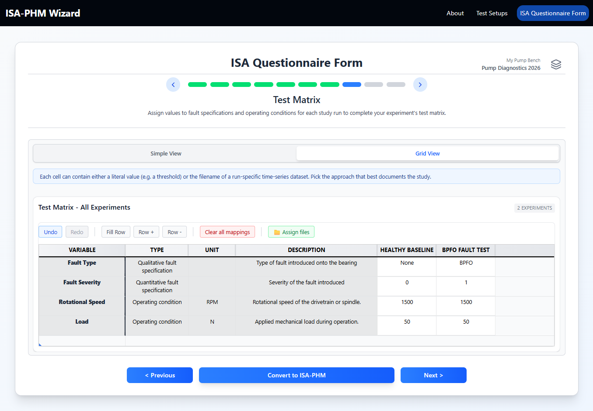
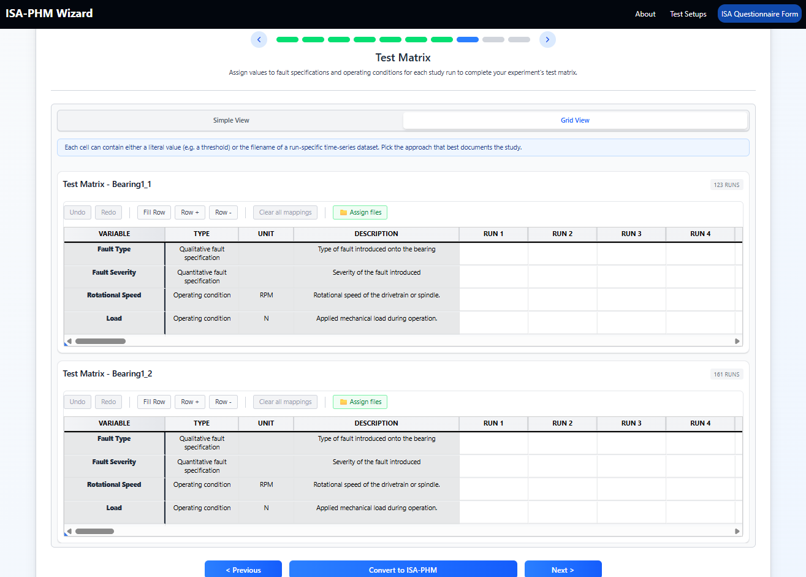
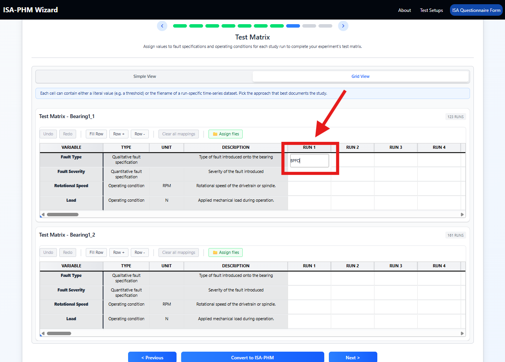
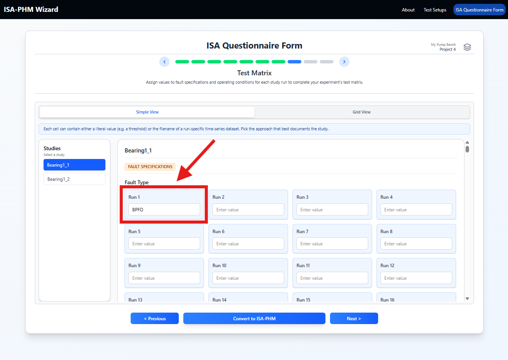
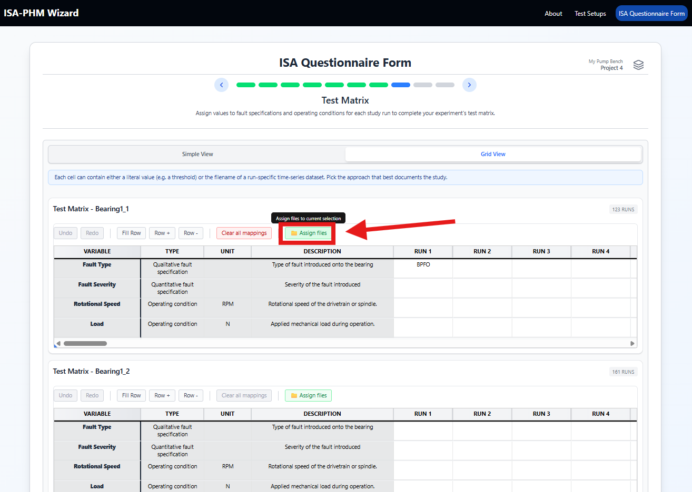

# Slide 8 — Test Matrix

**ISA-PHM hierarchy level:** Experiment *(ISA: Study)* — Configuration / Test Matrix value *(ISA: Sample / Factor Value)*  
**Dependencies:** Experiments (Slide 5) + Experiment Variables (Slides 6–7)

---

<table><tr>
  <td></td>
  <td></td>
</tr>
<tr>
  <td align="center"><em>Diagnostics — one column per experiment</em></td>
  <td align="center"><em>Prognostics — one column per run per experiment</em></td>
</tr></table>

---

## Purpose

The Test Matrix is where the experiment design becomes explicit. You assign a value for every experiment variable to every experiment or run.

The experiment type determines **how many columns appear per experiment**:

- **Diagnostics**: one column per experiment
- **Prognostics**: one column per run per experiment

> **Note — fixed values vs. time series:** The number of columns is separate from what kind of value goes in each cell. Any factor row — in both diagnostics and prognostics — can hold either a **fixed scalar** (e.g. `"BPFO"`, `1300`) or a **file path to a time-series CSV** (e.g. `.../run_01_settings.csv`). Use file paths when that factor's value changes over time within a run and is recorded as a separate file.
>
> **Expected file format for time-series factor files:** Two-column CSV — a `time` column followed by the factor value column:
>
> ```
> time,feed_rate
> 0.0,500
> 0.001,502
> 0.002,501
> ```

---

## Grid structure

```
Rows:    Fault Specifications | Operating Conditions
Columns: Experiments (Diagnostics) or runs per experiment (Prognostics)
Cells:   Variable value for that experiment or run
```

### Diagnostics experiment

Each experiment appears as **one column**. Values are typically fixed scalars — the fault type, severity, speed, etc. for that experiment.

```
| Variable           | Motor + Pump 1 | Motor + Pump 2 |
|--------------------|----------------|----------------|
| Fault Type         | BPFO           | BPFI           |
| Fault Position     | Center         | Left           |
| Motor Speed        | 1300 RPM       | 1300 RPM       |
| Discharge Pressure | 120 bar        | 100 bar        |
```


A diagnostics experiment can also use file paths if a fixed value cannot be guaranteed — for example, when a factor varies during a run and is logged to a file rather than captured as a single number.

### Prognostics experiment

Each experiment appears as **multiple columns** — one per run — labelled `Run 1`, `Run 2`, etc. (determined by *Number of runs* on Slide 5). Values are often **file paths** when each run's variable is logged to a separate CSV file, but fixed scalars work too when a variable doesn't change between runs.

```
| Variable              | Run 1                       | Run 2                       | … |
|-----------------------|-----------------------------|-----------------------------|-…-|
| Feed Rate (file path) | .../Case_01_feed_run_01.csv | .../Case_01_feed_run_02.csv | … |
| Material (fixed)      | Steel                       | Steel                       | … |
```


The **file picker** (see below) helps you assign file paths without typing them manually.

## Filling the grid

**Grid view:**
1. Click a cell to select it.
2. Type the value and press Enter or Tab.
3. Continue across the row.



> **Tip:** Tab down a column to fill all variable values for one experiment, then move to the next column. Ctrl+Z undoes the last cell edit within the session.

**Simple view:**
1. Select an experiment from the left panel.
2. For each variable, a field or input appears on the right.
3. Fill each value.
4. Move to the next experiment.



---

## File picker (Prognostics template)

For prognostic experiments, variable values in the Test Matrix are often **file paths** to per-run settings files. If your project has a dataset indexed, a file picker button appears when you select cells — click it to browse and assign files instead of typing paths.



> For diagnostics experiments, cell values are plain text or numbers — the file picker does not appear.

The file picker supports **bulk assignment**: select multiple cells first, then pick files. Files are assigned left to right in alphabetical filename order. If you pick fewer files than cells the remainder stay blank; if you pick more than cells the extras are ignored.

For full details on selection behaviour, file naming conventions, and root-folder paths — see **[Working with the Grid](../guides/GUIDE_GRID.md#assign-files-file-picker)**.

---

## Empty grid? Check these first

| Symptom | Fix |
|---|---|
| No rows | Add fault specs (Slide 6) and/or operating conditions (Slide 7) |
| No experiment/run columns | Add experiments on Slide 5 |
| Prognostics project shows only one run column | Check that `Number of runs` > 1 on Slide 5 |

---

## Tips

- Fill the matrix before moving to Slides 9–10. Output mapping slides show the same experiment/run rows.
- Values are free text — enter numbers, strings, or codes as they appear in your raw data filenames or experiment log.
- Constant operating conditions (same value for every experiment) are still filled for every row — copy-paste or grid undo/redo help here.

---

## Downstream use

Each experiment/run column in the test matrix becomes one entry in `study.materials.samples[]` in the output JSON. The variable values are written into `samples[].factorValues[]`, one per variable row.

| Test Matrix concept | JSON key |
|---|---|
| One experiment/run column | `study.materials.samples[]` |
| Cell value | `samples[].factorValues[].value` |
| Which factor | `samples[].factorValues[].category.@id` (references `study_factor` entry — ISA: study factor = fault spec / operating condition) |
| Unit (if set) | `samples[].factorValues[].unit.@id` (references `unitCategories` entry) |
| Configuration name *(ISA: sample name)* | `samples[].name` (auto-generated) |

### Diagnostics (Sietze example)

One `samples[]` entry per experiment. Variable values are direct scalars.

```json
"samples": [
  {
    "name": "Techport - Motor + Pump 2-0",
    "factorValues": [
      { "category": { "@id": "#study_factor/..." }, "value": "BPFO" },
      { "category": { "@id": "#study_factor/..." }, "value": "Center" },
      { "category": { "@id": "#study_factor/..." }, "value": "1" },
      { "category": { "@id": "#study_factor/..." }, "unit": { "@id": "#unit/..." }, "value": "1300" },
      { "category": { "@id": "#study_factor/..." }, "unit": { "@id": "#unit/..." }, "value": "120" }
    ]
  }
]
```

- Configuration name *(ISA: sample name)* pattern: `"{experiment name}-0"` (single configuration row, always index `0`)
- Values: plain strings or numbers (fault type, severity, speed, pressure, etc.)

### Prognostics (Milling example)

Multiple `samples[]` entries per experiment — one per run. Variable values are **file paths** to per-run settings files.

```json
"samples": [
  {
    "name": "Milling Lab - Dril Bit 1-0",
    "factorValues": [
      { "category": { "@id": "#study_factor/..." }, "value": ".../Case_01_time_run_01.csv" },
      { "category": { "@id": "#study_factor/..." }, "value": ".../Case_01_CS_run_01.csv" }
    ]
  },
  {
    "name": "Milling Lab - Dril Bit 1-1",
    "factorValues": [
      { "category": { "@id": "#study_factor/..." }, "value": ".../Case_01_time_run_02.csv" },
      { "category": { "@id": "#study_factor/..." }, "value": ".../Case_01_CS_run_02.csv" }
    ]
  }
  // ... 15 more entries (17 runs total)
]
```

- Configuration name *(ISA: sample name)* pattern: `"{experiment name}-{run index}"` (e.g. `-0`, `-1`, ..., `-16` for 17 runs)
- Values: file paths, not scalars — each run's settings file path per factor column

---

[← Slide 7](./SLIDE_07_OPERATING_CONDITIONS.md) | [Next: Slide 9 →](./SLIDE_09_MEASUREMENT_OUTPUT.md) | [Troubleshooting](../guides/TROUBLESHOOTING.md)
