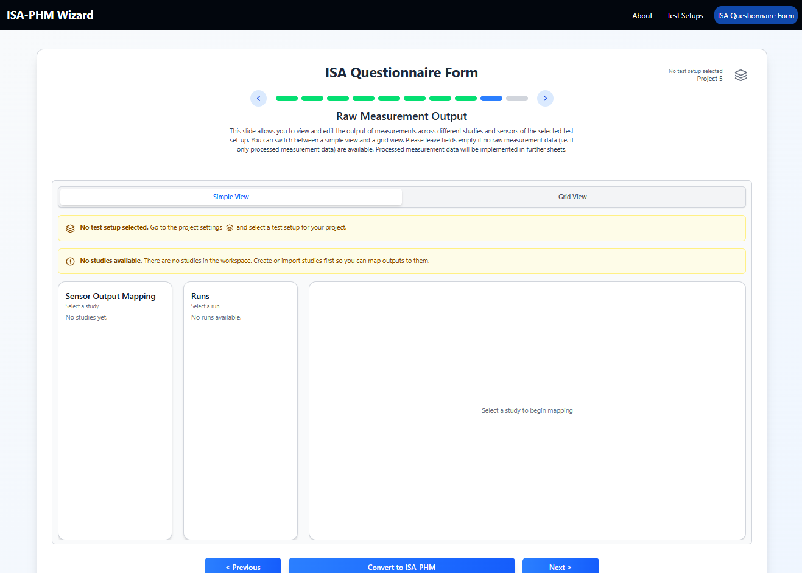
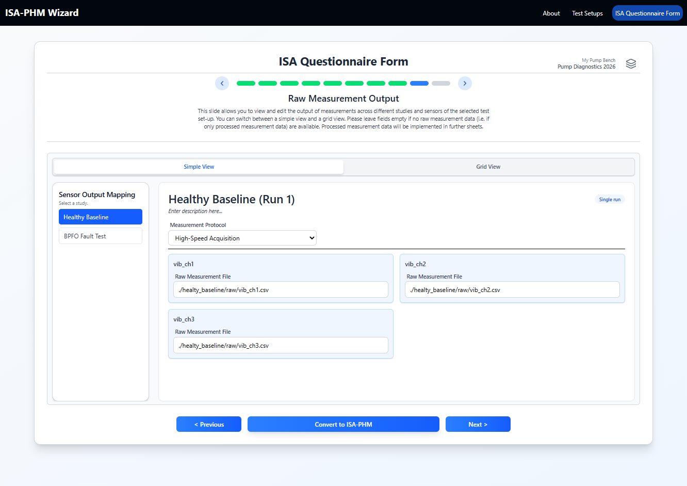
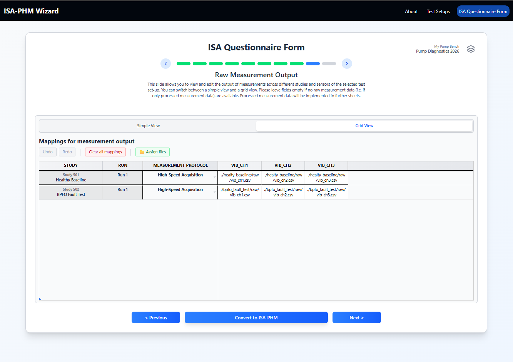
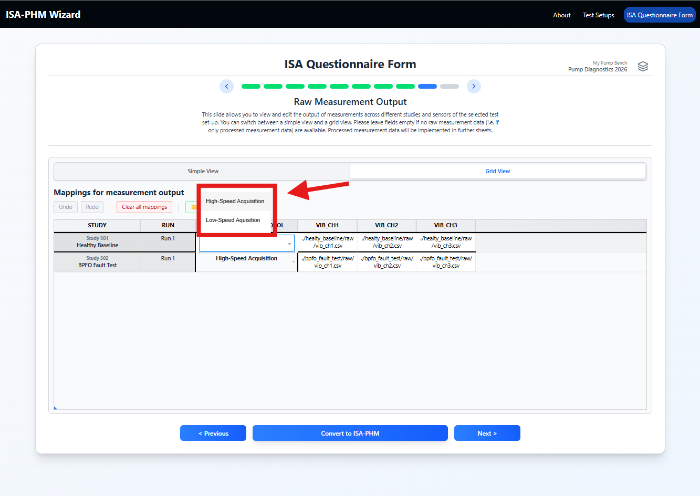
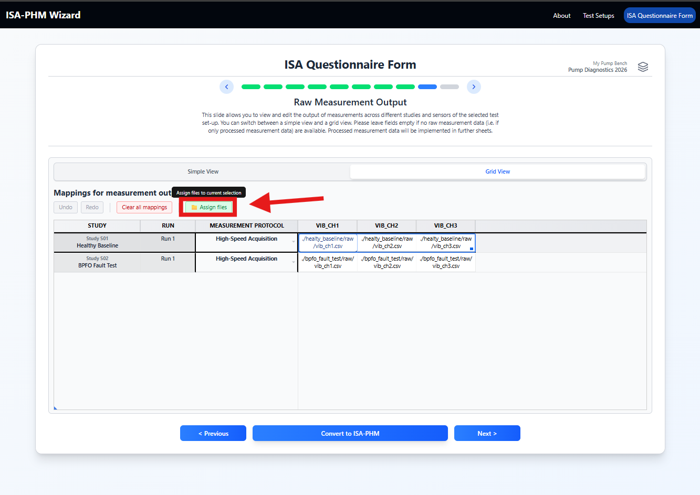

# Slide 9 — Raw Measurement Output

**ISA-PHM hierarchy level:** Assay  
**Dependencies:** Studies (Slide 5) + Sensors in test setup + Measurement Protocols in test setup

---

<table><tr>
  <td></td>
  <td></td>
  <td></td>
</tr>
<tr>
  <td align="center"><em>Empty state</em></td>
  <td align="center"><em>Simple view</em></td>
  <td align="center"><em>Grid view</em></td>
</tr></table>

---

## Purpose

Maps raw measurement output files (or values) to each study run and sensor. Also links each study to the measurement protocol that was used to acquire the data. This is the Assay layer of the ISA hierarchy for raw data.

---

## Grid structure

```
Rows:    Studies (and runs, for Prognostics template)
Columns: One per sensor in the selected test setup
Cells:   File name or path of the raw data file for that sensor/run
```

Additionally, each study has a **Measurement Protocol** selector (a dropdown or visible column) that links the study to one of the measurement protocol variants defined in the test setup.

---

## Step-by-step

### 1. Select a measurement protocol per study

For each study, use the **Measurement Protocol** dropdown to select which protocol was used during that experiment.



If the dropdown is empty: the test setup has no measurement protocols. Add them in the test setup editor → **Measurement** tab.

### 2. Fill raw output file names

For each study/run row and each sensor column, enter the filename or relative path of the raw data file collected by that sensor:

- `bearing_1500rpm_vib_ch1.csv`
- `study1_run2_accelerometer.csv`


> **Tip:** Tab across sensor columns to fill each file name for a study row in one pass. Ctrl+Z undoes the last cell edit.


File names should match the actual filenames in your dataset deposit so the assay files link correctly.

### 3. File picker (optional, with indexed dataset)

If your project has a dataset indexed, a file picker button appears when you select cells in a row. Click it to browse the indexed file list and assign paths without typing.



The file picker supports **bulk assignment**: select multiple sensor-column cells for a study/run row, then open the picker. Files are assigned left to right in alphabetical filename order. Picking fewer files than cells leaves the remaining cells blank; picking more files than cells truncates the extras.

For full details on fill behaviour, file naming conventions, and root-folder relative paths — see **[Working with the Grid](../guides/GUIDE_GRID.md#assign-files-file-picker)**.

---

## Simple view

Simple view shows one study at a time. Select a study from the left panel to see:
- Its measurement protocol selector
- A field for each sensor's raw output file/value


---

## Empty sensor columns? No studies?

| Symptom | Fix |
|---|---|
| No sensor columns | Add sensors to the test setup → Sensors tab |
| No protocol options | Add measurement protocols to the test setup → Measurement tab |
| No study rows | Add experiments on Slide 5 |

---

## Downstream use

Each sensor column for a study generates one `study.assays[]` entry. Slides 9 and 10 together fill in the **same assay objects** — Slide 9 supplies the measurement process and the raw data file; Slide 10 adds the processing process and processed output file.

| Slide 9 element | JSON location | Example |
|---|---|---|
| Assay filename | `assays[].filename` | `"a_st01_se01"` (study 1, sensor 1) |
| Raw data file name | `assays[].dataFiles[].name` | `"Vibration_Motor-2_100_time-bearing bpfo 3-ch1.txt"` |
| File type | `assays[].dataFiles[].type` | `"Derived Data File"` |
| Measurement type | `assays[].measurementType.annotationValue` | `"Vibration"` |
| Sensor model | `assays[].technologyPlatform` | `"Wilcoxon 786B-10"` |
| Measurement protocol | `assays[].processSequence[0].executesProtocol.@id` | references the measurement protocol |

Assay filenames follow the pattern `a_st{study_index}_se{sensor_index}` — e.g. study 1 / sensor 3 → `a_st01_se03`.

> **Multi-axis sensors** (e.g., a tri-axis accelerometer) should each be entered as separate sensors in the test setup (`acc_x`, `acc_y`, `acc_z`). Each axis then has its own column in this grid and generates its own assay.

---

[← Slide 8](./SLIDE_08_TEST_MATRIX.md) | [Next: Slide 10 →](./SLIDE_10_PROCESSING_OUTPUT.md)
