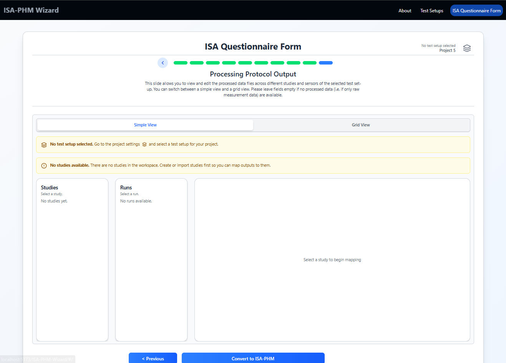
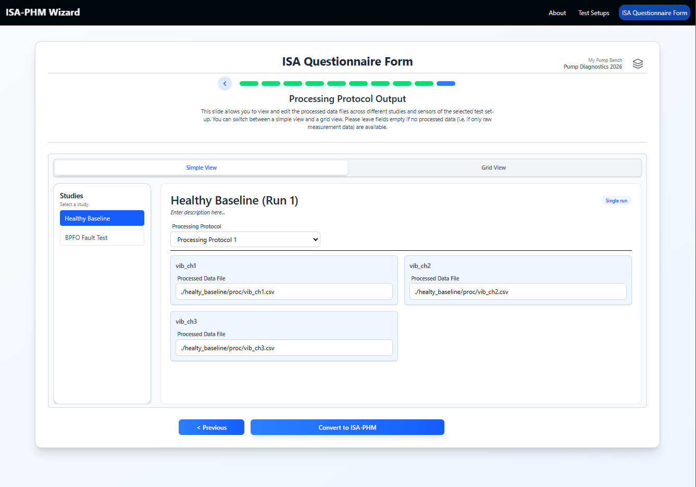
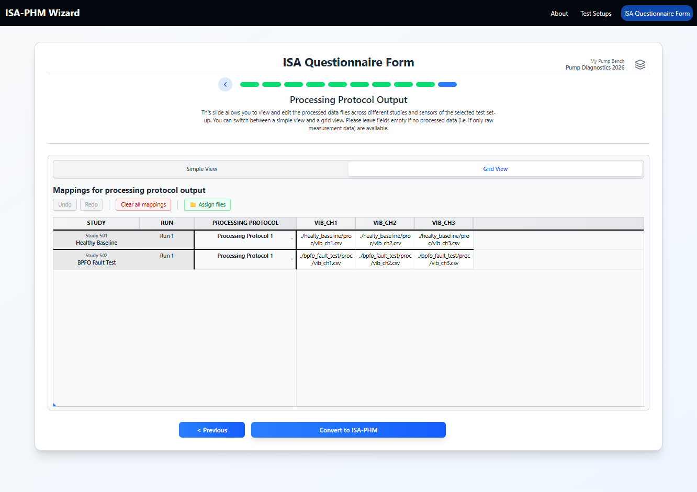
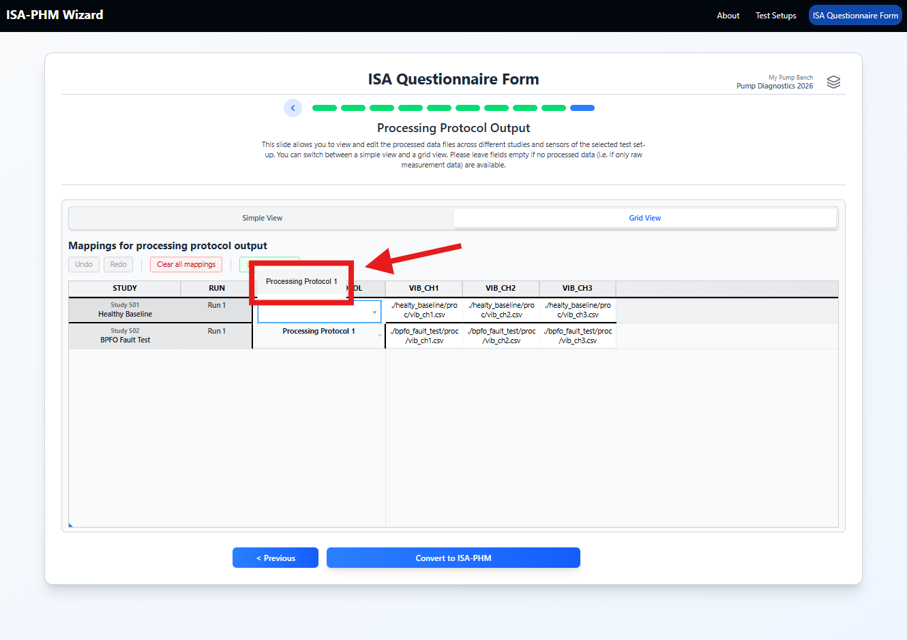

# Slide 10 — Processing Protocol Output

**ISA-PHM hierarchy level:** Assay  
**Dependencies:** Studies (Slide 5) + Sensors in test setup + Processing Protocols in test setup

---

<table><tr>
  <td></td>
  <td></td>
  <td></td>
</tr>
<tr>
  <td align="center"><em>Empty state</em></td>
  <td align="center"><em>Simple view</em></td>
  <td align="center"><em>Grid view</em></td>
</tr></table>

---

## Purpose

Maps processed/derived output files (or values) to each study run and sensor. Also links each study to the processing protocol used to transform raw data into features. This is the Assay layer of the ISA hierarchy for processed data.

The structure and workflow are identical to Slide 9 — the only difference is that this slide references **processing protocols** and **processed output files** rather than raw acquisition.

---

## Grid structure

```
Rows:    Studies (and runs, for Prognostics template)
Columns: One per sensor in the selected test setup
Cells:   File name or path of the processed data file for that sensor/run
```

Each study also has a **Processing Protocol** selector.

---

## Step-by-step

### 1. Select a processing protocol per study

For each study, use the **Processing Protocol** dropdown to select which transformation pipeline was applied to the raw data.



If the dropdown is empty: add processing protocols in the test setup editor → **Processing** tab.

### 2. Fill processed output file names

For each study/run row and each sensor column, enter the filename of the processed output:

- `features_bearing_run1_ch1.csv`
- `fft_study2_vib.csv`

> **Tip:** Same grid navigation as Slide 9 — Tab across sensor columns for each row, Ctrl+Z to undo the last edit.


### 3. File picker (optional)

If a dataset is configured, use the file picker to browse and assign files from the indexed list. Bulk selection, left-to-right fill, blank/truncate behaviour, and root-folder path rules are all identical. See **[Working with the Grid](../guides/GUIDE_GRID.md#assign-files-file-picker)** for full details.

---

## Relationship to Slide 9

| | Slide 9 | Slide 10 |
|---|---|---|
| Protocol type | Measurement protocol | Processing protocol |
| Files represent | Raw sensor signals | Derived features / processed data |
| ISA assay type | Raw data acquisition | Derived data |

Both slides contribute assay entries to the output JSON. A complete project typically has entries on both slides.

If your dataset is raw-only (no feature extraction was done), Slide 10 can be left empty. The assay file will still be generated but will be blank.

---

## Downstream use

Slide 10 fills in the **second process** in each assay's `processSequence[]` — the same assay objects created by Slide 9. Both slides contribute to the same `study.assays[]` entries; they are not separate assay files.

| Slide 10 element | JSON location | Example |
|---|---|---|
| Processed output file | `assays[].processSequence[1].outputs[].@id` → `dataFiles[].name` | `"features_bearing_run1_ch1.csv"` |
| Processing protocol | `assays[].processSequence[1].executesProtocol.@id` | references the processing protocol |
| Process name | `assays[].processSequence[1].name` | `"vib_ch_1_run_1_processing"` |

The two chained processes in `processSequence` are:
1. **Measurement process** (Slide 9) — takes the study sample as input, outputs the raw data file.
2. **Processing process** (Slide 10) — takes the raw data file as input, outputs the processed data file.

Assay filenames are driven by Slide 9 and follow `a_st{study_index}_se{sensor_index}`. If Slide 10 is left empty for a sensor/study, the processing step's output will be blank.

---

## Final step after Slide 10

After completing Slide 10 (or at any point), click **Convert to ISA-PHM** to generate the output JSON.  
See [Export Guide](../guides/GUIDE_EXPORT.md) for what the output contains and how to use it.

---

[← Slide 9](./SLIDE_09_MEASUREMENT_OUTPUT.md) | [Export Guide →](../guides/GUIDE_EXPORT.md)
