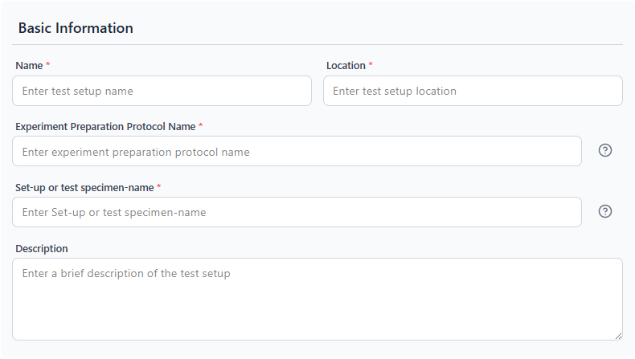
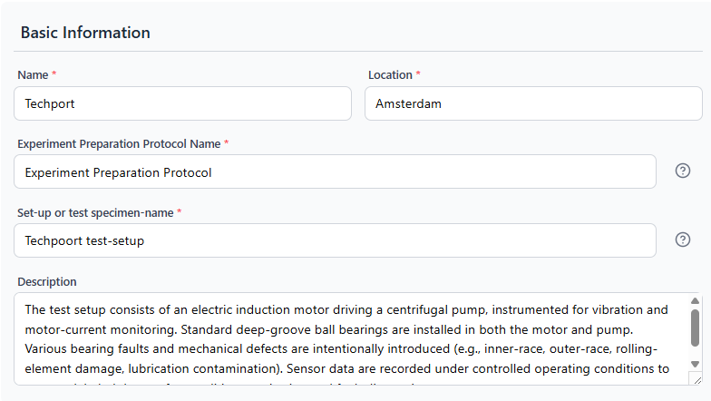

# Test Setup Tab — Basic Info

**Required to save a test setup:** All four required fields must be filled.

---

<table><tr>
  <td></td>
  <td></td>
</tr></table>

---

## Purpose

Identifies and contextualizes the test setup. These fields appear in the ISA-PHM output as the study design descriptor and preparation protocol metadata.

---

## Fields

| Field | Required | Description | Example |
|---|---|---|---|
| **Name** | Yes | Display name of the setup | `Pump Bench Alpha` |
| **Location** | Yes | Physical location of the lab bench | `Lab 3, Building 7, TU Delft` |
| **Experiment Preparation Protocol Name** | Yes | Name of the installation or preparation procedure | `Standard Bearing Swap v2` |
| **Set-up or test specimen-name** | Yes | Identifier of the physical rig or specimen | `Pump-bench-A` |
| **Description** | No | Longer free-text description of the setup | see example below |

---

## Name

Used as the identifier throughout the app. Keep it short and unique so it's recognizable in dropdowns (e.g. the project configuration modal lists all setups by name).

## Location

A human-readable string — no fixed format required. City, building, room, or lab name.

## Experiment Preparation Protocol Name

The name of the document or SOP that describes how the test rig is prepared for each experiment. For example, how a bearing is installed, calibrated, or zeroed. This does not link to a file — it's a reference name used in ISA-PHM metadata.

> **Note:** The default value `Experiment Preparation Protocol Name` is also perfectly valid if you don't have a specific SOP name.

## Set-up or test specimen-name

A short stable identifier for the physical test rig or specimen. Used in ISA-PHM as the Study Design Descriptor name.

## Description

Optional but recommended. Describe the rig in enough detail that someone unfamiliar with your lab could understand what the setup measures. Include:
- What type of machine it is
- What faults or conditions it is designed to test
- What sensors are typically used (can reference the Sensors tab)

**Example description (Techport setup):**
> The test setup consists of an electric induction motor driving a centrifugal pump, instrumented for vibration and motor-current monitoring. Standard deep-groove ball bearings are installed in both the motor and pump. Various bearing faults and mechanical defects are intentionally introduced. Sensor data are recorded under controlled operating conditions to create a labeled dataset for condition monitoring and fault diagnosis.

---

## Save behaviour

Clicking **Add Test Setup** or **Update Test Setup** saves all six tabs at once. If any required field is missing, the save is blocked and a validation message appears.

---

[← Test Setups Guide](../guides/GUIDE_TEST_SETUPS.md) | [Next: Characteristics →](./TAB_CHARACTERISTICS.md)
