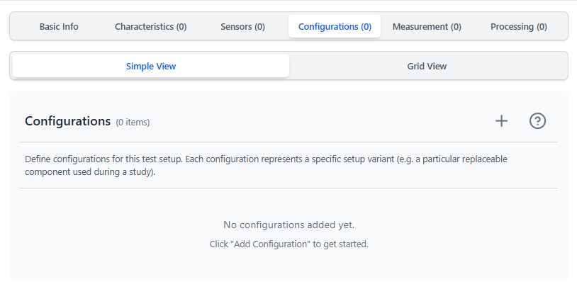
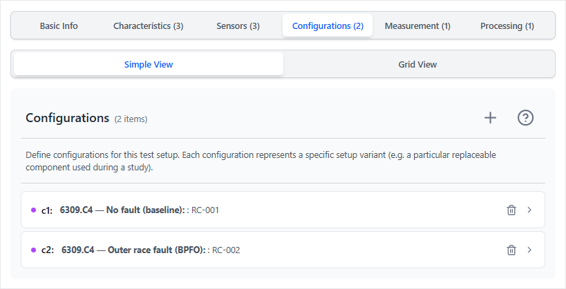
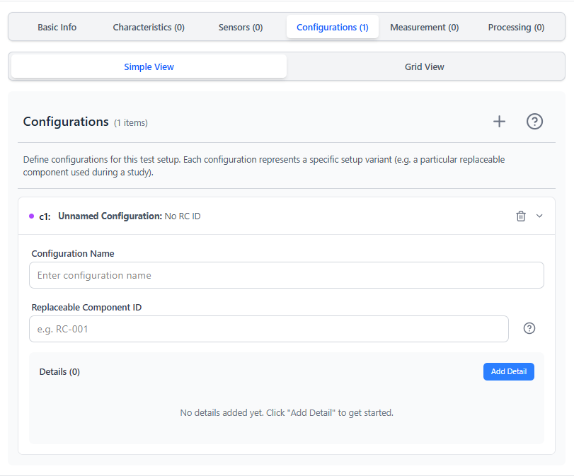
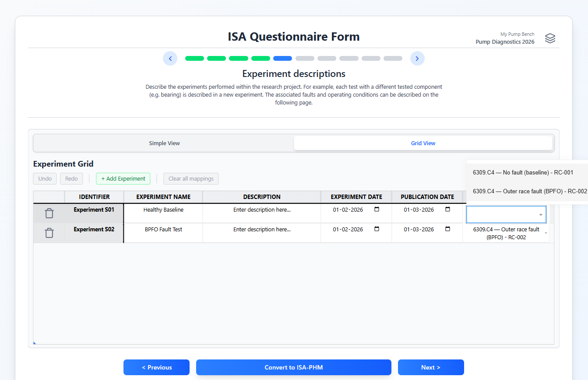

# Test Setup Tab — Configurations

---

<table><tr>
  <td></td>
  <td></td>
</tr></table>

---

## Purpose

A Configuration is the ISA-PHM **Sample** — it identifies the **specific physical component installed** in the rig for a given experiment. This is not just a health label or fault class; it is a distinct physical object.

> **Key rule:** Two experiments that use the same component *type* but a **different physical unit** should each have their own Configuration.

**Example:** A run-to-failure dataset with 15 bearing units — all LDK UER204 — where each unit is tested independently until it fails. Even though the bearing model is identical, each physical unit is its own Configuration:

| Configuration name | Replaceable Component ID |
|---|---|
| `LDK UER204 — Unit 01 (run-to-failure)` | `BRG-01` |
| `LDK UER204 — Unit 02 (run-to-failure)` | `BRG-02` |
| … | … |

This traceability matters: if one bearing develops an unexpected failure mode, you can identify it by its ID.

Each configuration can be linked to an experiment on Questionnaire Slide 5.

---

## Characteristics vs. Configurations

| | Characteristics | Configurations |
|---|---|---|
| What it describes | Fixed properties of the rig (same for all experiments) | The specific component swapped in per experiment |
| ISA-PHM entity | Study Design Descriptor | Sample |
| Changes per experiment? | No | Yes |
| Example | Motor rated power = 11 kW | Bearing unit 03 — outer race fault |

---

## Fields per configuration

| Field | Required | Description | Example |
|---|---|---|---|
| **Name** | Yes | Human-readable name for this variant | `Healthy Bearing`, `BPFO Fault Severity 1` |
| **Replaceable Component ID** | No | An identifier for the specific component instance | `RC-001`, `Bearing-SKF-6308-A` |
| **Details** | No | Key/value pairs for additional properties | `Fault size = 0.5 mm` |

---

## Adding configurations

1. Click **+ Add Configuration**.
2. Fill the Name and optionally the Replaceable Component ID.
3. Add one or more **Detail** entries (name/value pairs) for extra traceability.

---

## Details (name/value pairs)

Use Detail entries to record properties that are specific to this configuration but don't belong in Characteristics (which apply to all configurations). Examples:

| Detail Name | Detail Value |
|---|---|
| Fault type | BPFO |
| Fault size | 0.5 mm |
| Installation date | 2026-03-01 |
| Tool grade | P25 |
| Serial number | BRG-2026-003 |

---

## How configurations link to experiments

On Questionnaire Slide 5 (Experiment Descriptions), each experiment has a **Configuration** dropdown. The dropdown is populated from this list. Selecting a configuration links that experiment to the specific hardware state described here.

This is important for traceability: the ISA-PHM output includes the configuration name as a design descriptor for each experiment *(ISA: Study)*.

---

## How many configurations?

One configuration per physical state you tested. For a typical seeded-fault diagnostic dataset:

- `Healthy`
- `BPFO Fault, Severity 1`
- `BPFO Fault, Severity 2`
- `Inner Race Fault, Small`
- etc.

For a prognostics dataset where wear evolves continuously, you might have one configuration per tool (or use operating conditions in the Test Matrix to describe the degradation state per run).

---

[← Sensors](./TAB_SENSORS.md) | [Next: Measurement Protocols →](./TAB_MEASUREMENT_PROTOCOLS.md)
