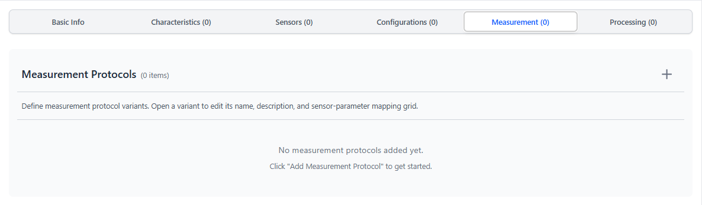
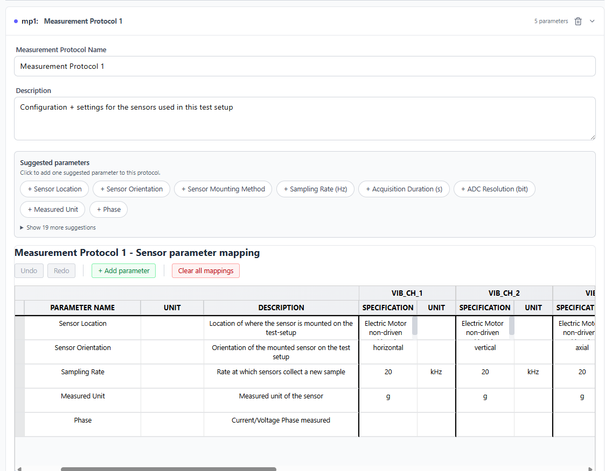
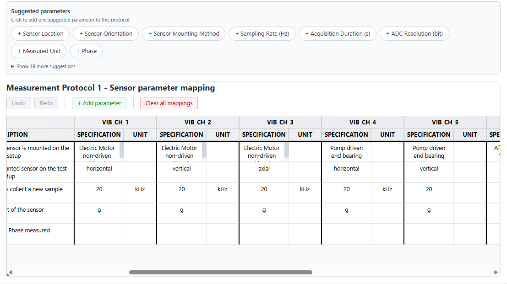
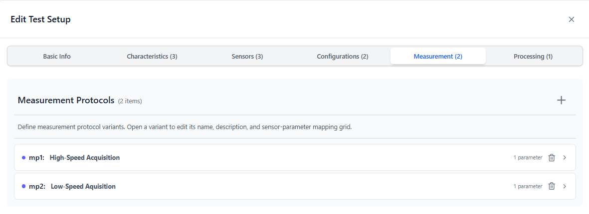

# Test Setup Tab — Measurement Protocols

> **Add sensors first.** The parameter grid creates one column per sensor — with no sensors, the grid has no sensor columns.

---

<table><tr>
  <td></td>
  <td></td>
</tr></table>

---

## Purpose

Documents how raw signals are acquired. You can define multiple protocol **variants** within one test setup (e.g. different sample rates for different measurement campaigns). On Questionnaire Slide 9, each experiment *(ISA: Study)* is linked to one protocol variant.

In ISA-PHM terms, the selected measurement protocol is referenced in each measurement output *(ISA: Assay)* as `processSequence[0].executesProtocol`. Its parameters become protocol parameter values for that process.

---

## Structure

Each protocol variant contains:
- **Name** — identifier for this variant
- **Description** — optional free text
- **Parameter list** — rows of acquisition settings
- **Sensor-parameter mapping grid** — values per sensor for each parameter

---

## Creating a protocol variant

1. Click **+ Add Protocol** (or **+**) on the Measurement Protocols tab.
2. Enter a **Name** (e.g. `Standard Acquisition 25.6 kHz`).
3. Optionally add a **Description**.

---

## Adding parameters

Each parameter is a row in the protocol's table. Add parameters two ways:

**Suggestion chips (recommended):** Click a chip to add a pre-filled row:

| Suggestion | Typical unit |
|---|---|
| Sampling Rate | kHz |
| Record Length | s |
| Filter Type | — |
| Filter Cutoff Frequency | Hz |
| ADC Resolution | bit |
| Amplifier Gain | dB |
| Trigger Type | — |

**Manual:** Click **+ Add parameter**. Fill Name, Unit, and Description yourself.

---

## Sensor-parameter mapping grid

After adding parameters and sensors (sensors must exist on the Sensors tab), a grid appears with:
- **Rows:** each parameter
- **Columns:** each sensor

Fill in the value of each parameter for each sensor. Many parameters are the same across all sensors (e.g. sampling rate); others may differ (e.g. amplifier gain per channel).

---

## Multiple protocol variants

Add a second or third variant if different experiments used different acquisition settings:

- Variant A: `High-Speed Acquisition` — 51.2 kHz sample rate
- Variant B: `Low-Speed Acquisition` — 12.8 kHz sample rate

On Slide 9, each experiment *(ISA: Study)* independently selects which variant was used.

---

## Downstream use

The selected protocol on Slide 9 is serialized inside `isa-phm.json` for each assay (`a_st{study_index}_se{sensor_index}`) via `processSequence[0].executesProtocol`. Its parameters and per-sensor values are serialized as protocol parameter values.

---

[← Configurations](./TAB_CONFIGURATIONS.md) | [Next: Processing Protocols →](./TAB_PROCESSING_PROTOCOLS.md)
