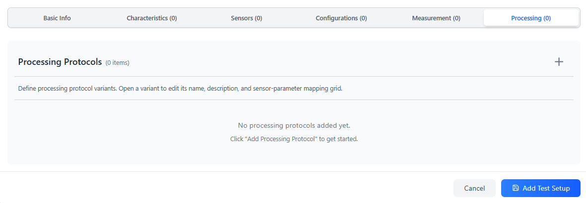
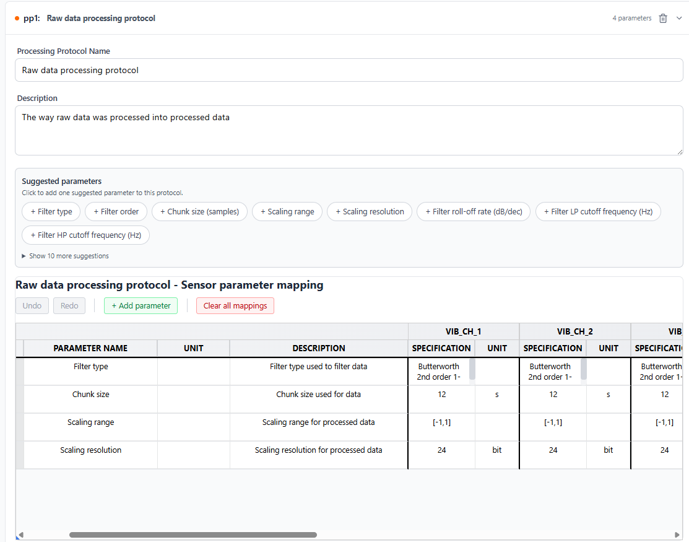
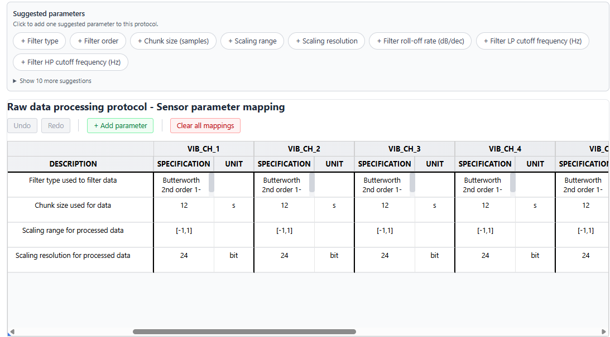
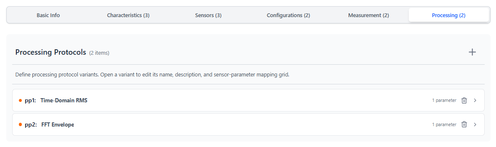

# Test Setup Tab — Processing Protocols

> **Add sensors first.** The parameter grid creates one column per sensor.

---

<table><tr>
  <td></td>
  <td></td>
</tr></table>

---

## Purpose

Documents how raw signal data is transformed into processed outputs (features, spectra, statistics). This captures the processing lineage needed for reproducible feature engineering. On Questionnaire Slide 10, each study is linked to one processing protocol variant.

The structure is identical to the Measurement Protocols tab — the difference is that processing protocols describe *transformation* rather than *acquisition*.

---

## Structure

Each processing protocol variant contains:
- **Name** — e.g. `FFT Feature Extraction`, `Time-Domain Statistics`
- **Description** — optional
- **Parameter list** — rows describing processing settings
- **Sensor-parameter mapping grid** — per-sensor values

---

## Creating a protocol variant

1. Click **+** on the Processing Protocols tab.
2. Enter a **Name**.
3. Add parameters.

---

## Suggested parameters

| Suggestion | Typical unit |
|---|---|
| Analysis Method | — |
| Window Function | — |
| Overlap | % |
| FFT Size | samples |
| Frequency Resolution | Hz |
| Feature Type | — |
| Normalization | — |
| Segment Length | samples |
| Resampling Rate | Hz |

---

## Filling the sensor-parameter grid

Same as Measurement Protocols: each parameter row has a value per sensor column.

For processing, values often differ per sensor channel — for example, different frequency ranges of interest per sensor type.

---

## Multiple variants

Add separate variants for significantly different processing pipelines applied to the same raw data. For example:

- Variant A: `Time-Domain RMS` — extracts RMS per window
- Variant B: `FFT Envelope` — applies Hilbert transform then FFT

Each study on Slide 10 selects one variant.

---

## Difference from Measurement Protocols

| | Measurement Protocols | Processing Protocols |
|---|---|---|
| Describes | Raw signal acquisition settings | Signal transformation / feature extraction |
| Linked in questionnaire | Slide 9 | Slide 10 |
| Assay type in output | Raw data acquisition | Derived data |

---

## Downstream use

The selected processing protocol on Slide 10 is serialized into `isa-phm.json` as the Assay Measurement Type for the processing assay. Its parameters and per-sensor values appear as Protocol Parameter rows within that file.

---

[← Measurement Protocols](./TAB_MEASUREMENT_PROTOCOLS.md) | [Next: Save the test setup →](../guides/GUIDE_TEST_SETUPS.md#saving)
