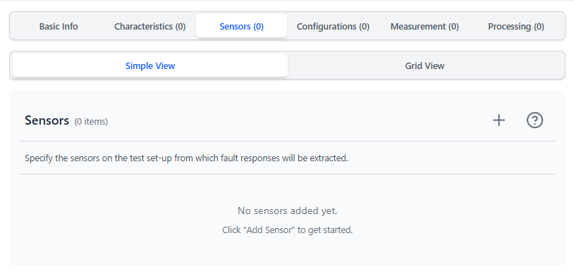
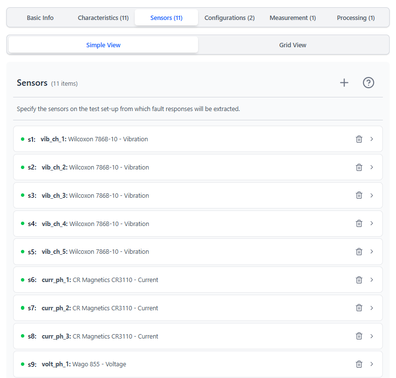
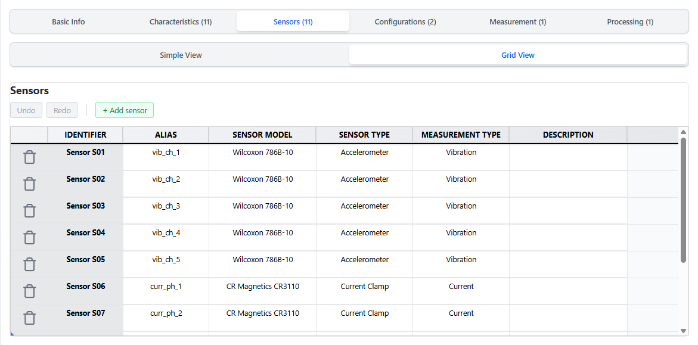
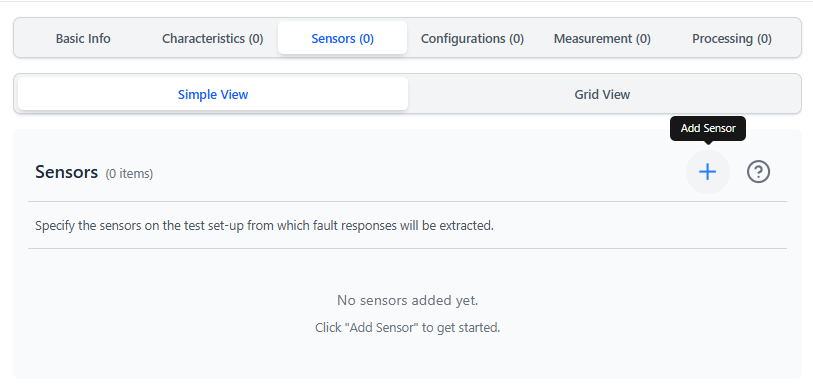

# Test Setup Tab — Sensors

> **Add sensors before adding measurement or processing protocols.** Protocol parameter grids create one column per sensor.

---

<table><tr>
  <td></td>
  <td></td>
  <td></td>
</tr></table>

---

## Purpose

Defines all measurement channels in the test setup. Each sensor entry represents **one measurement channel** — meaning one data file with a timestamp column and a single measurement value column. Each sensor becomes:
- A column in the Measurement Protocol parameter grid (Measurement tab)
- A column in the Processing Protocol parameter grid (Processing tab)
- A column in the Raw Measurement Output grid (Questionnaire Slide 10)
- A column in the Processing Output grid (Questionnaire Slide 11)

> **Multi-axis sensors:** A tri-axis accelerometer (X, Y, Z) must be entered as **three separate sensors** — one per axis (e.g., `acc_x`, `acc_y`, `acc_z`). Each axis generates its own assay entry in the output JSON, linked to its own two-column data file.

---

## Fields per sensor

| Field | Description | Example |
|---|---|---|
| **Alias** | Short unique identifier for this channel | `vib_ch1`, `curr_phase_a` |
| **Sensor Model** | Manufacturer model number or name (`technologyPlatform` in ISA) | `PCB 352C33`, `LEM LA55-P` |
| **Sensor Type** | Technology or transducer type (`technologyType` in ISA) | `Accelerometer`, `Current transducer` |
| **Measurement Type** | Physical quantity measured | `Vibration`, `Current`, `Temperature` |
| **Description** | Additional context | `Channel 1 on bearing housing, drive-end side` |

---

## Adding sensors

The app auto-generates an alias like `Sensor SE01` when you click **+ Add Sensor**. Rename it to something meaningful.

**Simple view:** One card per sensor.  
**Grid view:** All sensors in a table; faster for setups with many channels.

> **Tip:** Grid view is recommended for setups with many channels. You can paste values copied from a spreadsheet directly into grid cells.

---

## Alias conventions

Keep aliases:
- Short (under 12 characters is ideal)
- Lowercase with underscores: `vib_ch1`, `curr_line_b`
- Unique within the setup
- Stable across projects using the same physical channel

Aliases appear as column headers in the output grids where you assign filenames. A good alias makes it immediately clear which file goes in which column.

---

## Examples

| Alias | Sensor Model | Sensor Type | Measurement Type |
|---|---|---|---|
| `vib_ch1` | PCB 352C33 | Accelerometer | Vibration |
| `vib_ch2` | PCB 352C33 | Accelerometer | Vibration |
| `curr_phase_a` | LEM LA55-P | Current transducer | Current |
| `temp_housing` | PT100 | RTD | Temperature |
| `mic_1` | GRAS 46AM | Microphone | Acoustic emission |

---

## Deleting sensors

Deleting a sensor from the list removes it from protocol parameter grids and output mapping grids. Any filenames already mapped to that sensor will be lost. Rename rather than delete if you just want to update the alias.

---

[← Characteristics](./TAB_CHARACTERISTICS.md) | [Next: Configurations →](./TAB_CONFIGURATIONS.md)
